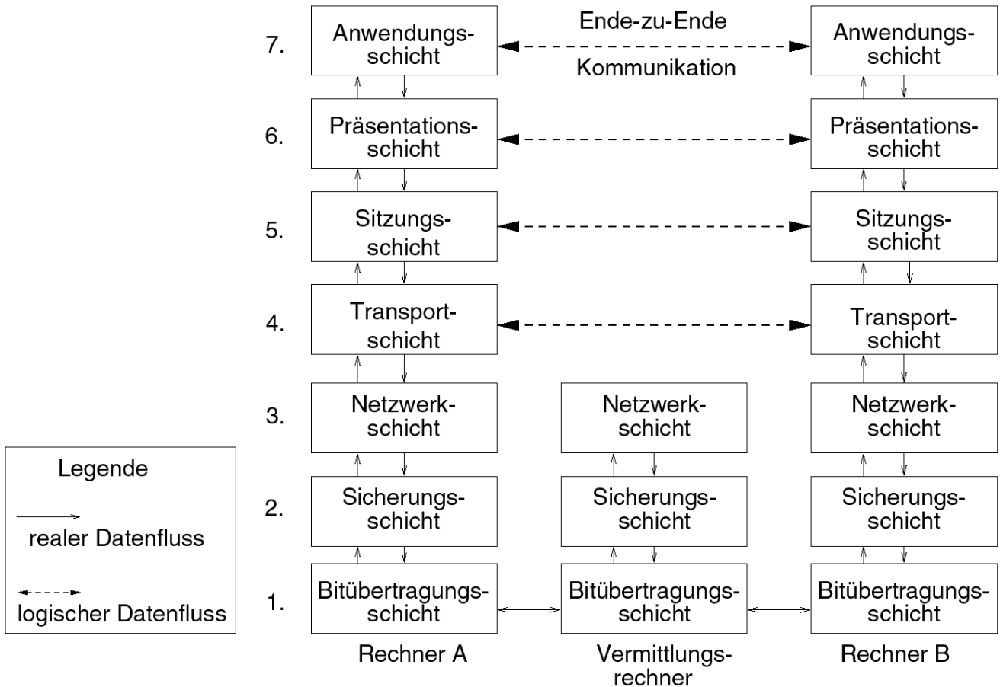
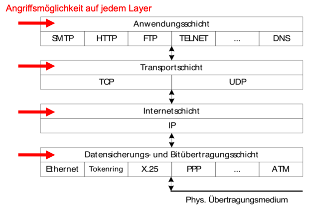

# ISich, Informationssicherheit, INF-P-IN008, BE1, HS20/21

- [ISich, Informationssicherheit, INF-P-IN008, BE1, HS20/21](#isich--informationssicherheit--inf-p-in008--be1--hs20-21)
  * [1 Einführung in die Informationssicherheit und Sicherheitskonzepte](#1-einf-hrung-in-die-informationssicherheit-und-sicherheitskonzepte)
      - [Lernziele](#lernziele)
      - [Vorbereitung](#vorbereitung)
      - [Präsenz](#pr-senz)
          + [CIA](#cia)
      - [Nachbearbeitung](#nachbearbeitung)
        * [Distributed Denial of Service (DDoS)](#distributed-denial-of-service--ddos-)
          + [Angriff](#angriff)
  * [2 Anwendungssicherheit](#2-anwendungssicherheit)
      - [Lernziele](#lernziele-1)
      - [Vorbereitung](#vorbereitung-1)
        * [OWASP](#owasp)
          + [OWASP Top10](#owasp-top10)
          + [Example Attack Scenarios](#example-attack-scenarios)
          + [Aufgabe: Übung Analyse Webanwendung (ca. 2h)](#aufgabe---bung-analyse-webanwendung--ca-2h-)
        * [Kapitel 3 und 4 IT-Sicherheit](#kapitel-3-und-4-it-sicherheit)
          + [ISO/OSI-Modell](#iso-osi-modell)
          + [Das TCP/IP-Referenzmodell](#das-tcp-ip-referenzmodell)
          + [Well-Known Ports](#well-known-ports)
          + [NAT-Tabelle](#nat-tabelle)
        * [Sicherheitsprobleme](#sicherheitsprobleme)
        * [IP](#ip)
          + [Vertraulichkeit, Integrität und Verbindlichkeit](#vertraulichkeit--integrit-t-und-verbindlichkeit)
          + [ICMP](#icmp)
          + [ARP](#arp)
          + [UDP und TCP](#udp-und-tcp)
          + [Netzdiensten](#netzdiensten)
          + [DNS - Domain Name Service](#dns---domain-name-service)
        * [Security Engineering](#security-engineering)
        * [Phasen](#phasen)
        * [Schutzbedarfsermittlung](#schutzbedarfsermittlung)
          + [Szenarios](#szenarios)
        * [Bedrohungsmatrix](#bedrohungsmatrix)
        * [Bedrohungsbaum](#bedrohungsbaum)
        * [Risikoanalyse](#risikoanalyse)
        * [Penetrationstests](#penetrationstests)
        * [Sicherheitsgrundfunktionen](#sicherheitsgrundfunktionen)
        * [SDL - Security Development Lifecycle](#sdl---security-development-lifecycle)
          + [Entwicklungsphasen](#entwicklungsphasen)
          + [Bedrohungs- und Risikoanalyse](#bedrohungs--und-risikoanalyse)
      - [Präsenz](#pr-senz-1)
        * [OWASP](#owasp-1)
          + [OWASP Top 10 2010 -> 2013 -> 2017](#owasp-top-10-2010----2013----2017)
      - [Injection](#injection)
      - [Cross Site Scripting](#cross-site-scripting)
      - [Cross Site Request Forgery](#cross-site-request-forgery)
      - [Sichere Anwendungsentwicklung](#sichere-anwendungsentwicklung)
      - [Security Development Life Cycle](#security-development-life-cycle)
      - [Nachbearbeitung](#nachbearbeitung-1)
        * [Buffer Overflow](#buffer-overflow)
  * [3 Kryptographie](#3-kryptographie)
      - [Lernziele](#lernziele-2)
      - [Vorbereitung](#vorbereitung-2)
        * [Leitsatz](#leitsatz)
        * [Definition](#definition)
        * [Sicherheitsziele](#sicherheitsziele)
        * [Krypto-Puzzle](#krypto-puzzle)
        * [Grobe Gegnerkathegorien](#grobe-gegnerkathegorien)
        * [Angriffe](#angriffe)
        * [Verschlüsselung](#verschl-sselung)
        * [Authentizierwert anhängen](#authentizierwert-anh-ngen)
        * [Verfahren](#verfahren)
        * [Codierungen](#codierungen)
        * [Hashfunktionen](#hashfunktionen)
        * [Hybride Verschlüsserlung](#hybride-verschl-sserlung)
        * [Symmetrische Verfahren](#symmetrische-verfahren)
        * [Blockchiffren](#blockchiffren)
        * [Stromchiffren](#stromchiffren)
        * [Asymmetrische Verfahren](#asymmetrische-verfahren)
        * [RSA](#rsa)
        * [Blockchiffren im Blockmodus](#blockchiffren-im-blockmodus)
        * [ECB-Modus (Electronic Codebook) für mehrere Blöcke](#ecb-modus--electronic-codebook--f-r-mehrere-bl-cke)
        * [CBC-Modus (Cipher Block Chaining) für mehrere Blöcke](#cbc-modus--cipher-block-chaining--f-r-mehrere-bl-cke)
      - [Präsenz](#pr-senz-2)
      - [Nachbearbeitung](#nachbearbeitung-2)
  * [4 Identity- und Accessmanagement](#4-identity--und-accessmanagement)
      - [Lernziele](#lernziele-3)
      - [Vorbereitung](#vorbereitung-3)
      - [Präsenz](#pr-senz-3)
  * [5 Netzwerk- und Systemsicherheit](#5-netzwerk--und-systemsicherheit)
      - [Lernziele](#lernziele-4)
      - [Vorbereitung](#vorbereitung-4)
      - [Präsenz](#pr-senz-4)
      - [Nachbearbeitung](#nachbearbeitung-3)

---
## 1 Einführung in die Informationssicherheit und Sicherheitskonzepte

#### Lernziele

- Ich lerne die Grundbegriffe und -konzepte der Informationssicherheit kennen und weiss um aktuelle Bedrohungen.
- Ich kann mich in der Umgebung für die HackingTool Übungen bewegen. 
- Ich weiss, wie der OpenVPN Zugriff funktioniert und kann diesen für eine sichere Anmeldung verwenden.

#### Vorbereitung

- [Lektion1 Vorbereitung](links/Lektion1 Vorbereitung 2019-20.pdf)

- Lehrbuch C. Eckert: Kapitel 1. Sie erhalten in diesem Kapitel eine erste  Einführung und Übersicht über die IT Sicherheit als Vorbereitung zur PVA.
    - Notizen:
      
      
- Optional - Lehrbuch C. Eckert: Lesen Sie Kapitel 2. Sie vertiefen bei persönlichem Interesse das in der vorherigen PVA besprochene Wissen über die Grundlagen der IT Sicherheit.
    - Notizen:

#### Präsenz

- Wo wird wie angegriffen?

- **Wieso Sicherheit?**
    - Vertraulichkeit
    - Integrität
    - Verfügbarkeit
    
Informationen und die sie unterstützenden Prozesse, Systeme und
Netzwerke sind wichtige Geschäftswerte. Ihre Vertraulichkeit, Integrität und Verfügbarkeit können wesentlich zur Erhaltung von Wettbewerbsvorsprung, Liquidität, Rentabilität, Einhaltung gesetzlicher Vorschriften und Geschäftsansehen beitragen.

Informationssicherheit schützt Informationen vor einer Vielzahl von
Bedrohungen. Sie soll die Aufrechterhaltung des Geschäftsbetriebs gewährleisten, geschäftsschädigende Einflüsse niedrig halten sowie die Investitionsrentabilität und die Geschäftsgelegenheiten maximieren.

[Verizon Data Breach Report](https://enterprise.verizon.com/de-de/resources/reports/dbir/) 

- Wieviel Security ist nötig?

Aufwand und Ertrag

- Es gibt keine absolute Sicherheit 
- IT Security soll die Werte der Firma schützen: "So viel wie nötig, so wenig wie möglich"
- Das ISMS hilft, diese Balance zu finden und zu erhalten

Nachhaltigkeit

- "Aufräumaktionen" In unregelmässigen Abständen verursachen grosse Kosten und Unruhe ohne dass die Risiken angemessen erkannt und managed werden.

- Das ISMS ermöglicht nachhaltige, messbare Sicherheit.

Es werden generell nur Investitionen gemacht wenn das Risiko sinkt - Sägezahncompliance (Bild links)

Bedrohungspyramide

- [Beispiel ATP Case Ruag](https://www.melani.admin.ch/melani/de/home/dokumentation/berichte/fachberichte/technical-report_apt_case_ruag.html)

Grundsätze

- IT-Sicherheit ist kein Selbstzweck, sondern dient immer einem übergeordneten Ziel (Unterstützung eines Geschäftsprozesses oder Wahrung der Privatsphäre).

- Es gibt keine 100% Sicherheit, aber es gibt eine für ein Problem angemessene Sicherheit. Diese muss für jedes Projekt / jede Anwendung / jede Firma individuell bestimmt werden.

- Sicherheit muss einfach sein und soll den Benutzer (möglichst) nicht behindern.

- Sicherheit ist eine Kette und nur so stark wie ihr schwächstes Glied. 

###### CIA

- **Schutzziele**

- Grundsätze:
    - IT-Sicherheit ist kein Selbstzweck, sondern dient immer einem übergeordneten Ziel (Unterstützung eines Geschäftsprozesses ider Wahrung der Privatsphäre).
    - Es gibt keine 100% Sicherheit, aber es gibt eine für ein Problem abgemessene SIcherheti. Diese muss für jedes Projekt / jede Anwendung / jede Firma individuell bestimmt werden.
    - Sicherheit soll einfach sein und soll den Benutzer möglichst nicht behindern.
    - Sicherheit ist eine Kette und nur so stark wie ihr schwächstes Glied.
    
- Confidentiality (Vertraulichkeit)
    - Vertraulichkeit bedeutet: Daten vor unbefugtem Zugriff zu schützen.
        - Need to know Prinzip
        - Zugriffsberechtigungen
        - Datenverschlüsselung (Kryptographie)
        - Daten verstecken (Steganographie)
        
- Integrity (Integrität)
    - Integrität besagt, dass Daten über einen bestimmten Zeitraum vollständig und unverändert sein müssen.
        - Dazu müssen die Daten vor Verlust und nicht autorisierter Veränderung geschützt werden.
        - Integrität kann mit kryptographisch gesichterten Prüfsummen geprüft/bewiesen werden (Hash).
        
- Availability (Verfügbarkeit)
    - Die Verfügbarkeit stellt sicher, dass ein berechtigter Benutzer zu dem Zeitpunkt auf eine Information zugreifen kann, zu der er sie braucht.
        - Gemessen wir sie wie folgt:
        
        
        
        - Eine Verfügbarkeit von 99.99% entspricht dabei einer jährichen Ausfallzeit von ca. 1h.
    
Verwandte Begriffe

- Authentizität: Echtheit und Glaubwürdigkeit einer Person oder eines Dienstes müssen überprüfbar sein.
- Nachvollziehbarkeit: Handlungen von Benutzern oder Systemen müssen aufgezeichnet werden (Logging).
- Zurechenbarkeit (Accountability): „Eine durchgeführte Handlung kann einem Kommunikationspartner eindeutig zugeordnet werden.“
- Verbindlichkeit/Nichtabstreitbarkeit (Non-Repudiation): Sie erfordert, dass „kein unzulässiges Abstreiten durchgeführter Handlungen“ möglich ist. Sie ist unter anderem wichtig beim elektronischen Abschluss von Verträgen. Erreichbar ist sie beispielsweise durch elektronische Signaturen.
- Nicht-Anfechtbarkeit: der Nachweis, dass eine Nachricht versendet und empfangen worden ist.
    
- Risikoanalyse
    
    
    
- Ressourcen
    - Unter Ressourcen verstehen wir im Rahmen des IT Security Risikomanagements schützenswerte Objekte.
        - Beispiele:
            - Mitarbeiter
            - Daten des Unternehmens
            - Hardware / Infrastruktur des Unternehmens
            - Uneingeschränkte Verfügbarkeit der IT Services
    
- Gefährdung
    - Gefahr (engl. danger): Zustand oder Vorgang, der zu Schaden (materiell oder immateriell) für Mensch, Umwelt oder Sachgüter (Werte) führen kann.
    - Gefährdung ist die Gefahr, die auf ein bestimmtes Objekt bezogen wird.
    - Ein Akteur, der eine Schwachstelle ausnutzt führt zu einer Gefährdung einer Ressource und kann diese beschädigen.
    
- Schwachstelle
    - Schwachstellen sind Fehler in einer Software oder einem Prozess, welche von einem Akteur ausgnutzt werden kann.
        - Eine Schwachstelle kann technischer Art sein (z.B. eine fehlende Input Validierung).
        - Eine Schwachstelle kann aber auch in einem Prozess liegen. Fehlt z.B. das Vier-Augen-Prinzip bei dem Abschluss von Verträgen, kann dies eine Schwachstelle darstellen.
        - Die Gutgläubigkeit der Menschen kann eine Schwachstelle sein (Stichwort: Social Engineering).
        - **Input Validierung** z.B. SQL Injection
    
- Bedrohung
    - Eine Bedrohung ist eine Aktion oder Ereignis, das die Sicherheit gefährdet und bei Eintreten das korrekte Funktionieren eines Systems verunmöglicht.
        - Bedrohungen wirken gegen eine der Hauptsäulen der Sicherheit (Verfügbarkeit, Vertraulichkeit, Integrität)
        - Eine Bedrohung selbst führt noch zu keinem Schaden, erst wenn ein Akteur (Threat Agent) tätigt wird und eine Schwachstelle ausnutzt, kann dies der Fall sein.
    
- Risiko
    - Das Risiko ist die Bewertung der 
      
    Kette -> Bedrohung -> Schwachstelle -> Gefährdung -> Ressource 
      
    nach Eintretenswahrscheindlichkeit und Schadensausmass.
    
    - Risiko = Eintretenswahrscheindlichkeit x Schadensausmass
    - Eintretenswahrscheindlichkeit: Wie häufig tritt ein Ereignis in einem bestimmten Zeitraum ein oder wie lange ist der Zeitraum zwischen zwei Ereignissen.
    - Schadensausmass: Was passiert mit einer Ressource, wenn ein Ereignis eintritt?
    - In der Regel nimmt man für beide Werte die schwersten Ausprägungen an.
    
- Risikomanagement
    
    
    
    - Risiken sollen so verwaltet werden, dass sie möglichst nicht im inakzeptablen Bereich liegen. In der Praxis lässt sich das Schadensausmass oft nicht verringern, weshalb das Risiko meist durch Reduktion der Eintrittswahrscheindlichkeit verringert wird. Dazu werden mitigierende Kontrollen definiert.
        - Regelmässig sind alle Risiken und die mitigierenden Massnahmen neu zu bewerten um sicherzustellen, dass das Risiko noch im akzeptablen Bereich liegt.
    
- Umgang mit Risiken
    - Mögliche Strategien im Umgang mit Risiken:
        - Eliminieren
            - Durch geeignete Massnahmen die Eintretenswahrscheindlichkeit auf Null senken.
        - Überwälzen
            - Das Risiko wird versichert, bzw. auf einen anderen Marktteilnehmer übertragen (z.B. mittels AGB).
        - Reduzieren (Mitigieren)
            - Das Schadensausmass wird durch geeignete Massnahmen reduziert.
        - Akzeptieren
            - Das Risiko wird als geschäftsnotwendig akzeptiert, laufend überwacht und regelmässig neu bewertet.

- **ISMS**
    
    - [ISMS](https://en.wikipedia.org/wiki/Information_security_management)
    
Information security management system

- Hier muss im Management die Wahrnehmung von den Geführungen eingebracht werden um Mittel gesprochen zu bekommen.

- IT-Governance ist die Verantwortung von Führungskräften und Aufsichtsräten und besteht aus Führung, Organisationsstrukturen und Prozessen, die sicherstellen, dass die Unternehmens-IT dazu beiträgt, die Organisationsstrategie und –ziele zu erreichen und zu erweitern.

- Definition

    - Verfahren und Regeln innerhalb einer Unternehmung um die Informationssicherheit nachhaltig zu
        - definieren
        - zu steuern 
        - zu kontrollieren und aufrecht zu erhalten
    
    - Grundziele einer unternehmens- bez. Behördenweiten Informationssicherheit:
        - Dauerhafte Erfüllung der Anforderungen 
        - Nachhaltige Begrenzung der Risiken

Vorteile eines ISMS

- Basis für eine systematische, wirtschaftliche und nachhaltige Informationssicherheit im Unternehmen.
- Ermöglicht die kontinuierliche Verbesserung.
- Nachvollziehbare Konformität mit den IS-Zielen und -Politik und unterstützt die Erreichung der Geschäftsziele.
- Erhöhtes Vertrauen und Zufriedenheit der verschiedenen Stakeholder (Geschäftspartner, Kunden, Lieferanten) und Shareholder. 
- Steigert Rentabilität (Ausfallreduzierung, Wiederanlauf nach Sicherheitsvorfällen).
- Unterstützt die Wettbewerbsfähigkeit des Unternehmens (gezielte Investitionen in Sicherheit).

Minimale Anforderungen

- Eine Security Policy, welche vom Management aktiv unterstützt wird. n Eine nachvollziehbare Auswahl von Controls.
- Key Performance Indikatoren zur Messung von Erfüllung und Fortschritten bezüglich Zielen.
- Ein dokumentiertes Risikomanagement, bei welchem Risiken erfasst, dokumentiert, gemildert und die Restrisiken akzeptiert werden.
- Regelmässige Überprüfung der Compliance.

Kritische Erfolgsfaktoren

- Offenkundige Unterstützung und Engagement seitens der Geschäftsführung. n Sicherheitspolitik, -ziele und -aktivitäten als Ausdruck der Geschäftsziele.
- Implementierung von Sicherheit in Übereinstimmung mit der

Organisationskultur.

- Eingehende Kenntnis der Sicherheitsanforderungen, der Risikoanalyse und des Risikomanagements.
- Verteilung von Richtlinien über Informationssicherheitspolitik und Normen an alle Angestellte und Auftragnehmer.
- Schulung und effektives Marketing von Sicherheit gegenüber allen Managern und Mitarbeitern.
- Messsystem zur Leistungsbeurteilung der ISMS und zum Feedback von Verbesserungsvorschlägen.
  
Sicherheitspyramide

Akteure und Verantwortlichkeiten

|Geschäftsleitung |Gesamtverantwortung |
|---|---|
| Risk Control | Definiert 'Risk Appetite' der Firma Erstellt IT Security Policy Genehmigt IT Standards Prüft Arbeit des Risk Managements
| Risk Management | Erlässt Standards im Rahmen der IT Security Policy Genehmigt Security Procedures Prüft Arbeit des Security Managements
| Security Management (CISO) | Verantwortlich für IT Security Tagesgeschäft Erlässt Security Procedures im Rahmen der Standards Kontrolliert Einhaltung der Richtlinien
| Spezialisten | Betreiben IT im Rahmen der Vorgaben durch Policy, Stanrdards und Procedures

Chief Information Security Officer

- Aufgaben des Chief Information Security Officers (CISO):
    - Erarbeitung und Definition der sicherheitsrelevanten Objekte, der Bedrohungen und Risiken und den daraus abgeleiteten Sicherheitszielen.
    - Aufbau und Betrieb einer Organisationseinheit zur Umsetzung der Sicherheitsziele. n Definition und Implementierung der nötigen Prozesse für die Informationssicherheit. n Ausarbeitung der Sicherheitskonzepte und Sicherheitsvorschriften.
    - Audit der Funktionseinheiten zum Stand der Umsetzung und Weiterenwicklung der Sicherheitsvorschriften.
    - Bewusstsein der Mitarbeiter durch Trainings und Kampagnen schaffen.
    - Ressourcen und Budget für den Aufbau und den Betrieb des ISMS bestimmen.
    - Zertifizierung: CISM (www.isaca.org).

Linienorganisation

Projektorganisation

Demi Cycle

Plan -> Do -> Check -> Act -> Plan

Plan

- Die nötigen Dokumente wie Sicherheitspolitik (Security Policy), Ziele, Vorgaben, Prozesse und Controls werden definiert.
- Im Zentrum steht das Management der Risiken sowie die kontinuierliche Verbesserung der Sicherheit.
- Das ISMS muss sich an den Vorgaben und (Geschäfts-)Zielen der Firma ausrichten.

Do

- Die Sicherheitspolitik muss zum Leben erweckt werden. n Controls müssen eingeführt werden.
- Controls müssen betrieben werden.
- Die Prozesse und Tätigkeiten werden gelebt.

Check

- Die Leistungsfähigkeit der Prozesse wird gegen die Sicherheitspolitik und die Ziele der Firma geprüft und bewertet.
- Dazu gibt es Prozessmessungen (KPI) sowie Prüfungen und Audits.
- Die Ergebnisse werden dem Management zum Review vorgelegt.

Act

- Die Firma beschliesst korrigierende und präventive Massnahmen, welche auf den Resultaten der Check Phase beruhen.
- Das Ziel ist es, das ISMS und die damit verbundenen Prozesse kontinuierlich zu verbessern und dadurch die Sicherheit zu erhöhen

Verschiedene Regulatorien

- Gesetze und Normen wie Basel II / III 
- Rundbrief der Bankenkommission
- Sarbanes-Oxley Act (SOX) n EuroSox
- Umsetzung Datenschutz (DSG und VDSG) 
- Aufbewahrungspflichten (GebüV) 
- Branchenspezifische Anforderungen und interne Anforderungen 
- Governance, Risk and Compliance (GRC)

ISMS: Standards

Standards

- Die gängigsten Methoden, Best-Practices und Standards unterscheiden sich nicht gross bezüglich der Ausgestaltung des Sicherheitsprozesses und der Verantwortlichkeiten des Managements, jedoch in der Auswahl der Massnahmen und der Risikobewertung.
- BSI (Bundesamt für Sicherheit in der Informationstechnik) n COBIT
- ISO 27001

ISO 27001

- ISO/IEC 27001 beschreibt wie die physische, die technische, die organisatorische und die personelle Sicherheit umgesetzt werden kann.
- ISO/IEC 27001 ist ein Management Prozess und KEINE technische Anleitung.
- ISO/IEC 27001 ist eine „MUSS Vorgabe“, sie muss zwingend umgesetzt werden, um eine Zertifizierung zu erhalten.
- Der zentrale Punkt ist die kontinuierliche Selbst-Verbesserung einer Unternehmung (Deming Cycle), welche akzeptiert, dass eine umfassende Sicherheit nicht durch ein einmaliges Projekt geschaffen und schon gar nicht erhalten werden kann.
- Das bedeutet, dass mit der Einführung von ISO/IEC 27001 die Sicherheit KEINEN Sprung nach vorne machen wird, dass aber der Grundstein für eine Entwicklung in die richtige Richtung gelegt wird.

#### Nachbearbeitung

- **Aufgabe:**
    - Erarbeiten eines Konzepts und Präsentation zum Thema DDOS. Diskutieren Sie mögliche Probleme im Moodle Modulforum (1 Thread pro Gruppe).

##### Distributed Denial of Service (DDoS)

Bei der Distributed Denial of Service (DDos) Attake, handelt es sich um einen gezielten Angriff auf eine Webseite oder einen zur Verfügung gestellten Dienst über eine vielzahl von Geräten (Devices). Das Ziel ist es, die Verfügbarkeit der Webseite oder des Dienstes zu stören. Ein solcher Angriff kann wirtschaftliche Folgen haben. Dabei werden die Geräte oft "ferngesteuert" und als sogenannte Bots bezeichnet. Das Netz dieser Geräte wird als Botnetz bezeichnet. Botnetze können im Dark Web bereits für kleinere Beträge gemietet werden. Die Geräte werden meist über einen Trojaner oder ein Wurm "infiziert" welcher eine Verbindung zu einem zentralen Server herstellt. Neuere Bots verbinden sich über Peer-to-Peer mit anderen Bots. Über die Bots kann weitere Malware (z.B. Keylogger, etc.) verbreitet werden.

Ein DDos-Angrriff hat zum ziel, eine Webseite mit Anfragen (Requests) zu "bombardieren", so dass die Webseite nicht mehr aufgeruffen werden kann bzw. unter der Last der Anfragen zusammenbricht.

###### Angriff

####### Detektion

Symptome einer DDoS Attacke sind

* Hoher Ressourcen verbrauch
* Lange Antwortzeiten

####### Verhinderung

Folgende Massnahmen können DDoS-Angriffe nicht komplett verhindern aber erschweren.

* Sichere Kennwörter für Router, Netzwerke und vernetzte Geräte IoT
* Filtern von ungültigen Adressen
* Sperrlisten bzw. wo möglich Allow-Listen
* Inteligente Firewalls mit DDoS-Erkennung
* Nur die wirklich benötigten Dienste aktivieren und nur die absolut notwendigen Netzwerkports öffnen.
* Einsatz von Intrusion Detection Systemen (IDS)
* Systeme "härten" (*Hardening*)
* Aktuelle Patchlevel für OS und Software

######## Reaktion

Reaktion (oder Gegenmassnahmen) können sein:

* Protokollieren des Angriffs (Netflows, Server-Logs, Application-Logs, Mailverkehr mit den Erpressern, etc.).
* Minimale Kommunikationskanäle gegen aussen offen halten (statischer Webauftritt), Kunde Informieren und alternative Kontaktmöglichkeiten bieten (Telefon, Fax, E-Mail)
* Angriff analysieren.

---
## 2 Anwendungssicherheit

#### Lernziele

- Ich kenne typische Bedrohungen und Massnahmen im Bereich sicherer Programmierung.
- Ich kann Praxisbeispiele von typischen Attacken nennen und die richtigen Massnahmen treffen.
- Ich kann eine Webanwendung auf die gängigen Schwachstellen hin prüfen und weiss, welche Gegenmassnahmen wirksam sind.
- Ich kann ein kleines Team von Anwendungsentwicklern beraten, um die häufigsten Lücken in der Programmierung zu vermeiden.
- Ich kenne A1, A3, A4 und A8 aus den OWASP Top 10 (2013) und kann die Angriffe sowie Gegenmassnahmen erklären.
- Ich kenne die Neuerungen von OWASP Top 10 (2013) zur Vorgängerversion 2010.

#### Vorbereitung

##### OWASP
>Um der steigenden Bedeutung der Sicherheit von Web-Anwendungen für die Sicherheit von Unternehmen Rechnung zu tragen, wurde das OWASP-Projekt (Open Web Application Security Project) initiiert. OWASP ist eine Vereinigung von Firmen und Organisationen, wie Sun Microsystems, IBM, Swiss Federal Institute of Technology oder auch British Telecom, die das Ziel haben, die Sicherheit von Web-Anwendungen zu verbessern. Mit den OWASP Top-Ten stellt das Konsortium ein Dokument zur Verfügung, das einen Überblick über die wichtigsten Schwachstellen und Angriffe auf Web-Anwendungen umfasst und ca. alle drei Jahre aktualisiert wird. Das Dokument wird durch Sicherheitsexperten aus aller Welt erstellt. Seit 2008 gelten die Top-Ten sogar als offizielle Vorgaben für den Payment Card Industry (PCI) Data Security Standard, so dass bei Code Reviews nachgewiesen werden muss, dass geeignete Maßnahmen zur Abwehr der in den Top-Ten gelisteten Schwachstellen und Verwundbarkeiten getroffen wurden. Im November 2017 lag ein noch nicht verabschiedeter Request for Comments vor (siehe https://github.com/OWASP/Top10/). Nachfolgend gehen wir auf ausgewählte Schwachstellen, die über die Zeit nicht an Aktualität verloren haben, etwas näher ein.

###### OWASP Top10

- A1 – Injection
    >Injection flaws, such as SQL, OS, and LDAP injection occur when untrusted data is sent to an interpreter as part of a command or query. The attacker’s hostile data can trick the interpreter into executing unintended commands or accessing data without proper authorization.
    
- A2 – Broken Authentication and Session Management
    >Application functions related to authentication and session management are often not implemented correctly, allowing attackers to compromise passwords, keys, or session tokens, or to exploit other implementation flaws to assume other users’ identities.

- A3 – Cross-Site Scripting (XSS)
    >XSS flaws occur whenever an application takes untrusted data and sends it to a web browser without proper validation or escaping. XSS allows attackers to execute scripts in the victim’s browser which can hijack user sessions, deface web sites, or redirect the user to malicious sites.

- A4 – Insecure Direct Object References
    >A direct object reference occurs when a developer exposes a reference to an internal implementation object, such as a file, directory, or database key. Without an access control check or other protection, attackers can manipulate these references to access unauthorized data.

- A5 – Security Misconfiguration
    >Good security requires having a secure configuration defined and deployed for the application, frameworks, application server, web server, database server, and platform. Secure settings should be defined, implemented, and maintained, as defaults are often insecure. Additionally, software should be kept up to date.

- A6 – Sensitive Data Exposure
    >Many web applications do not properly protect sensitive data, such as credit cards, tax IDs, and authentication credentials. Attackers may steal or modify such weakly protected data to conduct credit card fraud, identity theft, or other crimes. Sensitive data deserves extra protection such as encryption at rest or in transit, as well as special precautions when exchanged with the browser.

- A7 – Missing Function Level Access Control
    >Most web applications verify function level access rights before making that functionality visible in the UI. However, applications need to perform the same access control checks on the server when each function is accessed. If requests are not verified, attackers will be able to forge requests in order to access functionality without proper authorization.

- A8 - Cross-Site Request Forgery (CSRF)
    >A CSRF attack forces a logged-on victim’s browser to send a forged HTTP request, including the victim’s session cookie and any other automatically included authentication information, to a vulnerable web application. This allows the attacker to force the victim’s browser to generate requests the vulnerable application thinks are legitimate requests from the victim.

- A9 - Using Components with Known Vulnerabilities
    >Components, such as libraries, frameworks, and other software modules, almost always run with full privileges. If a vulnerable component is exploited, such an attack can facilitate serious data loss or server takeover. Applications using components with known vulnerabilities may undermine application defenses and enable a range of possible attacks and impacts.

- A10 – Unvalidated Redirects and Forwards
    >Web applications frequently redirect and forward users to other pages and websites, and use untrusted data to determine the destination pages. Without proper validation, attackers can redirect victims to phishing or malware sites, or use forwards to access unauthorized pages.

Diese zwei Fragen sollte man sich dazu stellen:

**Am I Vulnerable To XYZ?**

**How Do I Prevent XYZ?**

###### Example Attack Scenarios

- A1 – Injection

    - Scenario #1: The application uses untrusted data in the construction of the following vulnerable SQL call:
        - String query = "SELECT * FROM accounts WHERE custID='" + request.getParameter("id") + "'";
    
    - Scenario #2: Similarly, an application’s blind trust in frameworks may result in queries that are still vulnerable, (e.g., Hibernate Query Language (HQL)):
        - Query HQLQuery = session.createQuery(“FROM accounts WHERE custID='“ + request.getParameter("id") + "'");
    
    - In both cases, the attacker modifies the ‘id’ parameter value in her browser to send: ' or '1'='1. For example: http://example.com/app/accountView?id=' or '1'='1 This changes the meaning of both queries to return all the records from the accounts table. More dangerous attacks could modify data or even invoke stored procedures.

- A2 – Broken Authentication and Session Management "Hijacking"

    - Scenario #1: Airline reservations application supports URL rewriting, putting session IDs in the URL:
        - http://example.com/sale/saleitems;jsessionid= 2P0OC2JSNDLPSKHCJUN2JV?dest=Hawaii

    - An authenticated user of the site wants to let his friends know about the sale. He e-mails the above link without knowing he is also giving away his session ID. When his friends use the link they will use his session and credit card.

    - Scenario #2: Application’s timeouts aren’t set properly. User uses a public computer to access site. Instead of selecting “logout” the user simply closes the browser tab and walks away. Attacker uses the same browser an hour later, and that browser is still authenticated.

    - Scenario #3: Insider or external attacker gains access to the system’s password database. User passwords are not properly hashed, exposing every users’ password to the attacker.

- A3 – Cross-Site Scripting (XSS)

    - The application uses untrusted data in the construction of the following HTML snippet without validation or escaping:
    
        - (String) page += "<input name='creditcard' type='TEXT‘ value='" + request.getParameter("CC") + "'>";
    
    - The attacker modifies the ‘CC’ parameter in his browser to:
    
        - '>\'.
    
    - This causes the victim’s session ID to be sent to the attacker’s website, allowing the attacker to hijack the user’s current session.
    
    - Note that attackers can also use XSS to defeat any automated CSRF defense the application might employ. See A8 for info on CSRF.

- A4 – Insecure Direct Object References

    - The application uses unverified data in a SQL call that is accessing account information:

        - String query = "SELECT * FROM accts WHERE account = ?"; 
        
        - PreparedStatement pstmt = connection.prepareStatement(query , … );
    
        - pstmt.setString( 1, request.getParameter("acct"));
        
        - ResultSet results = pstmt.executeQuery( );
    
    - The attacker simply modifies the ‘acct’ parameter in her browser to send whatever account number she wants. If not properly verified, the attacker can access any user’s account, instead of only the intended customer’s account.
        
        - http://example.com/app/accountInfo?acct=notmyacct

- A5 – Security Misconfiguration

    - Scenario #1: The app server admin console is automatically installed and not removed. Default accounts aren’t changed. Attacker discovers the standard admin pages are on your server, logs in with default passwords, and takes over.
    
    - Scenario #2: Directory listing is not disabled on your server. Attacker discovers she can simply list directories to find any file. Attacker finds and downloads all your compiled Java classes, which she decompiles and reverse engineers to get all your custom code. She then finds a serious access control flaw in your application.
    
    - Scenario #3: App server configuration allows stack traces to be returned to users, potentially exposing underlying flaws. Attackers love the extra information error messages provide.
    
    - Scenario #4: App server comes with sample applications that are not removed from your production server. Said sample applications have well known security flaws attackers can use to compromise your server.

- A6 – Sensitive Data Exposure

    - Scenario #1: An application encrypts credit card numbers in a database using automatic database encryption. However, this means it also decrypts this data automatically when retrieved, allowing an SQL injection flaw to retrieve credit card numbers in clear text. The system should have encrypted the credit card numbers using a public key, and only allowed back-end applications to decrypt them with the private key.
    
    - Scenario #2: A site simply doesn’t use SSL for all authenticated pages. Attacker simply monitors network traffic (like an open wireless network), and steals the user’s session cookie. Attacker then replays this cookie and hijacks the user’s session, accessing the user’s private data.
    
    - Scenario #3: The password database uses unsalted hashes to store everyone’s passwords. A file upload flaw allows an attacker to retrieve the password file. All of the unsalted hashes can be exposed with a rainbow table of precalculated hashes.

- A7 – Missing Function Level Access Control

    - Scenario #1: The attacker simply force browses to target URLs. The following URLs require authentication. Admin rights are also required for access to the “admin_getappInfo” page.
    
        - http://example.com/app/getappInfo
    
        - http://example.com/app/admin_getappInfo
    
    - If an unauthenticated user can access either page, that’s a flaw. If an authenticated, non-admin, user is allowed to access the “admin_getappInfo” page, this is also a flaw, and may lead the attacker to more improperly protected admin pages.

    - Scenario #2: A page provides an ‘action ‘parameter to specify the function being invoked, and different actions require different roles. If these roles aren’t enforced, that’s a flaw.

- A8 - Cross-Site Request Forgery (CSRF)

    - The application allows a user to submit a state changing request that does not include anything secret. For example:
    
        - http://example.com/app/transferFunds?amount=1500 &destinationAccount=4673243243
    
    - So, the attacker constructs a request that will transfer money from the victim’s account to the attacker’s account, and then embeds this attack in an image request or iframe stored on various sites under the attacker’s control:
    
        - 
    
    - If the victim visits any of the attacker’s sites while already authenticated to example.com, these forged requests will automatically include the user’s session info, authorizing the attacker’s request.

- A9 - Using Components with Known Vulnerabilities

    - Component vulnerabilities can cause almost any type of risk imaginable, ranging from the trivial to sophisticated malware designed to target a specific organization. Components almost always run with the full privilege of the application, so flaws in any component can be serious, The following two vulnerable components were downloaded 22m times in 2011.
    
        - Apache CXF Authentication Bypass
            – By failing to provide an identity token, attackers could invoke any web service with full permission. (Apache CXF is a services framework, not to be confused with the Apache Application Server.)
    
        - Spring Remote Code Execution
            – Abuse of the Expression Language implementation in Spring allowed attackers to execute arbitrary code, effectively taking over the server.
    
    - Every application using either of these vulnerable libraries is vulnerable to attack as both of these components are directly accessible by application users. Other vulnerable libraries, used deeper in an application, may be harder to exploit.

- A10 – Unvalidated Redirects and Forwards

    - Scenario #1: The application has a page called “redirect.jsp” which takes a single parameter named “url”. The attacker crafts a malicious URL that redirects users to a malicious site that performs phishing and installs malware.
    
        - http://www.example.com/redirect.jsp?url=evil.com
    
    - Scenario #2: The application uses forwards to route requests between different parts of the site. To facilitate this, some pages use a parameter to indicate where the user should be sent if a transaction is successful. In this case, the attacker crafts a URL that will pass the application’s access control check and then forwards the attacker to administrative functionality for which the attacker isn’t authorized.
    
        - http://www.example.com/boring.jsp?fwd=admin.jsp

###### Aufgabe: Übung Analyse Webanwendung (ca. 2h)

- Sie sind Sicherheitsverantwortlicher bei einem IT-Dienstleister, der für Krankenkassen ein Webportal entwickelt, mit dem diese Patientendossiers verwalten können. Kunden können sich einloggen und Rechnungen für die Rückerstattung einreichen.

    - Machen Sie eine kurze Schutzbedarfsanalyse dieser Daten und begründen Sie Ihre Einstufung mit einigen kurzen Sätzen.
    - Nennen Sie 3 typische Bedrohungen, welche auf eine Webanwendung wirken. Beschreiben Sie die Bedrohungen kurz in ein, zwei Sätzen.
    - Nennen Sie 2 technische und 2 organisatorische Massnahmen, die dabei helfen, die Webanwendung zu schützen. Erklären Sie, welche Massnahme gegen welche Bedrohung wirkt.

Diese Aufgabe wird nicht bewertet. Sie ist bis zum Vortag der PVA abzuschliessen.
Es erfolgt ein Feedback während der PVA.

##### Kapitel 3 und 4 IT-Sicherheit

###### ISO/OSI-Modell

- **Bitübertragung**
    >Als unterste Schicht im OSI-Modell findet sich die physikalische Bit-übertragungsschicht (engl. physical layer). Ihre Aufgabe besteht in der Herstellung einer physikalischen Verbindung zwischen zwei direkt verbundenen Kommunikationspunkten und in der Übertragung der Bitströme. Die physikalische Schicht legt die Charakteristika der physischen Verbindung fest wie die Spannung oder Voltzahl, die zur Repräsentation von 1 und 0 benötigt werden. Darüber hinaus wird für die Netzkomponenten die Anzahl der Pins und deren Funktion definiert, der Verbindungsauf- und -abbau wird spezifiziert und der Umgang mit unterschiedlichen Transportmedien wie Koaxialkabel, Lichtwellenleiter oder Funkverbindungen wird geregelt.

- **Datensicherung**
    >Die Sicherungsschicht (engl. data link layer) bündelt Bitströme der unteren Ebene zu Datenpaketen (engl. frames) bzw. teilt die Pakete der darüber liegenden Ebene auf Datenpakete auf und fügt Kontrollinformationen in Form von Prüfsummen hinzu, um Übertragungsfehler erkennen zu können. Die Datenframes werden sequentiell übertragen. Zu den Aufgaben dieser Schicht gehört der Einsatz fehlererkennender bzw. fehlerkorrigierender Codes (z.B. Cyclic Redundancy Checks (CRC)) zur Erkennung und Behebung von Übertragungsfehlern sowie die Behandlung beschädigter, duplizierter oder verloren gegangener Frames. Darüber hinaus legt die Schicht Protokolle zur Regelung des Medienzugangs fest (u.a. CSMA/CD für das Ethernet) und reguliert den Nachrichtenfluss zwischen Sender und Empfänger (u.a. mittels Sliding Window-Verfahren).

- **Vermittlung**
    >Die Netzwerk- oder Vermittlungsschicht (engl. network layer) verknüpft und kontrolliert Teilnetze. Im Gegensatz zu den niedrigeren Ebenen, die nur eine Verbindung mit benachbarten Maschinen aufnehmen können, errichtet die Vermittlungsschicht eine Ende-zu-Ende Kommunikation zwischen Kommunikationspartnern, die nicht direkt benachbart sein müssen. Die Vermittlungsschicht bietet Protokolle an, sie es ermöglichen, dass Teilnetze mit unterschiedlichen Adressierungsschemata, unterschiedlichen Paketgrößen oder auch mit heterogenen Protokollen miteinander kommunizieren können. Eine wesentliche Aufgabe besteht darin, für die zu transportierenden Pakete einen günstigen Weg auszuwählen (engl. routing). Mittels Routingprotokollen werden ankommende Pakete an Knotenrechner im Netz weitergeleitet. Solche Wege können über Tabellen statisch festgelegt sein, oder sie können beim Verbindungsaufbau dynamisch bestimmt bzw. für jedes übertragene Paket, abhängig von der aktuellen Netzbelastung, dynamisch neu ermittelt werden. Zu den Aufgaben dieser Schicht gehört auch, Stausituationen zu erkennen und zu beheben (engl. congestion control). Schließlich ist die Vermittlungsschicht auch für die Erstellung von Abrechnungen zuständig. Das heißt, dass Abrechnungsfunktionen definiert sind, die die übertragenen Paketzahlen, Bits oder Zeichen protokollieren und in Rechnung stellen.

- **Transport**
    >Die Transportschicht (engl. transport layer) übernimmt die Aufgabe, für jeden Verbindungswunsch der höheren Ebene eine Verbindung zwischen den Endsystemen zu etablieren. Abhängig vom Datenaufkommen und der Netzbelastung kann pro Verbindungswunsch eine eigene logische Verbindung aufgebaut oder zur Reduktion der Kosten können mehrere Verbindungen im Multiplexbetrieb auf einen Kanal gebündelt werden. Die Transportschicht ermöglicht eine Ende-zu-Ende Kommunikation zwischen einzelnen Prozessen bzw. Diensten auf den jeweiligen Endsystemen. Daneben realisiert sie in der Regel ein zuverlässiges, paketorientiertes Ende-zu-Ende Protokoll. Das bedeutet, dass das Protokoll die Daten der darüber liegenden Ebene auf Pakete aufteilt und sicherstellt, dass alle Pakete in der richtigen Reihenfolge beim Empfänger ankommen und jedes empfangene Paket quittiert wird. Des Weiteren hat diese Schicht die Aufgabe, eine Flusssteuerung für die Verbindungen durchzuführen. Dazu gehört die Verhinderung von Pufferüberläufen auf der Empfängerseite, indem die Senderate reguliert wird.

- **Sitzung**
    >Die Sitzungsschicht (engl. session layer) koordiniert und synchronisiert die Kommunikation zwischen Anwendungsprozessen und trifft Vorkehrungen für ein Wiederaufsetzen unterbrochener Sitzungen. Dazu integriert sie Informationen über Sicherungspunkte (engl. checkpoint) in den Nachrichtenstrom, so dass bei einer Verbindungsunterbrechung ein Dialog, z.B. ein komplexer Dateitransfer, bei einem dieser Sicherungspunkte wieder aufgesetzt werden kann.

- **Präsentation**
    >Da in einem Rechnernetz unterschiedliche Datenformate existieren, übernimmt die Darstellungsschicht (engl. presentation layer) die Aufgabe, die Daten der Anwendungsschicht, also die maschinenabhängigen Repräsentationen, in ein netzeinheitliches Format umzuwandeln. Im Gegensatz zu den unteren Schichten, die vordringlich reine Transportaufgaben durchführen, ohne die Nachrichteninhalte zu interpretieren, beschäftigt sich diese Schicht mit Syntax und Semantik der übertragenen Informationen. Zur Beschreibung der hierzu eingesetzten Transfersyntax werden Sprachen definiert wie ASN.1 (Abstract Syntax Notation No 1). Weitere Aufgaben der Informationsrepräsentation betreffen die Datenkompression oder die Datenverschlüsselung, die häufig auf dieser Schicht angesiedelt werden.

- **Anwendung**
    >Die Anwendungsschicht (engl. application layer) stellt schließlich eine Vielzahl von Protokollen zur Verfügung, die Dienste für Benutzer erbringen wie SMTP zum Versenden von Electronic Mails, FTP für den Dateitransfer bzw. Dateizugriff auf entfernte Rechner oder HTTP für den Zugriff auf Web-Objekte.

###### Das TCP/IP-Referenzmodell

- IP-Header

###### Well-Known Ports

| Port | Protokoll | Dienst |
| ---- | ---- | ---- |
| 21 | TCP | ftp |
| 25 | TCP | smtp |
| 79 | TCP | finger |
| 80 | TCP | http |
| 88 | UDP | kerberos |
| 513 | TCP | rlogin |
| 514 | TCP | shell |
| 2049 | UDP | NFS | 

###### NAT-Tabelle

##### Sicherheitsprobleme

##### IP

- Spoofing: Maskierung als anderer Rechner.
- DoS: Denial of Service
    - DDoS: Distributed Denial of Service
    - Trinoo, Tribe Flood Network (TFN) und Stacheldraht
- UDP-flood
- SYN-flood-Angriff : [Beispiel](http://cr.yp.to/syncookies.html)
- Smurf-Angriff

###### Vertraulichkeit, Integrität und Verbindlichkeit

- **Vertraulichkeit**
    >Weder die Nutzdaten noch die Verwaltungsdaten (Headerdaten) eines IP- Pakets werden vor der Übertragung verschlüsselt. Das bedeutet, dass auf allen Kommunikationsverbindungen sowie in allen Vermittlungsstellen diese Daten im Klartext vorliegen. Nutzdaten können z.B. vertrauliche Passwörter, die für ein entferntes Login benötigt werden47, vertrauliche Firmendaten oder personenbezogene, vertrauliche Daten beinhalten; sie werden vor unautorisiertem Lesen nicht geschützt. Die Offenlegung aller Verkehrsdaten kann von Angreifern für die Durchführung von Verkehrsflussanalysen ausgenutzt werden. Das bedeutet, dass anhand der Sende- und Empfangsadressen Zugriffs- und Kommunikationsprofile erstellbar sind. Anonymität wird somit ebenfalls nicht gewährleistet. 

- **Integrität**
    >Das Internet-Protokoll stellt auch keine Mechanismen wie Hashfunktionen oder Message Authentication Codes zur Überprüfung der Integrität der übertragenen Nutzdaten zur Verfügung, so dass es dem Empfänger eines Nachrichtenpaketes nicht möglich ist, unautorisierte Modifikationen zu erkennen und Maßnahmen zur Abwehr der daraus resultierenden Angriffe zu ergreifen. Die in den Standardprotokollen verwendeten Prüfsummenverfahren wie CRC dienen zur Erkennung von Bitübertragungsfehlern, sind aber ungeeignet, gezielte Manipulationen zu erkennen, da ein Angreifer mit den manipulierten Daten auch deren korrekte Prüfsumme berechnen und in das Datenpaket integrieren kann.
 
- **Verbindlichkeit**
    >Die Identifikation der Kommunikationspartner erfolgt anhand der in den IP-Paketen eingetragenen, jedoch nicht fälschungssicheren IP-Adressen. Weitere Maßnahmen, wie digitale Signaturen, um transferierte Daten den absendenden Prozessen bzw. Benutzern zuzuordnen, werden nicht ergriffen. Das hat zur Konsequenz, dass IP-basierte Aktionen ohne zusätzliche Maßnahmen nicht verbindlich sind.
Bedrohungen der Vertraulichkeit, Integrität und Verfügbarkeit des IP-Protokolls gehen auch von den so genannten Routing-Angriffen aus, auf die wir im Folgenden noch kurz eingehen.
 

**Routing-Angriffe**

- **Strict Source**
    >Zur Wegewahl werden Routing-Protokolle benutzt, wobei der festgelegte Wegmeistens ein symmetrischer ist, d.h. Antworten vom Zielrechner werden auf dem gleichen Weg an den Sender zurückgeleitet. Wie bereits erwähnt, lassen sich über das Optionsfeld eines IP-Pakets diverse Zusatzfunktionen aktivieren. Angriffspunkte bieten die Optionen Loose Source Routing oder das Strict Source Routing, da damit die Route festlegbar ist, die IP-Pakete durch das Netzwerk nehmen sollen. Beim Strict Source Routing muss der Sender aber die IP-Adressen, über die das Paket geschickt werden soll, in der richtigen Reihenfolge in das IP-Paket eintragen. Das heißt, dass zwei Rechner, die in der angegebenen Folge hintereinander stehen, auch direkt miteinander verbunden sein müssen. Dies erfordert vom Angreifer Kenntnisse über die Netzinfrastruktur.

- **Loose Source**
    >Das Loose Source Routing ermöglicht dem Angreifer, explizit einen Pfad zum Zielrechner anzugeben, ohne dass die Rechner auf diesem Pfad direkt miteinander verbunden sein müssen. Der Angreifer kann also seinen eigenen Rechnernamen in diesen Vermittlungspfad aufnehmen lassen. Das hat zur Folge, dass die Antworten auf diesem Pfad zurückgesendet werden müssen und der Angreifer die Möglichkeit hat, alle gesendeten Pakete zu beobachten und zu analysieren (z.B. extrahieren von Klartext-Passwörtern). Um derartige Angriffe zu verhindern, weisen viele Router ankommende Pakete mit aktivierten Source routing-Optionen zurück, ohne sie zu bearbeiten.

- **RIP**
    >Weiterhin sind auch Angriffe zu nennen, die das Routing Information Protocol (RIP) ausnutzen. Das RIP wird eingesetzt, um Routing-Informationen in einem Netzwerk zu propagieren. Typischerweise überprüfen die Empfänger diese Informationen nicht. Auf diesem Weg ist es einem Angreifer möglich, die Kommunikation zweier Maschinen an eine spezifische Zielmaschine umzuleiten. Dies geschieht, indem der Angreifer X einen Rechner A simuliert und manipulierte RIP Pakete an die anzugreifende Maschine B sowie an die zwischen X und A liegenden Gateways schickt. Über die RIP-Pakete werden sowohl B als auch die Gateways aufgefordert, jedes Paket von B, das eigentlich an A gerichtet ist, zum Rechner X zu senden. Nachdem der Angreifer die Pakete ausgewertet hat, sendet er sie weiter an den eigentlichen Empfänger A. Aktiviert der Angreifer zusätzlich noch die Option Source Routing, so kann er erreichen, dass auch die Antwortpakete von A zu B über den Angreifer X umgeleitet werden. Um RIP-Angriffen zu begegnen, müssen Router so konfiguriert werden, dass Änderungen der bestehenden Wegewahl nicht oder nur unter speziellen Randbedingungen möglich sind.
 

- Das IP-Protokoll umfasst zwei Protokolle, die aus Sicherheitssicht von Bedeutung sind, da sie Ausgangspunkt von vielen Angriffen im Internet sind. Es handelt sich dabei zum einen um das ICMP (Internet Control Message Protocol) und zum anderen um das bereits angesprochene Address Resolution Protocol (ARP). Auf Sicherheitsprobleme im Zusammenhang mit diesen beiden Protokollen wird im Folgenden kurz eingegangen.

###### ICMP
>Das Internet Control Message Protocol (ICMP) ist für die Übermittlung von Fehler- und Statusmeldungen zuständig. ICMP-Fehlermeldungen in- formieren u.a. über die Nichterreichbarkeit von Empfängern (destination unreachable) oder fordern zum Fragmentieren von Paketen auf (fragmentation needed), falls das übermittelte Paket zu groß war. Statusmeldungen betreffen die Verfügbarkeit von Verbindungen oder von Maschinen. Erkennt die Netzwerkschicht eines Routers eine Stausituation in einem Teilnetz, so sendet sie eine ICMP-redirect Nachricht an die an das Teilnetz angeschlossenen Router. Damit werden diese aufgefordert, die überlasteten Verbindungen zu vermeiden und stattdessen die in der Nachricht angegebenen Wege zu wählen. Mittels einer ICMP-source quench Nachricht können aber auch direkt die Verursacher eines Staus, also die Sender, beeinflusst werden. Eine solche Nachricht fordert den Sender zum Drosseln seines Nachrichtenversands auf. Informationen über den Status einer spezifischen Maschine erhält man u.a. mittels der ping-Nachricht.

- Angriffe zum Abbruch von Verbindungen
- Angriffe zur Erhöhung der Netzlast
- Dedizierte Denial-of-Service Angriffe
    - Source quench
    - Ping-to-Death
- Gezieltes Umleiten von Paketen
    - Redirect
    
###### ARP
>Wie bereits erklärt, unterscheidet man zwischen der physikalischen Adresse eines Rechners und seiner logischen Adresse. Die physikalische Adresse oder Maschinenadresse ist i.d.R. eine auf dem Netzwerk-Controller als Firmware permanent abgespeicherte Adresse, während logische Adressen IP-Adressen oder Domänennamen sind. IP-Adressen oder auch die Domänennamen sind für den Aufbau flexibler Adressierungstrukturen wesentlich besser geeignet als die starren physikalischen Adressen. Ein Netzwerktreiber ist jedoch nicht in der Lage, einen Rechner über dessen logische Adresse anzusprechen, sondern benötigt dafür stets die physikalische Adresse. Da in den IP-Paketen aber nur die Sender- bzw. Empfänger IP-Adressen enthalten sind, ist ein Protokoll erforderlich, das die notwendige Abbildung bewerkstelligt. Dies ist die Aufgabe des Address Resolution Protocols (ARP). Dazu verwaltet jeder Rechner eine ARP-Adresstabelle in Form eines Schnellzugriffspeichers (engl. cache). Ein Cache-Eintrag enthält eine IP-Adresse mit der ihr zugeordneten physikalischen MAC-Adresse. Falls bei der Adressabbildung die benötigte Information nicht im Cache zugreifbar ist, wird über einen Broadcast an alle Rechner des Netzsegments eine ARP-Request Nachricht verschickt. Erkennt ein Rechner in diesem Broadcast seine eigene IP-Adresse, so schickt er dem anfragenden Rechner seine MAC-Adresse in einer ARP-Reply Nachricht zurück und der Anfrager aktualisiert damit seine Cache-Einträge.

- ARP-Cache-Poisoning
    - Maskierung
    
- Denial-of-Service-Angriffe
    - Broadcast-Sturm

###### UDP und TCP

- Sequenznummerangriff unter TCP
- Verbindungsübernahme
    - Session Hijacking
    - desynchronisieren

###### Netzdiensten
>Die Anwendungsschicht der Internet-Protokollfamilie umfasst eine große Anzahl von Protokollen und Diensten, die hier nicht alle behandelt werden können. Im Folgenden beschränken wir uns auf einige bekannte Dienste, die kurz vorgestellt und deren Sicherheitsrisiken erläutert werden. Ausführlichere Abhandlungen finden sich unter anderem in [67]. Aufgrund der steigenden Bedeutung von Sicherheitsproblemen Web-basierter Anwendungen, wird dieser Aspekt in Abschnitt 3.5 separat behandelt.

- Sniffer
    - Replay

###### DNS - Domain Name Service
> Der Domain Name Service (DNS) ist ein verteilter Namensdienst, der die Aufgabe hat, symbolische Namen (DNS-Namen) auf IP-Adressen abzubilden und umgekehrt, zu einer IP-Adresse den zugehörigen DNS-Namen zu ermitteln. Die logischen Teilnetze des Internet sind hierarchisch in so genannten Domänen strukturiert. Domänen der obersten Ebene sind zweistellige Ländercodes oder Kürzel, wie com, de, edu. Die logische Struktur kann sich von der physikalischen Adressstruktur unterscheiden, so dass man von einem logischen Rechnernamen nicht unbedingt auf dessen Standort schließen kann. Ein Rechner mit dem Namen server.sec.informatik.tu-muenchen.de kann sich beispielsweise an beliebigen Orten innerhalb oder außerhalb Münchens befinden. Durch diese Flexibilität des Adressschemas ist es möglich, Dienste transparent für Benutzer zu verlagern oder auch für einen Knoten mehrere dienstspezifische Namen, wie ftp.sec.informatik.tu-muenchen.de für den Datei-Transfer und www.sec.informatik.tu-muenchen.defür den WWW-Zugriff, zu vergeben.

- DNS-Spoofing
- DNS-Cache-Poisoning

##### Security Engineering

##### Phasen

- BSI-Sicherheitsprozess

##### Schutzbedarfsermittlung

Kategorien	Erläuterung
niedrig bis mittel	Die Schadensauswirkungen sind begrenzt und überschaubar.
hoch	Die Schadensauswirkungen können beträchtlich sein.
sehr hoch	Die Schadensauswirkungen können ein existentiell bedrohliches, katastrophales Ausmaß annehmen.

###### Szenarios

Gesetze

- Schadensszenario 1: Verstoß gegen Gesetze/Vorschriften/Verträge

    - Vorschriften
    
        - Relevante Vorschriften sind Verwaltungsvorschriften, Verordnungen und Dienstvorschriften.
     
    - Verträge
    
        - Verträge sind unter anderem Dienstleistungsverträge im Bereich Datenverarbeitung oder auch Verträge zur Wahrung von Betriebsgeheimnissen.

Selbstbestimmungsrecht

- Schadensszenario 2: Beeinträchtigung des informationellen Selbstbestimmungsrechts
 
Unversehrtheit

- Schadensszenario 3: Beeinträchtigung der persönlichen Unversehrtheit
 
Aufgabenerfüllung

- Schadensszenario 4: Beeinträchtigung der Aufgabenerfüllung
 
Negative Auswirkungen

- Schadensszenario 5: negative Auswirkungen 

Finanzielle Auswirkungen

- Schadensszenario 6: finanzielle Auswirkungen

##### Bedrohungsmatrix
>Bei dieser Vorgehensweise klassifiziert man zunächst die Gefährdungsbereiche; sie bilden die Zeilen der Matrix. Eine mögliche Klassifikation von Gefährdungsbereichen, die die wichtigsten Problembereiche abdeckt, ist die folgende:

1.Bedrohungen durch externe Angriffe:
Externe Bedrohungen ergeben sich durch Aktionen eines Angreifers, die er ohne die Hilfe des bedrohten technischen Systems durchführt. Zu den externen Bedrohungen zählen physische Zerstörung von Systemkomponenten sowie Diebstahl von Ressourcen wie beispielsweise von Magnetbändern, Festplatten oder ganzen Geräten wie Notebooks und Smartphones. 

Interne Angriffe
2.Bedrohungen der Datenintegrität und der Informationsvertraulichkeit:
Unter diesen Problembereich fallen Angriffe, die gezielt versuchen, interne Kontrollen zu umgehen oder Schutzmechanismen unwirksam zu machen. Beispiele hierfür sind direkte Zugriffe auf Speichermedien unter Umgehung der Zugriffskontrolle des zugrunde liegenden Betriebssystems oder die Verwendung verdeckter Informationskanäle, um vertrauliche Informationen auszutauschen. 

Denial-of-Service
3.Bedrohungen der Verfügbarkeit und der Ressourcennutzung:
Bedrohungen dieses Gefährdungsbereichs betreffen die unautorisierte Ressourcennutzung wie beispielsweise den Zugriff auf teure Ein/Ausgabegeräte oder die Nutzung von Rechenkapazität, bzw. die eine „normale“ Ressourcenbelegung übersteigende Nutzung von Ressourcen.

Abstreiten
4.Abstreiten durchgeführter Aktionen:
Die Bedrohungen dieser Gefährdungsklasse betreffen zum einen den Bereich der Abrechnung genutzter Ressourcen wie Speicher, E/A-Geräteoder CPU-Zeit. Zum anderen betreffen sie die Abrechnung in Anspruch genommener Dienste und die daraus resultierenden rechtsverbindlichen, vertraglichen Folgen, wie das Durchführen von Banktransaktionen oder das Abwickeln elektronischer Einkäufe.

Rechtemissbrauch
5.Missbrauch erteilter Berechtigungen:
Bedrohungen dieser Klasse treten auf, wenn ein autorisierter Benutzer die ihm erteilten Berechtigungen und das in ihn gesetzte Vertrauen missbraucht, indem er zum Beispiel Daten gezielt manipuliert.

Auslöser
Die Spalten einer Bedrohungsmatrix werden durch die potentiellen Auslöser von Bedrohungen definiert. Hierunter fallen die Systemadministratoren bzw. Operatoren, die Programmierer, die System- oder Anwendungssoftware erstellen, Benutzer, die intern oder über externe Medien auf das System zugreifen. Auslöser können ferner die verwendeten Dienste, Protokolle und Ausführungsumgebungen wie zum Beispiel E-Mail-Dienste, die TCP/IP-Protokollfamilie oder die Java Virtual Machine (JVM) zur Ausführung von Java-Applets sein.
In die Matrix trägt man potentielle Angriffsszenarien ein. Ein Auszug einer solchen Matrix ist mit Tabelle 4.2 gegeben. In den Tabelleneinträgen sind jedoch nur Beispiele für Bedrohungen festgehalten.”

##### Bedrohungsbaum

- Textuelle Darstellung

- Ziel: Maskierung bei Ausführung der Authentifikationsprozedur
    - ODER
    - Subziel 1: lokaler Login
        - UND
        - Subziel 1.1: korrekter Login
            - ODER	
            - Subziel 1.1.1: Authentifikation ist nicht gefordert
            - Subziel 1.1.2: ohne Authentifikation
                - UND 
                - 1.1.2.1: Erlangen des Authentifikationstokens
                - 1.1.2.2: Erlangen der Authentifikationsdaten
            - Subziel 1.2: Besitz des mobilen Gerätes
            - ODER 
            - Stehlen	
                - Bedrohen des Besitzers
                - Erpressen
                - Subziel 1.2.1: Inbesitznahme des Gerätes
                - ODER
                    - verlorenes Gerät
                    - unbeaufsichtigtes Gerät
                    - überlassenes Gerät  
    - Subziel 2: entfernter Login
    - ...

##### Risikoanalyse

Sei S die Schadenshöhe (das Schadensaus maß) und E die Eintrittswahrscheinlichkeit. Dann ergibt sich ein quantitativer Wert für das Risiko durch R = S ∗ E.

##### Penetrationstests

- Typische Penetrationstests umfassen:
    - Angriffe durch Erraten von Passwörtern oder Wörterbuchattacken,
    - Angriffe durch Aufzeichnen und Manipulieren des Netzverkehrs,
    - Angriffe durch Einspielen gefälschter Datenpakete oder
    - Angriffe durch Ausnutzen bekannter Software-Schwachstellen (Makro-Sprachen, Betriebssystemfehler, Remote-Dienste etc.).

- Vorgehensweise
    - Ein Penetrationstest durchläuft typischerweise mehrere Schritte, die im Folgenden skizziert werden.
    - Zunächst erfolgt i.d.R. eine Recherche im Internet, um frei zugängliche Informationen über den Untersuchungsgegenstand, wie die Menge der erreichbaren IP-Adressen, zu ermitteln.
    - Mittels Portscannern oder ähnlichen Analyse-Tools werden die von dem Zielsystem angebotenen Dienste, bzw. die geöffneten Ports ermittelt, die Rückschlüsse darauf zulassen, welche Anwendungen und Dienste an diese Ports gekoppelt sein könnten.
    - Im nächsten Schritt wird versucht, mittels Fingerprinting-Methoden Informationen über das verwendete Betriebssystem, dessen Version, über den verwendeten Internet-Browser, die zugrunde liegende Hardware und auch über sonstige Anwendungen, die auf dem Zielsystem installiert sind, in Erfahrung zu bringen.
    - Unter Rückgriff auf das Expertenwissen in Schwachstellendatenbanken wird dann versucht, Schwachstellen, die über die auf dem Zielsystem installierte Betriebs- und Anwendungssoftware bekannt sind, zu identifizieren.
    - Es wird dann versucht, derart identifizierte Schwachstellen auszunutzen, um systematisch unberechtigten Zugriff auf das Zielsystem zu erlangen oder um weitere Angriffe vorzubereiten.

##### Sicherheitsgrundfunktionen

- Identifikation und Authentifikation
    - Identität
    - Authentifikation
    - Fehlerbehandlung
    
- Rechteverwaltung
    - Vergabe
    - Wahrnehmung
    
- Rechteprüfung
    - Zugriffskontrolle
        - Beispiele für solche Ausweise sind das File Handle unter NFS, der File-Descriptor in Unix Systemen oder der Object-Handle in Windows-Betriebssystemen.
    - Ausnahme

- Beweissicherung
    - Beweissicherung
    - Forensik

- Wiederaufbereitung
    - gemeinsame Betriebsmittel

- Gewährleistung der Funktionalität
    - Verfügbarkeit
    

##### SDL - Security Development Lifecycle

###### Entwicklungsphasen

###### Bedrohungs- und Risikoanalyse

- In der Anforderungsphase (1) erfolgt die Identifikation der Sicherheitsanforderungen und Schutzziele der zu erstellenden Software und deren Schnittstelle zu und sichere Interoperation mit vorhandenen Softwareprodukten.

- In der Entwurfsphase (2) werden im Sinne einer Trusted Computing Base diejenigen Komponenten identifiziert, die für die Sicherheit grundlegend sind. Zusätzlich wird die Software-Architektur definiert (z.B. Schichtenarchitektur mit Verfeinerungsschritten). In dieser Phase erfolgt auch eine Bedrohungs- und Risikomodellierung gemäß der STRIDE und DREAD-Methodik (s.u.).

- In der Implementierungsphase (3) werden Tools und Test-Methoden zur Vermeidung von Sicherheitsschwachstellen eingesetzt, sowie Code-Reviews durchgeführt. Beispiele für verwendete Tools sind die von Microsoft entwickelten Werkzeuge PREfix, PREfast und Fuzzingtools zum Testen von APIs mittels gezielt konstruierter, ungültiger Eingaben.

- In der Überprüfungsphase (4) (Verification) liegt die Software mit vollem Funktionsumfang vor und es beginnen die Beta-Tests mit Benutzern. Gleichzeitig wird eine systematische Suche nach Sicherheitsmängeln (genannt Security Push) mittels erneuter Code-Reviews und Sicherheitstests (Pen-Testing) durchgeführt.

- In der Veröffentlichungsphase (5) (Release) durchläuft die Software eine abschließende Sicherheitsüberprüfung (FSR, Final Security Review), um zu klären, ob sie reif ist, an den Kunden ausgeliefert zu werden. In dieser Phase werden u.a. auch Penetrationstests durchgeführt.

- Um während der Lebenszeit (6) der ausgelieferten Produkte in der Lage zu sein, auf neu entdeckte Fehler und Schwachstellen schnell und umfassend reagieren zu können, muss ein Prozess definiert sein, der festlegt, wie Berichte über Schwachstellen auszuwerten sind und wie darauf reagiert wird, zum Beispiel durch eine Veröffentlichung der Schwachstelle, durch eine Aktualisierung der Tools zur Codeanalyse oder durch einen erneuten Code-Review.

- [Beispiel STRIDE / DREAD](https://docs.microsoft.com/de-de/previous-versions/technical-content/cc405496(v=msdn.10)?redirectedfrom=MSDN)

- **STRIDE**

    
       
    - Spoofing Identity
    - Tampering with Data
    - Repudiation
    - Information Disclosure
    - Denial of Service
    - Elevation of Privilege

- STRIDE ist ein Acronym und steht für Spoofing Identity, Tampering with Data, Repudiation, Information Disclosure, Denial of Service und Elevation of Privilege. Das bedeutet, dass mit dem STRIDE Ansatz versucht wird, Angriffe, die diesen Angriffsklassen zuzurechnen sind, zu identifizieren, zu bewerten und geeignete Maßnahmen zur Abwehr der Angriffe festzulegen. Bei der Angriffsklasse, die auf die Veränderung von Daten abzielt (Tampering with Data), fokussiert der Ansatz vordringlich auf Angriffe zur Veränderung persistent gespeicherter Daten, wie Passwörter oder Log-Dateien, sowie auf Angriffe auf die Integrität von Datenpaketen, die über Netze übertragen werden. Repudiation-Angriffe umfassen beispielsweise nicht durchgeführte Bestellungen. Eine unberechtigte Informationsweitergabe (Information Disclosure) ist beispielsweise ein unautorisierter Datenbank-Zugriff oder aber auch der Zugriff und die Weitergabe von lokalen Daten. Zu den Angriffen mit dem Ziel, die eigenen Berechtigungen zu erhöhen (Elevation of Privileges), zählen u.a. Buffer-Overflow- oder auch SQL-Injection-Angriffe.

- **DREAD**

    
       
    - Damage (Schadens-) potenzial: Wie groß ist der Schaden, wenn die Sicherheitslücke ausgenutzt wird?
    - Reproducibility (Reproduzierbarkeit): Wie leicht kann der Angriff reproduziert werden?
    - Exploitability (Ausnutzbarkeit): Wie leicht kann ein Angriff gestartet werden?
    - Affected (betroffene) Benutzer: Wie viele Benutzer können ungefähr betroffen sein (Angabe in Prozent)?
    - Discoverability (Auffindbarkeit): Wie leicht kann die Sicherheitslücke aufgefunden werden?

- Die qualifizierte Risikobewertung inklusive der Priorisierung der iden- tifizierten Bedrohungen erfolgt anschließend mittels der so genannten DREAD-Methode. DREAD steht für die Kriterien Damage, Reproducibility, Exploitability, Affected und Discoverability. Mit dem Kriterium des Schadenspotentials (Damage) versucht man den Schaden zu qualifizieren, der durch das Ausnutzen der Lücke entstehen könnte, die durch die Bedrohungsanalyse identifiziert wurde. Mit Reproduzierbarkeit bewertet man den Schwierigkeitsgrad zur Reproduktion des Angriffs und die Ausnutzbarkeit bewertet die Schwierigkeit, einen entsprechenden Angriff durchzuführen. Das Kriterium Affected gibt eine qualitative Einschätzung wie groß der Kreis der potentiell betroffenen Benutzer ist und die Auffindbarkeit qualifiziert den Schwierigkeitsgrad, mit dem die Sicherheitslücke aufgedeckt werden kann.

#### Präsenz

- Diskussion: Angriffe auf Anwendungen generell
- Präsentation: OWASP Top 10: Was ist OWASP, wer steht dahinter?
- Diskussion: Wie kann OWASP in der Anwendungsentwicklung eingesetzt werden?
- Lehrgespräch: Eckpunkte einer sicheren Anwendungsentwicklung
- Präsentation: Schwachstellenprüfung bei Webanwendungen
- Vorlesung: Vertiefte Betrachtung von A1(Injection Lücken), A3 (Cross Site Scripting) und A8 (Cross Site Request Forgery)
- Aufgabe und anschliessende Präsentationen: OWASP Bedrohungen A1, A3, A8 anhand entsprechender Übungen.
- Didaktischer Puffer: Fragerunde/Diskussionsrunde zur PVA und bereits gestellter Übungsaufgaben in den Räumlichkeiten der FFHS bis zum planmässigen Ende der PVA. 

####TCP/IP Schichtenmodell

####Wieso ist die Anwendungssicherheit so wichtig?

####SQL Injection

##### OWASP

- Wer/Was ist OWASP?
    - The Open Web Application Security Project® (OWASP) is a nonprofit foundation that works to improve the security of software. Through community-led open source software projects, hundreds of local chapters worldwide, tens of thousands of members, and leading educational and training conferences, the OWASP Foundation is the source for developers and technologists to secure the web.

OWASP bedeutet Open Web Application Security Project. Es ist eine gemeinnützige Organisation, welche viele Hilfestellungen zur Entwicklung von sicheren Webanwendungen publiziert hat.

- OWASP Top 10 Verwundbarkeiten 
- OWASP Guidelines 
- APIs wie AntiSamy und ESAPI 
- Tools wie WebGoat und WebScarab

#####Methodology

###### OWASP Top 10 2010 -> 2013 -> 2017

Es kehren einige Risiken aus vor 2010 wieder zurück. In der heutigen Technik werden viele Schichten und Frameworks dazwischen geschalten. Daher werden viele Möglichkeiten

Was ist das?
Was kann man dagegen tun?

https://owasp.org/www-project-top-ten/#
https://wiki.owasp.org/index.php/Category:Attack

#### Injection

[Wikipedia](https://en.wikipedia.org/wiki/SQL_injection)

- Ist die Anwendung verwundbar?
- Eine Anwendung ist für diesen Angriff verwundbar, wenn:
    - Daten, die vom Nutzer stammen, nicht ausreichend validiert, gefiltert oder durch geeignete Sanitizer-Funktionen laufen.
    - Dynamische Anfragen oder nicht-parametrisierte Aufrufe ohne ein dem Kontext (SQL, LDAP, XML usw.) entsprechendes Escaping direkt einem Interpreter übergeben werden.
    - Bösartige Daten innerhalb von ORM („Objekt Relationales Mapping“)-Suchparametern genutzt werden können, um vertrauliche Datensätze eines Dritten zu extrahieren.
    - Bösartige Daten direkt oder als Teil zusammengesetzter dynamischer SQL-Querys, Befehle oder Stored Procedures genutzt werden können.
- Injection ist u.a. bei der Verwendung von SQL, NoSQL, ORMFrameworks, Betriebssystem-Kommandos, LDAP, Expression Language (EL) , Object Graph Navigation Language (OGNL) oder XML zu finden. Das Grundkonzept eines Injection-Angriffs ist für alle Interpreter gleich. Ein Quellcode Review ist eine sehr gute Methode, um Injection-Schwachstellen zu finden, dicht gefolgt vom gründlichen (ggf. automatisierten) Testen aller Parameter und Variablen wie z.B. Eingabe -Felder und Header-, URL-, Cookies-, JSON-, SOAP- und XML-Eingaben. Statische (SAST, Quellcode-Ebene) und dynamische (DAST, laufende Anwendung) Test-Werkzeuge können von Organisationen für ihre CI/CD-Pipeline genutzt werden, um neue Schwachstellen noch vor einer möglichen Produktivnahme aufzuspüren.

- Wie kann ich das verhindern?
- Um Injection zu verhindern, müssen Eingabedaten und Kommandos (bzw. Querys) konsequent getrennt bleiben.
    -  Die besten Methoden dafür sind entweder eine sichere API, die die direkte Interpreter-Nutzung vollständig vermeidet, bzw. die eine parametrisierte, typgebundene Schnittstelle anbietet oder die korrekte Verwendung eines ORM-Frameworks. Anmerkung: Stored Procedures können - auch parametrisiert immer noch SQL-Injection ermöglichen, wenn PL/SQL oder T-SQL Anfragen und Eingabedaten konkateniert oder mit EXECUTE IMMEDIATE oder exec() ausgeführt werden.
    -  Für die serverseitige Eingabe-Validierung empfiehlt sich die Nutzung eines Positivlisten(“Whitelist”)-Ansatzes. Dies ist i.A. kein vollständiger Schutz, da viele Anwendungen Sonder - und Meta-Zeichen z.B. für Textfelder oder Mobile Apps benötigen.
    -  Für jede noch verbliebene dynamische Query müssen Sonder und Meta-Zeichen für den jeweiligen Interpreter mit der richtigen Escape-Syntax entschärft werden.
- Anmerkung: Ein Escaping von SQL-Bezeichnern, wie z.B. die Namen von Tabellen oder Spalten usw. ist nicht möglich.

- Falls Nutzer solche Bezeichner selbst eingeben können, so ist dies durchaus gefährlich. Dies ist eine übliche Schwachstelle bei Software, die Reports aus einer Datenbank erstellt.
    - Querys sollten LIMIT oder andere SQL-Controls verwenden, um den möglichen Massen-Abfluss von Daten zu verhindern.

#### Cross Site Scripting

[Wikipedia](https://en.wikipedia.org/wiki/Cross-Site-Scripting)

- Ist die Anwendung verwundbar?

- Es gibt drei Formen von XSS, die üblicherweise auf die Browser des Benutzers abzielen:
    - Reflektiertes XSS:
        - Die Anwendung oder API beinhaltet ungeprüfte und nicht maskierte Nutzereingaben ( Escaping) als Teil des HTML-Outputs. Ein erfolgreicher Angriff erlaubt es einem Angreifer, beliebiges HTML und JavaScript im Browser des Opfers auszuführen. Typischerweise wird ein Anwender dazu einen schädlichen Link aufrufen müssen, der auf eine vom Angreifer kontrollierte Seite zeigt, z.B. infizierte populäre Websites (Watering-Hole), Werbung oder vergleichbares.
    - Persistentes XSS:
        - Die Anwendung oder API speichert unbereinigten Nutzer-Input der zu einem späteren Zeitpunkt von einem anderen Nutzer oder Administrator angezeigt wird. Persistentes XSS wird oft als hohes oder kritisches Risiko eingeschätzt.
    - DOM-basiertes (lokales) XSS: 
        - JavaScript Frameworks, SinglePage-Anwendungen und APIs, die vom Angreifer kontrollierte Daten dynamisch einbinden, sind für DOM-basiertes XSS anfällig. Im Idealfall würde die Anwendung keine vom Angreifer kontrollierten Daten an unsichere JavaScript APIs senden.
- Typische XSS-Angriffe sind Diebstahl von Sessions, Übernahme von Accounts, MFA-Bypass-Angriffe, DOM-Node-Replacements oder Defacements (wie betrügerische Login-Seiten), Angriffe gegen den Browser des Nutzer wie schädliche Software Downloads, Key-Logger und andere Client-basierte Angriffe.

- Wie kann ich das verhindern?

- Um XSS zu verhindern, müssen nicht vertrauenswürdige Daten von aktiven Browserinhalten getrennt werden. Das kann erreicht werden durch:
    -  Verwendung von Frameworks, die XSS automatisch (by Design) maskieren, wie z.B. das aktuellste Ruby on Rails oder React JS. Lernen Sie die Einschränkungen des XSSSchutzes jedes Frameworks kennen und sorgen Sie für eine angemessene Behandlung nicht abgedeckter Fälle.
    -  Maskieren der nicht vertrauenswürdigen Daten in HTTP Anfragen auf Grundlage des Kontexts im HTML Output (body, attribute, JavaScript, CSS oder URL) zur Verhinderung von Schwachstellen mit reflektiertem und persistentem XSS. Das OWASP Cheat Sheet 'XSS Prevention' bietet weitere Informationen über erforderliche Maskierungs -Techniken.
    -  Kontextsensitive Kodierung bei der Modifikation der Browserdaten auf der Client-Seite schützt vor DOM-basiertem XSS. Falls das auf diese Weise nicht vermieden werden kann, können vergleichbare kontextsensitive Maskierungs -Techniken auf Browser APIs angewendet werden, wie im OWASP Cheat Sheet 'DOM based XSS Prevention’ beschrieben.
    -  Aktivierung von Content Security Policy (CSP) als tiefgreifende Schutzmaßnahme gegen XSS, so lange keine anderen Schwachstellen die lokale Einbindung von Schadcode erlauben (z.B. path traversal overwrites oder verwundbare Bibliotheken aus verwendeten Quellen).

#### Cross Site Request Forgery

[Wikipedia](https://en.wikipedia.org/wiki/Cross-site_request_forgery)

- Ist die Anwendung verwundbar?

- Um diese Schwachstelle festzustellen, prüft man, ob jeder Link und jedes Formular mit einem unvorhersagbaren (“geheimen”) Token geschützt ist. Alternativ kann man die Anfrage vom Benutzer rückbestätigen lassen, z.B. durch erneute Authentifizierung oder CAPTCHA-Eingabe. Hierbei kann man sich auf Links und Formulare konzentrieren, die tatsächlich eine zustandsändernde Funktion auslösen, da diese die wichtigsten Ziele für CSRF darstellen.
- Auch mehrstufige Transaktionen sollten geprüft werden, da diese ebenso anfällig sein können. Ein Angreifer kann ohne Weiteres eine Sequenz von gefälschten Requests durch die Verwendung mehrerer Tags oder auch durch JavaScript auslösen.
- Anmerkung: Session Cookies, IP-Adressen oder andere Informationen, die vom Browser automatisch gesendet werden, nutzen nichts, da sie auch bei untergeschobenen Requests mitgesendet werden!
- Das OWASP-Tool CSRF Tester kann helfen, Testfälle zur Demonstration von CSRF-Schwachstellen zu generieren.

- Wie kann ich CSRF verhindern?

- Um CSRF zu verhindern, sollte jede Eingabeseite einen Token beinhalten. Der Token sollte unvorhersagbar und für jede Session, besser für jedes Formular, einzigartig sein und vom Server geprüft werden.
    - 1. Die bevorzugte Methode, das Token einzubetten, ist ein HiddenInput-Feld. Damit wird der Token-Wert im Body des Requests und nicht im URL übertragen (erleichtert sonst Ausspähung).
    - 2. Ein solches Token kann auch direkt in den URL geschrieben oder als URL-Parameter übergeben werden. Jedoch birgt diese Vorgehensweise das Risiko, dass der URL dem Angreifer in die Hände fällt und somit das geheime Token kompromittiert ist. OWASPs CSRF Guard kann genutzt werden, um automatisch solche Token in Java EE, .NET oder PHP Anwendungen einzubinden. OWASPs ESAPI beinhaltet Token-Generatoren und Validatoren, die Entwickler einsetzen können, um ihre Transaktionen zu schützen.
    - 3. Aktive Rückbestätigung vom Benutzer (erneute Authentifizierung, CAPTCHA-Eingabe, usw. ) kann auch vor CSRF schützen.

#### Sichere Anwendungsentwicklung

obscuring - schlecht
monitoring und analyse - must have

- Unterschied: 
    - Vulnerability Test
        - Versions kontrolle und Software und bekannten fehlern

    - Penetration Test
        - Wirkliches Austesten und angriffe ausführen.

#### Security Development Life Cycle

>The Systems Development Lifecycle (SDLC) is often depicted as a 6 part cyclical process where every step builds on top of the previous ones. In a similar fashion, security can be embedded in a SDLC by building on top of previous steps with policies, controls, designs, implementations and tests making sure that the product only performs the functions it was designed to and nothing more. However, modern Agile practitioners often find themselves at an impasse, there is a wealth of competing projects, standards and vendors who all claim to be the best solution in the field. The following article attempts to provide a long list of Free (as in Freedom) and Open Source solutions and frameworks that worked for us. It’s split into 6 sections, mapping loosely with the SDLC stages on the diagram below. Each section involves somewhat exaggerated low and high maturity scenarios of following the approach listed in it. The entire article can be summarised by the diagram at its end.

[SDLC & OWASP Guidelines](https://owasp.org/www-project-integration-standards/writeups/owasp_in_sdlc/)

#### Nachbearbeitung

Memory Leak

- Wiederholte Speicheranforderung 
- Aber keine Löschung der angeforderten Objekte (Speicher)
- Mit jedem Aufruf der Schadroutine wird Speicher angefordert bis keiner mehr da ist.
- Systeme können tagelang laufen bis zum Crash. 
- Massnahmen:
    - automatische Garbage Collection (Java)
    - Pointer sparsam und bewusst verwenden
    - Speicherressourcen beschränken
    - Code Reviews
    - Tools, die Memory Leaks feststellen

##### Buffer Overflow

- Buffer-Overflow-Angriffe nutzen Schwachstellen aus, die sich aus Implementierungsfehlern als Folge einer nachlässigen Programmierung ergeben. Der Ansatzpunkt für entsprechende Angriffe sind Programme, in denen Daten in einen Bereich einer Variablen fester Länge, z.B. in einen String oder ein Feld fester Länge, eingelesen bzw. kopiert werden, ohne dass das Programm prüft, ob die kopierte Eingabe überhaupt in den bereitgestellten Bereich passt. Derartige Variablen, in die Daten kopiert werden, sind abstrakt gesehen Pufferbereiche, woraus sich der Name dieses Angriffs ableitet. Durch das Schreiben einer zu großen Datenmenge in den Bereich des Puffers wird dieser zum Überlauf (engl. overflow) gebracht.

Der Speicher eines x86 Computers sieht wie folgt aus:

- Der Prozessor ist eine Recheneinheit mit Registern. Die drei wichtigsten sind: Instruction Pointer (EIP), der Base Pointer (EBP) und der Stack Pointer (ESP) n Jedes Programm läuft in seinem eigenen, virtuellen Adressraum. Der echte Speicher wird erst bei Bedarf zugeordnet.
- Dazu gibt es drei Speicherbereiche: Zuunterst befinden sich die Maschinenbefehle (Code Segment), dann folgend globale Variablen (Heap Segment) und schliesslich lokale Variablen (Stack Segment).
- Der Heap wächst nach oben, der Stack nach unten.

- Der Angreifer möchte nun seinen eigenen Code ausführen, der aber zuerst mal im Stack landet.
- Dazu nimmt er sehr lange Eingabestrings, sowie eine neue Sprungadresse für den Speicher und seine Maschinenbefehle (dies ist dann der eigentliche Payload des Angriffes).
- Wenn der Programmierer der Anwendung einen Fehler gemacht hat und die Menge, die in den Stack kopiert wird, nicht limitiert hat, wächst dieser bis in die anderen Speicherbereiche hinein und überschreibt diese.
- Meist führt dies einfach zu einem Speicherzugriffsfehler und die Anwendung stürzt ab.
- Gelingt es jedoch dem Angreifer die neue Sprungadresse so zu gestalten, dass sie auf seinen eigenen Code zeigt, kann er diesen ausführen lassen.
- Damit hat er sein Ziel erreicht und die Basis für seinen Exploit geschaffen.
        

    /* bufferoverflow1.c */ 
    #include <stdio.h> 
    #include <stdlib.h> 
    #include <string.h> 
    int main(void) {
        char *str = "0123456789012";
        char buf[10];                   //hat nur 10 Zeichnen
        strcpy(buf, str);               //strcpy kopiert str nach
    buf 
        printf("%s",buf); 
        return EXIT_SUCCESS; 
    }

Buffer Overflows Massnahmen

- Defensive Programmierung 
- Längenüberprüfungen für die Ein- und Ausgabe setzen. (z.B. strncpy anstelle von strcpy verwenden) n Verwenden einer Sprache wie Java, welche zur Laufzeit die Grenzen der Speicherbereiche überwacht.
- Verwenden von Compilererweiterungen wie Stackshield oder StackGuard, welche die Rücksprungadressen schützen. Dazu muss aber Code neu kompiliert werden.
- Schutzmassnahmen auf OS Ebene.

####Time of Check, Time of Use (TOCTUE)

- Vertreter der „Race Condition"
- Der Zustand eines Objekts (Berechtigungen auf das Objekt) wird nur bei der erstmaligen Benutzung kontrolliert. Spätere Zugriffe (auch von anderen Prozessen) werden nicht überprüft. Dies kann ausgenutzt werden.
- Bsp: Öffnen einer Datei zum Schreiben ohne Lock, der Lock wird danach von einem Administrator gesetzt, der Benutzer übermittelt das Resultat, wobei der Lock nicht mehr geprüft wird.

Weitere Schwachstellen

- Fehlermeldungen, die interne Details preisgeben.
- Fehlerhafter Einsatz von Kryptographie (s. auch OWASP Guidelines) 
- Nicht ordnungsgemäss geschlossene Sessions 
- Logische Programmierfehler, wie z.B. der Transfer von Geld in einer Anwendung, bevor das Konto auf eine genügende Deckung hin überprüft wurde

###Anwendungssicherheit

Prinzipien für die sichere Programmierung

- Alle Layers der Anwendung müssen betrachtet werden – es gibt kein Vertrauen 
- Positives Sicherheitsmodell verwenden (Default ist fail safe) 
- Nur mit Least Privilege arbeiten 
- Verhindere „security by obscurityl (Offenes Design verwenden) 
- Einfache, überschaubare Sicherheitsmechanismen verwenden
- Unerlaubte Zugriffe / Handlungen aufzeichnen 
- Vertraue nicht der Infrastruktur
- Vertraue nicht den Services n „All input is evill
- Dies alles zusammen genommen ergibt die erwähnte „Defensive Programmierungl

Die wichtigsten technischen Massnahmen

- Access Control umfasst die Identifizierung, Authentisierung, Autorisierung und das Sicherstellen der Nachvollziehbarkeit.
- Identitäten:
    - Wie werden die Identitäten verwaltet und gepflegt?
- Authentisierung
    - Wer darf auf die Daten Zugreifen? Wie wird die Identität des Zugreifers überprüft?
- Autorisierung
    - Welche Rechte hat die zugreifende Identität?
- Nachvollziehbarkeit (Audit Trail)
    - Wie wird geloggt? Was wird geloggt?
- Session Management
    - Wie werden Sessions aufgebaut, überprüft und wieder gelöscht?
- Input Validation „All input is evill
    - Es darf keinem Input getraut werden, niemals ;-)
- Output Encoding
    - Die Ausgabe sollte immer so gemacht werden, dass sie dem Betrachter nicht schaden kann.
- Error Handling
    - Fehler müssen immer abgefangen werden. Ein System darf nie in einem nicht definierten Zustand sein.
- Logging
    - Was muss wie und wo aufgezeichnet werden? Wer hat Zugang zu den Logs?
- Kryptographie:
    - Erfinden Sie keine neuen Algorithmen n Achten Sie auf eine korrekte Implementierung n Lassen Sie den kryptographischen Teil extern prüfen.

###Testing

- Je mehr Prüfungen, Reviews und Tests gemacht werden und je mehr diese die Sicherheit als Testszenario einbinden, desto erfolgreicher wird das Endergebnis auch aus Sicht Sicherheit sein.
- Software Testing ist aus Sicht Sicherheit ein Muss.
- Die Qualitätssicherung einer Software unterstützt immer auch die Sicherheit. Letztendlich ist Sicherheit auch ein Qualitätsmerkmal.
- Je früher gewisse Dinge getestet werden können, desto geringer sind die Kosten für allenfalls notwendige Änderungen.

Organisation des Testens

- Spezialisierte Crews (Organisationseinheiten) innerhalb der Firma für alle Projekte ergibt eine einheitliche Tiefe im Testing, aber die Use Cases sind dem Testteam nicht so bekannt.
- Externe Firmen, welche spezialisiert auf Code Reviews sind. Diese haben eine grosse Erfahrung und können gut Vergleiche mit ähnlicher Software anstellen, kennen jedoch das konkrete Umfeld nicht.
- Programmierer in den Projekten kennen den Use Case gut, aber haben unter Umständen eine unterschiedliche Tiefe des Testens. Zudem besteht die Gefahr der „Betriebsblindheitl.

Typen von Tests

- Es gibt (aus Sicht Sicherheit) folgende wichtige Typen:
    - Review der Anforderungsanalyse und der vorgeschlagenen Lösungsarchitektur aus dem Blickwinkel der Security.
    - Code Review: Der Code wird vollständig oder teilweise von einem anderen Programmierer auf Fehler durchsucht.
    - Code Analyse: Der Code wird automatisch oder halbautomatisch auf gewisse Schwachstellen hin untersucht. Dies geschieht Tool gestützt.
    - Regressionstest: Es sollen Nebenwirkungen durch Änderungen an einer Software auf bereits bestehende und getestete Module gefunden werden. Dieser Test ist nicht zu letzt auch nach der Inbetriebnahme wichtig, wenn die Software verändert wird.
    - Penetration/Vulnerability Test: Die Software wird mit den Augen eines Angreifers betrachtet. Der Tester versucht danach die Software zu einem unerwünschten Verhalten zu bringen um vorgängig definierte Ziele zu erreichen.

Kategorien von Testtools

- Schwachstellen Scanner 
- Fehler-Injektionen (Blackbox-Testing) 
- Fehler-Injektionen mit Sandbox 
- Binäre Analysen 
- Quellcode Analysen 
- Threat Modeling/Architektur Analysen 
- Rootkit and Trojan Analysis 
- Laufzeitanalysen

Auslieferung und Wartung

- Einheit von Code, Objektcode und verlinktem Executable über alle StagingStufen (Entwicklung, Test, Abnahme, Produktion) gewährleisten.
- Entsprechende Rollen und Verantwortlichkeiten definieren („ein Entwickler hat nichts auf der Produktion zu suchenl). n Alle Funktionen dokumentieren.
- Sichere Standardkonfiguration.
- Wartungsplan erstellen.
- Patchmanagement und Bugfixes.

###Security Development Life Cycle 

Phase 1 - Requirements

- Alle an einem Softwareprojekt beteiligten Personen sollten ein Security Training erhalten.
- Die Anforderungen an die Sicherheit einer Anwendung sind genauso wie anderen Anforderungen zu definieren.
- Es braucht Tests und Quality Gates, auch bezüglich der Sicherheit.(Sicherheit ist „nurl ein weiteres Qualitätsmerkmal!).
- Es braucht ein Securityrisk- und Privacyrisk-assement, welches die Risiken aufzeigt und bewertet.

Phase 2 - Design

- Im Design sind die Ergebnisse aus dem Risk Assessment sowie allgemein gültige Best Practices zu berücksichtigen. Zu dieser Zeit ist es noch kostengünstig, Security zu implementieren.
- Die Angriffsfläche muss minimal gehalten werden. Dazu muss beispielsweise das Prinzip der minimalen Rechte eingehalten werden.
- In dieser Phase soll auch ein Threat Modelling gemacht werden, welches darlegen soll, welchen Bedrohungen das konkrete Design ausgesetzt sein wird.

Phase 3 - Implementation

- Bei der Implementation dürfen nur definierte und geprüfte Tools (Compiler, IDE, etc.) verwendet werden. Zudem muss definiert sein, welche Security Checks bereits durch diese Tools ausgeführt werden sollen.
- Keine unsicheren Funktionen benutzen.
- Statische Analysen des Source Codes durchführen.

Phase 4 - Verification

- In der Verifikationsphase gibt es die dynamische Programm Analysen, welche sicherstellen sollen, dass sich die Anwendung so verhält wie gefordert.
- Mit Fuzz Testing wird versucht, das Programm zu Fehlern zu bewegen, indem es mit zufälligen oder absichtlich bösartigen Daten gefüttert wird.
- An dieser Stelle wird auch das Bedrohungsmodell und die Angriffsfläche nochmals überprüft.

Phase 5 - Release

- Es wird ein Incident Response Plan  benötigt, welcher definiert, wie auf einen Incident reagiert wird.
- Das Final Security Review wird durchgeführt.
- Zusätzlich können Penetration Tests, Verwundbarkeitsanalysen und manuelle Source Code Reviews gemacht werden.
- Ist die Software fertig (Release to Manufacturing), muss eine Bestätigung erfolgen, dass alle Security Anforderungen abgedeckt sind. Die Software und alllfällige Daten müssen archiviert und gegen Modifikation geschützt werden.

Incident

- Wird ein Incident festgestellt, z.B. eine Verwundbarkeit in der Software, muss diese analysiert, beurteilt und behoben werden.
- Es muss entschieden werden, wie rasch eine Lösung bereitgestellt werden kann und wie viel Qualitätssicherung nötig (insbesondere Regression Testing) ist.
- Die Kunden müssen informiert werden.
- Je nachdem, ob die Lücke bereits aktiv ausgenützt wird oder noch gar nicht bekannt ist, können sich die zur Verfügung stehenden Zeitfenster stark unterscheiden.

---
## 3 Kryptographie

#### Lernziele

- Ich kenne die Grundbegriffe und Einsatzgebiete von kryptographischen Massnahmen
- Ich kann einfache Fehlkonfiguration in Bezug auf den Einsatz von Kryptographie erkennen
- Ich kann Kryptographie im Alltag erkennen und deren Wirkung beurteilen.

#### Vorbereitung

##### Leitsatz

>Sicherheit ist so stark wie das schwächste Glied

##### Definition

>Unter Kryptographie versteht man die Lehre von den Methoden der Verschlüsselung und der Entschlüsselung. Kryptoanalyse ist die Wissenschaft vom Entschlüsseln von Nachrichten durch unauthorisierte Mithörer. Die Kryptologie schliesslich fasst die Disziplinen Kryptographie & -analyse zusammen.

- **Merken:**
    - Eine grosse Schlüsselgrösse ist nur notwendig jedoch nicht hinreichend für eine grosse Sicherheit.

- Abkürzungen
    - DES = Data Encryption Standard
    - AES = Advanced Encryption Standard
    - PGP = Pretty Good Privacy
    - MDC = Manipulation Detection Code auch als „Message Digest“, „Hash“ oder „Fingerprint“ bekannt
    - MAC = Message Authentication Code
    - MIC = Message Integrity Code
    - NIST = National Institute of Standards and Technology
    - OAEP = Optimal Asymmetric Encryption Padding
    - PKI = Public Key infrastructure

- Fremdwörter
    - Entropie = kryptographische Stärke

- Literatur:
    - New Directions in Cryptography
    - RSA, Algorithm for Public Key System
    - Handbook of Applied Cryptography

- Krypthoalgorithmen sollten sein:
    - Vertrauenswürdig (sicher)
    - Weder in der Entwicklung noch im Betrieb etwas kosten (billig)
    - wenig Strom und andere Ressourcen brauchen (effektiv)
    - sehr schnell sein (effizient).
    
#####Einsatz von Kryptographie

- Internet 
- eMail 
- Bancomat / ec-direct 
- e-Banking 
- Handy (Luftstrecke ist verschlüsselt); es gibt auch Handy’s, die end-to-end verschlüsseln.
- File- und Harddiskverschlüsselung 
- elektronisches Portemonnaie („CASH“) 
- PKI 
- elektronische rechtsgültige Unterschrift.

#####Kerckhoffscher Satz

- „Die Sicherheit eines Kryptosystems darf nicht von der Geheimhaltung des Algorithmus abhängen. Die Sicherheit gründet sich nur auf die Geheimhaltung des Schlüssels.“ August de Kerckhoff, la cryptographie militaire (1883)
- Das Verschlüsselungsverfahren (der Algorithmus) sollte offen gelegt und von möglichst vielen Kryptologen untersucht worden sein, bevor man dem Verfahren vertrauen kann.

    
##### Sicherheitsziele
>C: Vertraulichkeit / Confidentiality 
>Vertraulichkeit ist der Schutz vor unbefugter Preisgabe von Informationen. Vertrauliche Daten und Informationen dürfen ausschließlich Befugten in der zulässigen Weise zugänglich sein.

>I: Integrität / Integrity 
>Integrität bezeichnet die Sicherstellung der Korrektheit (Unversehrtheit) von Daten und der korrekten Funktionsweise von Systemen.

>A: Verfügbarkeit / Availability
>Die Verfügbarkeit von Dienstleistungen, Funktionen eines IT-Systems, IT-Anwendungen oder ITNetzen oder auch von Informationen ist vorhanden, wenn diese den Benutzern stets wie gewünscht zur Verfügung stehen.

- **Weitere Ziele**
    - Verbindlichkeit / liability / non-repudiation
        - Unter Verbindlichkeit werden die IT-Sicherheitsziele Authentizität und Nichtabstreitbarkeit zusammengefasst.
    - Zurechenbarkeit (Accountability)
        - Eine durchgeführte Handlung kann einem Kommunikationspartner eindeutig zugeordnet werden.
    - Authentizität / authenticity
        - Mit dem Begriff Authentizität wird die Eigenschaft bezeichnet, die gewährleistet, dass ein Kommunikationspartner tatsächlich derjenige ist, der er vorgibt zu sein.
    - Nichtabstreitbarkeit (im Sinne von Nicht-Anfechtbarkeit)/ non repudiation
        - Hierbei liegt der Schwerpunkt auf der Nachweisbarkeit gegenüber Dritten.
            - Nichtabstreitbarkeit der Herkunft / non repudiation of origin
            - Nichtabstreitbarkeit des Erhalts / non repudiation of receipt
    - Nachvollziehbarkeit
        - Handlungen von Benutzern oder Systemen müssen aufgezeichnet werden

##### Krypto-Puzzle

Vertraulichkeit

Mechanismus: 
- Verschlüsselung 
- Geheimhaltung

Symmetrisch: (Abhören verhindern)
- Algorithmen: DES, AES, IDEA, usw.

Asymmetrisch: (Abhören verhindern)
- Algorithmen: RSA
- Vorteil: Vereinfachung des Key-Managements
    - Verschlüsselung mit dem Public Key des Empfängers
    - Entschlüsseln mit dem Privat Key des Empfängers
    
Authentizität / Integrität

Mechanismus: Anhängen eines "AUthentizierwertes"

Symmetrisch: (Insertion verhindern / Integrität gewähren)
- Algorithmen: MAC/MIC (DES, AES, IDEA, usw.)

Asymmetrisch: (Insertion verhindern / Integrität gewähren / Non repudiation of origin -> gigitaöe Signatur)
- Algorithmen RSA, DSA -> DSA ist ein reiner Signierer, keine Verschlüsselung. (Signaturalgorithmus ohne Message recovery)
- Vorteil: Vereinfachung des Key-Managements
    - Signieren mit Secret Key des Senders
    - Verifizieren mit Public Key des Senders
    
Wichtig:
- Die Integrität ist eine Teilmenge der Authentizität
- Mit Verschlüsselung alleine kann keine absolute Integrität/Authentizität erreicht werden
- MAC bietet lediglich Integrität, jedoch keine Authentizität

##### Grobe Gegnerkathegorien

- Unintelligente Gegner
    - unbeabsichtigte Fehler und Störungen (Rauschen auf Übertragungsleitungen, Stromausfall, Naturereignisse, Software- und Hardwarefehler, Benutzerfehler, etc.)

- Intelligente Gegner / Angreifer
    - Diese Kategorie reicht von Hackern & Crackern über Hackerverbunde, kriminelle Organisationen, unehrliche Mitarbeitern bis hin zu Geheimdiensten.
    - Bedrohungen durch Gegner oder Angreifer, die bewusst versuchen, ein System an der schwächsten Stelle anzugreifen und die ihr Vorgehen auch anpassen können an sich ändernde Gegebenheiten. Diese Kategorie reicht von Hackern & Crackern über Hackerverbunde, kriminelle Organisationen, unehrliche Mitarbeiter bis hin zu Geheimdiensten.
- Wir beschäftigen uns in diesem Kurs mehrheitlich mit der zweiten Bedrohungsart 
- Eine unerlaubte Handlung eines Gegners bezeichnen wir als Angriff oder Attacke

##### Angriffe

- Eve 
    - Abhören der Meldung (Confidentiality) **Passiver Angriff**
    - Verändern der Meldung (Integrity) 
    - Eine erfundene Meldung einspielen (Insertion) 
    - Eine Meldung abfangen und später wieder einspielen (Replay) 
    - Löschen von Meldungen (Delete) 
    - Sich für jemanden anders (z.B. für Alice) ausgeben (Masquerade)

- Alice 
    - Abstreiten die Meldung geschickt zu haben (Non repudiation of origin) 
    - Eine schon einmal geschickte Meldung nochmals schicken (Replay) 
    - Sich für jemanden anders ausgeben (Masquerade) In diesem Fall wäre Alice in der Rolle von Eve

- Bob 
    - Abstreiten die Meldung erhalten zu haben (Non repudiation of receipt)

#####Bedrohungen I

- Es gibt 8 Bedrohungen, die mit Kryptografie bekämpft werden können:

1. Abhören einer Meldung (Confidentiality)
2. Verändern der Meldung (Integrity)
3. Eine erfundene Meldung einspielen (Insertion)
4. Abstreiten die Meldung geschickt zu haben (repudiation of origin)
5. Eine Meldung abfangen und später wieder einspielen (Replay)
6. Eine Meldung löschen (Delete)
7. Sich für jemanden anders ausgeben (Masquerade)
8. Abstreiten die Meldung erhalten zu haben (repudiation of receipt, z.B. in SIC)

#####Bedrohungen II

- Beispiele für Attacken, zu deren „Bekämpfung“ die kryptographischen Methoden nicht die geeigneten sind. Z.B.:
- Denial of Service Attacken: Überlastung eines Systems, damit es nicht mehr funktioniert. n Einschleusen von Viren.
- Trojanische Pferde: Programme, die neben ihrer eigentlichen Funktion versteckte Operationen durchführen.
- Sicherheitslücken: In (allen) Betriebssystemen und Anwenderprogrammen werden laufend Schwachstellen gefunden.

##### Verschlüsselung

- Bemerkungen und Abkürzungen:
    - K E = Key Encrypt = Verschlüsselungsschlüssel.
    - Gilt K D = Key Decrypt = Entschlüsselungsschlüssel.
    - Dieser prinzipielle Ablauf ist im symmetrischen wie asymmetrischen Fall derselbe.

- Zusammenfassung
    - Gilt K E = KD , dann spricht man von einem symmetrischen oder Secret Key Verfahren; z.B. DES, SAFER, AES, IDEA u.a.
    - Gilt K E /= KD , dann spricht man von einem asymmetrischen oder Public Key Verfahren; z.B. RSA .
    - K E ist im asymmetrischen Fall der Public Key des Empfängers, und K D ist der Secret oder Private des Empfängers.

##### Authentizierwert anhängen

- Bemerkungen
    - K G = Key Generate = Schlüssel zum Bilden des Auth.wertes
    - K V = Key Verify = Schlüssel zum Verifizieren des A.wertes.

- Zusammenfassung
    - Gilt K G = KV , dann heisst der Authentizierwert MAC (Message Authentication Code); z.B. Berechnung nach ANSI X9.9 (cf Kap. 8.2.1) resp. gemäss HMAC Konstruktion nach RFC 2104 (cf. Kap. 8.2.3).
    - Gilt K G /= KV , dann heisst der Authentizierwert Digitale Signatur; z.B. mit RSA, DSS resp. DSA, Schnorr u.a.; K G ist der Secret oder Private des Senders, und K V ist der Public Key des Senders

##### Verfahren

- Symmetrische Verfahren sind: AES, 3DES, div. Stromchiffren usw.
    - Algorithmen die zum Chiffrieren und Dechiffrieren die gleichen Schlüssel benötigen, nennt man symmetrische Algorithmen (z.B. DES, SAFER, AES, IDEA u.a).

- Mit dem Anhängen eines MAC werden die folgenden Angriffe entdeckt resp. verhindert werden:
    - Das Verändern einer Nachricht wird entdeckt, d.h. es wird Integrität gewährleistet.
    - Das Einschleusen von erfundenen Nachrichten wird entdeckt, d.h. Insertion wird verhindert.

- Asymmetrische Verfahren sind: RSA, DSA, Schnorr, ElGamal, Elliptische Kurven usw.
    - Algorithmen mit unterschiedlichen Schlüsseln zum Chiffrieren und Dechiffrieren heissen asymmetrische Algorithmen oder Public Key Systeme (z.B. RSA)

- Mit dem Anhängen einer digitalen Signatur die folgenden Angriffe entdeckt resp. verhindert:
    - Das Verändern einer Nachricht wird entdeckt, d.h. es wird Integrität gewährleistet.
    - Das Einschleusen von erfundenen Nachrichten wird entdeckt, d.h. Insertion wird verhindert.
    - Das Abstreiten eine Meldung unterschrieben zu haben (Non repudiation of origin)

#####Asymmetrische Verschlüsselung

Schlüsselgenerierung

- Generiere zwei Zufallszahlen p und q, beide prim

- Berechne n = pq und f = (p-1)(q-1)

- Wähle Zufallszahl e (1<e<f) so, dass ggT( e,f) = 1

- Berechne d = e -1 mod ((p-1)(q-1))

e: öffentlicher Schlüssel 

n: öffentlicher Parameter (Modulus) 

d: privater Schlüssel, geheim 

p,q: nach Gebrauch vernichten

#####Vergleich Symmetrisch Asymmetrisch

|Asymmetrisch|Symmetrisch|
|---|---|
|langsam|schnell|
|Nur für keine Datenmengen geeignet|Auch für grosse Datenmengen geeignet|
|Kein Transportproblem: Geheimer Schlüssel bleibt am Ort|Transportproblem: Muss secret key transportieren|
|Wenige Implementationen|Wenige sichere, aber viele schwache Implementationen|
|Sicherheitsproblem: Von wem stammt ein öffentlicher Schlüssel?|Sicherheitsproblem: Schlüsseltransport|

##### Codierungen

- Beispiele für die Entopie von 128Bit 

1. Digits (0...9): 39 digits * 3.3 bits/digits (*) 
    39475 10485 98021 43380 05872 49759 70291 2634

2. Hexadecimal (0...F): 32 nibbles * 4 bits/nibble 
    3F8A 84D1 EA7B 5092 C64F 8EA6 73BD F01B

3. Alphabet (A...Z): 28 characters * 4.7 bits/character (*) 
    AWORH GHJBP IUCMX MLZFQ TZDOP ZJV

4. Alphabet & Digits (A...Z, 0...9): 25 symbols * 5.2 bits/symbol (*) 
    E5RGL UPQ7A 8F3ZP NWTIC 22JBM

5. Base64 (A...Z, a...z, 0...9, /, +): 22 symbols * 6 bits/symbol (*) 
    y5GNa Riq92 VCm4Q 1BOKl x0

(*) Die Werte sind jeweils leicht über 128 Bit.

- **Merken:**
    - Digits 0-9 = 3.3 bits/digits
    - Hex 0-F = 4 bits/nibble
    - Alphabet A-Z = 4.7 bits/character
    - Alphabet + Digits A-Z, 0-9 = 5.2 bits/symbol
    - Base64 A-Z, a-z, 0-9, /, + = 6 bits/symbol
    
    
##### Hashfunktionen

>Unter einer Hashfunktion verstehen wir eine Funktion, die die Elemente von einer „grossen“ Menge in eine „kleine“ abbildet. Wir können uns diese Funktion als Trichter vorstellen.

Prinzip:

- Aufgrund der benötigten Rechenleistung ist es nicht praktikabel grosse Dateien asymmetrisch zu verschlüsseln
- Die hybride Verschlüsselung kombiniert die Vorteile der symmetrischen Verfahren (gute Performance) und der asymmetrischen Verfahren (einfachere Schlüsselverteilung), so dass die Nachteile vermieden werden können.

- Beispiel:
    - Hashfunktion = keyless hash function z.B. MD-5, SHA-1, RIPEMD, SHA-2 Familie: Outputgrösse ist je nach Hashfunktion 128, 160, 256, 512 Bit.

- **Merken:**
    - Ein MD 5 darf beim Signieren nicht mehr verwendet werden. Heute ist SHA-2 oder Keccak – im Folgenden immer SHA-3 genannt – erforderlich!
    - Die verwendeten Hashfunktionen haben eine wichtige Eigenschaft, die zentral beim Einsatz im Signieren ist.

##### Hybride Verschlüsserlung

- Eine Hashfunktion oder Streuwertfunktion ist eine Abbildung, die zu jeder

- Eingabe aus einer oft sehr grossen Quellmenge eine Ausgabe aus einer kleineren Zielmenge erzeugt, den sogenannten Hashcode oder Hashwert (Der Name stammt vom englischen Verb to hash, das sich als „zerhacken“ übersetzen lässt)

- Eine kryptologische Hashfunktion ist eine spezielle Form der Hashfunktion, welche zusätzlich kollisionsresistent oder eine Einwegfunktion (oder beides) ist. Sie werden unterteilt in:
    - Schlüssellose Hashfunktionen (kurz Hashfunktionen) 
    - Schlüsselabhängige Hashfunktionen, auch Message Authentication Codes (MAC) genannt. Zu diesen zählen Konstrukte wie HMAC, CBC-MAC oder UMAC.

- Erzeugung eines zufällig gewählten symmetrischen Session Key‘s (cf. z.B. mit Randomfkt)
- Die Dokumenten- oder Meldungsverschlüsselung wird mit symmetrischen Verfahren durchgeführt (z.B. AES).
- Der verwendete symmetrische Schlüssel wird mit einem asymmetrischen Verfahren (z.B. RSA) verschlüsselt und mitgeschickt.
- Vorteile:
    - „Einfaches“ Key Management (cf. asymmetrisches Verfahren).
    - Die bessere Performance der symmetrischen Verfahren wird mit der besseren Schlüsselverteilung der asymmetrischen Verfahren kombiniert.

##### Symmetrische Verfahren

##### Blockchiffren

##### Stromchiffren

##### Asymmetrische Verfahren

##### RSA

- Die Verschlüsselung mit dem RSA-Algorithmus ist das Potenzieren der Klartextmeldung m mit dem öffentlichen Exponenten e und eine Mod N Berechnung.
- Die Entschlüsselung mit dem RSA-Algorithmus ist das Potenzieren des Chiffrats c mit dem geheimen Exponenten d und eine Mod N Berechnung.

>Bei gegebenem Chiffretext von m kann ohne Probleme der Chiffretext Nachricht t\*m Mod N erzeugt werden. Der Angreifer muss nur c 1 = t e mod N berechnen und dann c 2 = c\*c 1 Mod N berechnen. Nun kann er c 2 zum Entschlüsseln schicken, und er erhält t\*m Mod N zurück. Mit Division durch t hat der Angreifer die Meldung m.

- Weitere asymmetrische Verfahren

        a) Verfahren, die verschlüsseln und signieren können
            i. Elliptische Kurven (cf. Kap. 11)
            ii. ElGamal
        b) Verfahren, die nur signieren können
            i. Schnorr
            ii. Nyberg-Rueppel
            iii. DSA resp. DSS
        c) Verfahren, die nur Schüssel austauschen können
            i. Diffie-Hellman
            
##### Blockchiffren im Blockmodus

##### ECB-Modus (Electronic Codebook) für mehrere Blöcke

- Vorteile:
    - Die Verschlüsselung und Entschlüsselung ist parallelisierbar.
    - Eine Teilverschlüsselung und -entschlüsselung eines grossen Files oder Harddisk ist möglich. 
    - Ein Verändern im Chiffretext wirkt sich nur auf den direkt betroffenen Block aus.

- Nachteile:
    - Gleiche Klartextblöcke werden in gleiche Chiffratblöcke verschlüsselt.
    - Ein Vertauschen von Chiffratblöcken wird beim Entschlüsseln nicht bemerkt (z.B. in einer Meldung wo die Namen eines Gläubigers resp. Schuldners genau einen Block beansprucht, könnte Gläubiger und Schuldner im Chiffrat vertauscht werden, ohne dass man die konkreten Namen kennt!!).
    - In dieser Form kann eine Meldung, deren Länge nicht ein Vielfaches der Blocklänge ist, nicht verschlüsselt werden. Möchte man das dann muss entweder ein Padding oder mit Hilfe eines „Tricks“ gearbeitet werden.

##### CBC-Modus (Cipher Block Chaining) für mehrere Blöcke

1) Der IV = Initial Value ist kein Schlüssel und muss deshalb auch nicht geheim gehalten werden. Er kann z.B. im unverschlüsseltem Message Header mitgeschickt werden.

2) Der IV dient zwei Zwecken:

a. Mit dem IV ist die Verschlüsselung für jeden Block softwaretechnisch gesehen gleich. Ohne IV müsste die SW checken, ob ein Block der zu verschlüsseln ist, der erste – also ohne IV – ist oder nicht.

b. Würde eine Meldung mit Key K verschlüsselt verschickt und später die selbe Meldung nochmals mit dem Key K verschlüsselt – was zwar nicht zu empfehlen ist, aber trotzdem getan wird – dann wäre das Chiffrat ebenfalls zweimal dasselbe. Mit einem wechselnden IV wäre das Chiffrat trotz der obigen Ausgangslage unterschiedlich. Den Chiffraten würde man auch nicht ansehen, dass aus derselben Klartextmeldung stammen.

- Vorteile:
    - Ein Verändern im Chiffretext wirkt sich nur auf den direkt betroffenen und auf den nächsten Block aus, d.h. ein CBC erholt sich wieder.
    - Gleiche Klartextblöcke werden nicht in gleiche Chiffratblöcke verschlüsselt, d.h. die Durchmischung ist besser als beim ECB.
    - Ein Vertauschen von Chiffratblöcken ist nun nicht mehr so einfach möglich.

- Nachteile:
    - Die Verschlüsselung und Entschlüsselung ist nicht parallelisierbar.
    - Eine Teilverschlüsselung und -entschlüsselung eines grossen Files oder Harddisk ist nicht möglich, d.h. es muss immer die ganze HD entschlüsselt resp. verschlüsselt werden.
    - In dieser Form können Meldungen, deren Länge nicht ein Vielfaches der Blocklänge sind nicht verschlüsselt werden. Möchte man das dann muss entweder ein Padding oder mit Hilfe eines „Tricks“ gearbeitet werden.

#### Präsenz

Sicherheits-Methoden sollen Publik gemacht werden können. - Solange der verwendete Schlüssel nicht bekannt ist...

#####Übersicht: Angiffe vs. Kryptographische Verfahren

|Angriff|Verfahren|
|---|---|
|Abhören einer Meldung (Confidentiality)|Symmetrische / asymmetrische / oder hybride Verschlüsselung|
|Verändern der Meldung (Integrity)|MAC oder digitale Signatur|
|Eine erfundene Meldung einspielen (Insertion)|MAC oder digitale Signatur|
|Abstreiten, die Meldung geschickt zu haben (repudiation of origin)|Digitale Signatur|
|Eine Meldung abfangen und später wieder einspielen (Replay)|Sequenznummer und MAC, oder Datum, Zeit und MAC|
|Eine Meldung löschen (Delete)|Sequenznummer und MAC|
|Sich für jemanden anders ausgeben (Masquerade)|Challenge-Response Protokoll: «Mutual Authentication“- Protokolle|
|Abstreiten die Meldung erhalten zu haben (repudiation of receipt, z.B. in SIC)|Challenge-Response Protokoll: der Empfänger muss den Erhalt der Nachricht ebenfalls mit einer digitalen Signatur bestätigen.|

8 Bedrohungen die mit Kryptographie bekämpft werden können

1. Abhören eine Meldung (Confidentiality)
2. Verändern der Meldung (Integrity)
3. Eine erfundene Meldung einspielen (Insertion)
4. Abstreiten die Meldung geschickt zu haben (reputition of origin)
5. Eine Meldung abfangen und später wieder einspielen ( Replay)
6. Eine Meldung löschen (Delete)
7. Sich für jemanden anderes ausgeben (Masquerade)
8. Abstreiten die Meldung erhalten zu haben (repudation of receipt)
    

Symmetrische Verschlüsselung ist sicherer weil sie nicht auf einem Mathematischen problem basieren.
Asymmetrische Verschlüsselungen basieren auf mathematischen formeln, diese sind lösbar und somit weniger sicher.

Es gibt Probleme die sich nicht in kurzer Zeit lösen lassen

TSP - traveling Salesman Problem
    
[Shore-Algorithmnus](https://de.wikipedia.org/wiki/Shor-Algorithmus)

#### Nachbearbeitung

---
## 4 Identity- und Accessmanagement

#### Lernziele

- Ich kenne typische Bedrohungen und Massnahmen in den Bereichen Identity Management, Authentisierung, Autorisierung.
- Ich weiss um die Stärken und Schwächen von Identity und Access Management Systemen und kann die Problematik von SSO (Single Sign On) richtig einschätzen.
- Ich verstehe, wie das Identity Federation System der Schweizerischen Hochschulen (Switch AAI) funktioniert. 
- Ich kann das Thema Identity und Access Management im Zusammenhang mit einer Webanwendung bearbeiten und Lösungen vorschlagen.

#### Vorbereitung

- RADIUS-Protokoll
- Kerberos-Protokoll

- Credentials - Wohldefinnierte Eigenschaften
- Client-Server-Architektur
- Maskierung
- Authentifikationstechniken

- Password-Cracking: Crack oder John the Ripper
- Passwortwahl
- Social Engineering

- Anforderungen:
    - Jedes Passwort sollte mindestens eine Länge von 12 Zeichen besitzen, aus Groß- und Kleinbuchstaben, sowie Sonderzeichen zusammengesetzt sein und kein Wort sein, das in einem Wörterbuch nachschlagbar ist.
    - Ferner sollte es kein Eigenname oder gar der eigene Vor- oder Nachname sein.
    - Es sollte mindestens ein Sonderzeichen enthalten und nicht nur aus einer Folge von Zeichen bestehen, die auf der Tastatur unmittelbar nebeneinander liegen, wie zum Beispiel die Sequenz uiop[.
    - Am Besten sollte es möglichst viele unterschiedliche Zahlen oder Buchstaben enthalten und in regelmäßigen Abständen, zum Beispiel spätestens nach einem Jahr, geändert werden.
    - Der Systemdienst der Zugriffskontrolle sollte durch frühzeitige Überprüfungen verhindern, dass ein Benutzer bei der Wahl seines Passwortes gegen die Längenforderungen aus (1.) und/oder gegen die Anforderungen (2.) und (3.) verstößt.
    - Das System sollte nur eine geringe Anzahl von Fehlversuchen beim Login tolerieren (z.B. 3) und danach die Kennung sperren.

- Einmal-Passwort
    - S/Key-Verfahren
    - OTP-Verfahren -> One-Time-Password-Verfahren
    - OPIE-Verfahren -> One-Time Password in Everything
    - TOTP - Time-Based-One-Time Password --> Google-Authenticator

- Challenge-Response-Verfahren (CR)

- Zero-Knowledge-Verfahren

- Biometrie

    - An ein biometrisches Merkmal, das zur Authentifikation von natürlichen Personen eingesetzt werden kann, werden folgende allgemeine Anforderungen gestellt.
    
    - Universalität: Jede Person besitzt das biometrische Merkmal.
    - Eindeutigkeit: Das biometrische Merkmal ist für jede Person verschieden.
    - Beständigkeit: Das Merkmal ist unveränderlich.
    - Quantitative: Erfassbarkeit: Das Merkmal läßt sich mittels Sensoren quantitativ erfassen.
    - Performanz: Die Erfassung des Merkmals kann mit einer erforderlichen Genauigkeit erfolgen und der Vorgang ist performant durchführbar.
    - Akzeptanz: Die Verwendung des Merkmals wird von Benutzern akzeptiert.
    - Fälschungssicherheit: Das Merkmal ist fälschungssicher.
            

- biometrische Eigenschaften
    - Handgeometrie
    - Iris und Retina
    - Gesichtserkennung
    - Stimme
    

- Probleme
    - Unveränderbarkeit: Sind die Daten einmal geklaut, lassen sie sich später nicht verändern

- Datensniffinng: USB-Snoop

#### Präsenz

>Identität: „ ... völlige Übereinstimmung einer Person oder Sache mit dem, was sie ist oder als was sie bezeichnet wird.” 

- Authentisierung - Zeige mir deinen Ausweis. - Beweis der Identität durch das Subjekt.
- Authentisierungsmittel - ID Karte - Haben/Wissen/Sein - Der gewählte Beweis für die Identität
- Autorisierung - Rechte aufgrund dieser Authentisierung - Die Gewährung von Rechten an einen Benutzer.
- Nachvollziehbarkeit - Beweis, dass diese Authentisierung auf mich zutrifft - Die Nachvollziehbarkeit definiert das Mass, in wie weit und zweifelsfrei Handlungen von Benutzern oder Systemen aufgezeichnet (Logging) werden müssen.
- Claim: Eigenschaft einer Identität, die für den Zugriff entscheidend ist (z.B. Alter oder Zugehörigkeit zu einer Berufsgruppe)

- Personen können mehrere Identitäten haben
    - E-Mail
    - SAP
    - SIP
    - usw.
    
ISO/IEC: Identity Management (IdM) umfasst

- Die sichere Verwaltung von Identitäten n den Identifikationsprozess einer Einheit (inkl. optionaler Authentisierung) n Eine „Einheit“ kann alles sein, was eindeutig als solche erkannt werden kann (Person, Tier, Gerät, Objekt, Gruppe, Organisation, etc.)
- Einheiten können mehrere Identitäten haben, die in verschiedenen Kontexten verwendet werden können.
- Die Information, die mit der Identifikation einer Einheit innerhalb eines bestimmten Kontexts verbunden ist.

Identity Management - IdM
- Erstellung
- Speicherung - Eventuell Cloud Lösungen
- Synchronisation - Dauert teilweise bis zu 72h
- Löschen - Wird in sehr vielen Firmen vergessen.
  

- Das Identity Management regelt die Erstellung, Speicherung, 
- Synchronisation und Löschung von Identitäten.
- Es ist wichtig zu verstehen, dass in diesem Bereich die organisatorischen Anforderungen weit schwieriger zu erfüllen sind, als die technischen.
- Für die Speicherung und den Zugriff auf Identitäten wird häufig ein LDAP Service verwendet.
- Um Identitäten in verschiedenen Verzeichnissen zu synchronisieren und bereitzustellen wird häufig ein Metadirectory verwendet.

###Access Management (Authentisierung, Authorisierung)
- Das Access Management regelt den Zugriff eines Subjekts auf ein Objekt es beinhaltet also die Authentisierung, aber auch die Autorisierung.
- Dies bedeutet, dass der Zugriff auf die Ressourcen gesteuert werden muss. 
- Typische Protokolle zur Authentisierung von Benutzern sind: Kerberos, HTTP Basic Auth, SAML.

- Kerberos, usw.

####Argumente für Identity & Access Management (IAM) 
  

- [IAM - wiki](https://de.wikipedia.org/wiki/Identitätsmanagement#Identit.C3.A4tsmanagement_von_Unternehmen)

Kosteneinsparung
- Personalaufwand
- Vereinheitlichte IAM Architektur
- Mitnutzung für nicht IT Themen
    - Smartphone verteilung
    - Zugriffsverwaltung Gebäude
- Effektivere Dienstleistungserbringunng
- Verbesserte SLA
- Veresserte Produltivität der Mitarbeitenden (kleinere Wartezeiten bei wechsel)

Wettbewerbsvorteile
- Self-Service
- Bessere Kunderfreundlichkeit

Vereinfachtes Reporting
- GeoTracking
- Kontrolle Rechtevergabe

IT Risikomanagement
- Starke Authentisierung
- Zeitnahe Terminierung von Konten bzw. Rechten 
- Konsistente Anwendung und Prüfung von Policies 
- Bessere Rollentrennung und Granularität(„need to know“)
- Vorbeugende Risikoerkennung (z.B. Betrug)
  

IAM Kernprozesse

  

- Governance
    - Definition einer Policy 
    - Festlegung der Organisation, der Domänen, der Akteure und der Prozesse 
    - Treffen von Enscheidungen in Bezug auf die Strategie
- Risikomanagement
    - Analysieren und Behandeln der Risiken im Zusammenhang mit IAM
- Compliance
    - Sicherstellen der Einhaltung der regulatorischen Rahmenbedingungen 
    - Prüfen der Einhaltung (Auditing)

- Verwaltung von Identitäten - Wer / Wem / Welche
    - Registrieren
    - Mutieren
    - Löschen
    - Externe?
    - Personalwechsel?
    - Spezialfall: Praktikanten - Sammeln sehr viele Berechtigungen beim Wechsel zwischen Abteilungen
- Verwaltung der Zugriffsrechte
    - Zuweisen
    - Mutieren
    - Löschen
- Verwaltung von Claims
    - Zuweisen
    - Mutieren
    - Löschen
- Verwaltung von Credentials
    - Erstellen
    - Zuweisen
    - Revozieren
- Auswertung der Logs
    - Analyse der Logfiles auf Anomalien hin
- Access Control
    - Ist das Runtime Element
    - Ist verantwortlich für
        - Authentisierung
        - Autentifiziereung
- Audit Trail
    - Erstellen einer Logdatei, welche die Nachvollziehbarkeit aller Handlungen sicherstellt

Verwaltung der Identitäten

- Die Verwaltung der Identität ist primär ein Problem der richtigen Prozesse (und deren Einhaltung) und weniger eine technische Herausforderung.
- Folgende Punkte müssen geklärt sein:
- Erteilen von Zugriffsrechten („wer - wem - welche“) n Umgang mit „Externen“ (Beratern, Lieferanten, Kunden, ...) n Umgang mit Personalwechsel
    - Versetzung
    - Pensionierung
    - Kündigung (geordnet oder im Streit)
- Abgabe von „Schlüsseln“ aller Art (auch elektronischen!) n Sperren von Konten, Entziehen von Rechten, ...
- Vergessene Zugangscodes (Passwörter, Smartcards, etc.)
- Dies sollte immer in einer Richtlinie geregelt werden!

  

Komponenten im IAM

  

Das Identity Management umfasst folgende Komponenten

- Datenquellen: diese enthalten Daten zu den Identitäten, z.B. ein Verzeichnis mit Telefonnummern oder Benutzernamen
- Verzeichnisdienst mit den digitalen Identitäten. Der Verzeichnisdienst enthält die digitalen Identitäten und beantwortet Anfragen nach Identitäten und Attributen
- Verwaltungsinterface zur Pflege der Identitäten n Audit Trail, eine Aufzeichnung sämtlicher Aktionen im Zusammenhang mit digitalen Identitäten

Access Management umfasst folgende Komponenten:

- Subjekt, das sich mit einem Authentisierungsmittel authentisiert (z.B. eine Person, die sich mit Passwort ausweist).
- Der Authentisierungsgateway nimmt die Authentisierung entgegen und prüft, ob diese korrekt ist.
- Danach stellt er ein Authentisierungsticket (z.B. Kerberos) bereit und übergibt dieses der angefragten Applikation.
- Diese gewährt Zugang auf der Basis dieses Tickets 
- Alle Aktionen werden aufgezeichnet (Audit Trail) 
- Teilweise ist die Aufgabe der Prüfung an einen zusätzlichen Server delegiert. Dieser wird AAA Server oder Triple-A Server genannt (Authentisierung, Autorisierung und Accounting).
- Er kann sowohl verschiedene Authentisierungsmittel prüfen wie auch eine Autorisierung und eine Abrechnung machen.

Identitätsmanagement (IdM) Konzepte
- [IdM - Wiki](https://de.wikipedia.org/wiki/Identitätsmanagement)
- Isolierte Benutzer und Berechtigungsnachweise pro Anwendung
    - Die Identitäten werden direkt in der Anwendung gespeichert und auch dort verwaltet.
- Zentralisierte Benutzerverwaltung
    - Single SignOn (SSO) Identitätsdomäne (z.B. Kerberos, .NetPassport)
    - Gemeinsame Benutzeridentität / Zertifikate für all Services (PKI)
    - Meta-Verzeichnisse (Synchronisation von Identitäten über verschiedene Domänen)
- Federation 
    - Ziel ist es, dass eine Organisation die Identitäten von Personen von anderen Organisationen akzeptieren und diesen vertrauen kann.
    - Man möchte die Verwaltung von Identitäten vereinfachen und es dem Benutzer ermöglichen, mit einer Identität auf Ressourcen in anderen Bereichen zugreifen zu können.
    - Dies ermöglicht organisationsübergreifende Prozesse und Informationsflüsse.
    - Die Identity Federation geht einen Schritt weiter als eine zentralisierte Identitätsverwaltung wie z.B. im Active Directory, da Sicherheitsgrenzen überschritten werden.
    - Föderales Model mit einer virtuellen Identitätsdomäne
    - Trennung des „Identity Service Provider“ vom IT-Service Provider (z.B. SAML,Liberty Alliance, Shibboleth)
    - Benutzerzentrierte Modelle
    - z.B. OpenID, CardSpace, Passwort Stores (virtuelles SSO) n Verwendung eines „Personal Authentication Device“ (HW oder SW
- Beispiel SwitchAAI FFHS (OpenSource)
    - Shibboleth
        - Switch verwendet Shibboleth als Basis für die Identity Federation, resp. für das SSO (Switch AAI, Authentication and Authorization Infrastructure)
        - Shibboleth ist frei verfügbar und steht unter einer Apache Lizenz.
        - Entwickelt wurde Shibboleth von MACE (Middleware Architecture Committee for Education)
        - Shibboleth basiert auf SAML (Security Assertion Markup Language. n Mit Shibboleth können folgende Ziele erreicht werden:
            - SSO (Single Sign on)
            - Bereitstellen und Aufbereiten von Informationen aus Identity Management Systemen für Dritte.
            - Verteilte Zugriffe, unabhängig von Ort und Ressource 
            - Lokale und zentrale Identity Provider
        
        - Hauptkomponente:
            - Identity Provider: Wird von der Organisation bereitgestellt, deren Benutzer Zugriff auf einen eingeschränkten Dienst möchten. Dieser befindet sich somit in der Heimateinrichtung.
            - Service Provider: Der Dienst, auf den die Benutzer zugreifen möchten. Dieser befindet sich somit beim Anbieter des Dienstes.
            - Lokalisierungsdienst: Zeigt an, woher ein Benutzer kommt.
        
        - Switch AAI beruht auf standardisierten Technologien:
        
            - Transportweg wird durch SSL geschützt 
            - Die Authentisierung der Systeme geschieht auf der Basis von Zertifikaten. Es werden nur Zertifikate aus einer bestimmten Liste von anerkannten CAs akzeptiert.
            - Die Assertions werden mit SAML realisiert
        - Jede Organisation, die bei Switch AAI mitmacht, unterstellt sich gewissen organisatorischen Bedingungen.

Identity Federation - Andere Technologien

- CardSpace: Von Microsoft entwickelt mit dem Ziel einer möglichst hohen Widerstandsfähigkeit gegen Angriffe. CardSpace baut auf dem Webservices Protocol Stack auf (WS-*)
- OpenID: wird von vielen grossen Anbietern wie yahoo oder google verwendet. OpenID basiert auf einem offenen Standard und verzichtet auf eine zentrale Verwaltung der Identitäten.
- Liberty Alliance / Kantara: Verwendet SAML und WS-Trust als Basis.

Ablauf eines Zugriffes

  

1. Ein Benutzer beweist seine Identität mit einem Passwort, einem Zertifikat, einem biometrischen Merkmal oder er greift anonym zu.
2. Er greift verschlüsselt auf den Access Gateway zu.
3.
    - a. bei authentisierten Zugriffen wird der Authentisierungsdienst kontaktiert, dieser überprüft den Benutzer.
    - b. bei einem anonymen Zugriff wird 4-8 übersprungen.
4. Der Authentisierungsdienst macht eine Abfrage zur Identität beim Identity Management System.
5. Alle Aktionen werden zentral geloggt (von allen beteiligten Systemen)
6. Nun erfolgt eine Grob Autorisierung, d.h. hat dieser Benutzer, resp. seine Rolle Zugriff auf eine bestimmte Anwendung oder Ressource?
7. Falls alle Prüfungen erfolgreich waren, erhält der Benutzer sein Ticket ausgestellt. Dies ist häufig Kerberos oder SAML. Mit diesem kann er sich bei der Ressource als authentisiert ausweisen.
8. Nun erfolgt der Zugriff auf den Filter Dienst. Anonyme und authentisierte Zugriffe vereinigen sich wieder.
9. Es ist für die Angriffserkennung und für die Fehlersuche von grosser Wichtigkeit die Filteraktionen zu loggen.
10. Nur erfolgt der Zugriff auf die Ressource / Anwendung.
11. Die Anwendung führt eine Feinautorisierung durch.
12. Dazu kontaktiert sie wiederum das Identity Management System

**Authentisierung**
 - Erkennung ohne Vorwissen
 - Verifikation der Identität 
    - Wissen - Logische Merkmale
        - z.B. Kenntniss des Passwortes
        - Ein typischer Vertreter ist ein Passwort oder ein PIN
    - Haben (Besitz) - Physische Merkmale
        - z.B. Besitz des Handy
        - Smartcard mit einem Zertifikat
        - One Time Password
    - Sein - Biometrische Merkmale
        - z.B. Iris scan, Fingerabdruck
        - Biometrie
- Starke Authentisierung benötigt midestens zwei dieser Merkmale
- Werden zwei dieser Faktoren kombiniert, sprechen wir von einer Zwei-Faktor Authentisierung oder auch einer starken Authentisierung.
    
**Passwortschutz**
- Direktes in-Erfahrung-Bringen
- Selektives Durchprobieren
    - Vergleich mit Listen „häufiger“ Passworte („Wörterbuchattacken“) 
    - Namen, Geburtstage, „Administrator“, „Passwort“, ...
- Systematisches Durchprobieren ("BruteForce-Attacke")
    - Erfolg abhängig vom gewählten Alphabet und der Länge
- Passwortstärke berechnen:
    - 0-9 - 3,32 Bit
- Risiken
    - Sniffing
    - Social Engineering
    - Diebstahl
    - Man-in-the-middle
    - Man-in-the-Browser
    - Session Hijacking
    - Backdoor Angriffe im Context des Benutzers

**Passwortmanagement**
- Probleme:
    - Vielzahl von Passwörtern benötigt -> „single-sign-on“ 
    - „Gute“ Passwörter sind schwer zu merken
    

- Lange Passwörter
- Grosse Zeichensätze
- Sperren von Zugängen nach wenigen erfolgreichen Versuchen
- Nach jedem fehlgeschlagenen Versuch 1 Sekunde sperren
- Ausbildung der Benutzer
- Richtlinien erlassen und durchsetzen
- Technische Massnahmen
    - Länge der Passwörter erzwingen
    - Gültigkeitsdauer beschränken

**SmartCard**

- SmartCards enthalten X.509 Zertifikate von PKIs.
- Durch die Kombination des Besitzes eines Zertifikats auf einer Smart Cards und einer PIN für das Entsperren des Schlüssel auf der Smart Cards gilt dies als sehr sicheres Authentisierungsmittel.
- SuisseID verfolgt genau dieses Konzept. Nebst der Signatur kann die SuisseID ebenfalls zur Authentisierung verwendet werden.
- Als Träger gibt es die Kartenform oder einen Kryptostick mit USB Anschluss. n Der private Schlüssel verlässt die Karte nie, Schlüsseloperationen werden immer auf der Karte ausgeführt.

**One Time Password**

- One Time Password Verfahren gibt es in verschiedener Ausprägung
    - Zeitgesteuert 
    - Ereignisgesteuert 
    - Challenge-Response Verfahren
- Der Client und der Server machen unabhängig voneinander eine bestimmte Berechnung. Der Benutzer überträgt das Resultat des Clients zum Server, der Server überprüft, ob das Resultat gleich ist und gewährt danach den Zugriff.
- Ein typischer Vertreter ist RSA SecureID.
- Eine klassische Strichliste auf Papier ist ebenfalls eine Umsetzung des OTP Verfahrens.

**Biometrische Zutrittskontrollen**

- Biometrische Zutrittskontrollen basieren auf Merkmalen einer Person, welche einmalig sind und dadurch eine korrekte Identifizierung ermöglichen.
- Beispiele sind:
    - Retina 
    - Iris 
    - Fingerabdruck
    - Stimme 
    - und weitere
- Bei der Biometrischen Erkennung müssen insbesondere Datenschutzfragen vorgängig geklärt werden.
- Die Datenbank mit den biometrischen Merkmalen unterliegt den allerhöchsten Schutzanforderungen.
- Ein zentrales Element zur Messung der Qualität der biometrischen Zutrittskontrolle ist die Cross Over Error Rate
- Sie definiert den Schnittpunkt der False Acceptance und False Rejection Rate Kurven n False Acceptance bedeutet, dass eine unberechtigte Person zugelassen worden ist
- False Rejection bedeutet, dass eine berechtigte Person abgewiesen wurde n Je höher die Empfindlichkeit des Sensors eingestellt wird, desto sicherer wird das System, zum Preis, dass sich die Abweisung von berechtigten Personen ebenfalls erhöht.

**Cross Over Error Rate**

  

**Single SignOn**
- Single Sign On ermöglicht es einem Benutzer sich nur ein einziges Mal authentisieren zu müssen und danach Zugriff auf alle Ressourcen zu erhalten, für die er die entsprechenden Rechte besitzt.
- Im Firmenumfeld wird dazu oft Kerberos eingesetzt 
- Für Webanwendungen wird häufig SAML (Security Assertion Markup Language) verwendet 
- Der Einsatz von Zertifikaten einer PKI kann ebenfalls als SSO System genutzt werden, wenn alle Anwendungen die Authentisierung via Zertifikat unterstützen.

**Kerberos**

- Befindet sich in Windows
- Authentifizierungsserver (AS) - Wer ist das?
- Ticket Granting Server (TGS) - Was darf er?
    - Ticket Granting Ticket (TGT)   
    

- Es gibt zwei Hauptelemente von Kerberos:
- Authentifizierungsserver (AS) „Wer ist das?“ n Ticket Granting Server (TGS) „Was darf er?“

- Die Authentisierung läuft, vereinfacht gesagt, wie folgt ab:
    - Der Benutzer authentifiziert sich am Authentifizierungsserver (beim Active Directory ein Domain Controller).
    - Der AS übergibt ein TGT (Ticket Granting Ticket) an den Benutzer.
    - Der AS generiert einen Sessionschlüssel für die Kommunikation zwischen TGS und dem Benutzer.
    - Der Benutzer macht eine Serviceanfrage mit Hilfe des TGT und einem Timestamp 
    - Der TGS übergibt dem Benutzer ein Service Ticket für den gewünschten Applikationsserver, sowie einen Service Session Schlüssel 
    - Das Applikationsserver erlaubt nun Zugriff auf die Ressource basierend auf dem Ticket

[SAML](https://de.wikipedia.org/wiki/Security_Assertion_Markup_Language) -> Häufig in Webanwendungen 
 
- SAML ist die Beschreibung einer Markup Sprache zur Übertragung von Sicherheitsinformationen in einer standardisierten Art und Weise auf der Basis von XML.
- Als Transportprotokoll wird in der Regel HTTPs verwendet. 
- SAML besteht aus folgenden vier Hauptbestandteilen:
    - Assertions: In den Assertions werden die Informationen zur Authentifizierung und zur Autorisierung hinterlegt. Es wird dabei zwischen Authentication Assertion und Attribute Assertions (zur Autorisierung) unterschieden.
    - Protocol: Entspricht der Definition, wie SAML Assertions angefordert und übermittelt werden.
    - Bindings: Definiert die Einbindung von SAML Assertions in die entsprechenden Protokolle und Frameworks.
    - Profile: Das Profil definiert die genaue Zusammenstellung von Assertion, Protocol und Binding, um einen bestimmten Use Case zu erfüllen.

**Zertifikate (PKI)**
- SmartCard usw.
- PIN
- Der Benutzer weist sich mit seiner Smart Card, resp. dem darauf gespeicherten X.509 Zertifikat aus.
- Er entsperrt die Smart Card durch die Eingabe eines PINs. Danach kann er sich an allen Anwendungen anmelden, welche der PKI vertrauen und die für eine Zertifikatsbasierte Authentisierung eingerichtet sind.
- Es werden keine Autorisierungsinformationen übermittelt. Das Problem der Rechtevergabe muss gesondert gelöst werden.

**Risiken von SSO**
- Identitätsdiebstahl
    - Zugriff auf alle möglichen Applikationen
- Verfügbarkeit muss sehr hoch sein, ansonsten geht nichts mehr
- Sehr beliebtes Angriffsziel
    - Es müssen folgende SSO spezifische Risiken beachtet werden
    - Hat ein Angreifer eine Identität gestohlen, hat er sofort Zugriff auf alle Systeme dieses Benutzers
    - Die Verfügbarkeit der SSO Lösung ist kritisch, steht das SSO nicht zur Verfügung, kann niemand auf Ressourcen zugreifen
    - Das SSO System ist ein sehr attraktives Ziel für jeden Angreifer n Die Sicherheit des SSO Systems muss sich nach dem höchsten Schutzbedarf aller daran angeschlossenen Anwendungen richten, sonst entsteht das Risiko des „schwächsten Glieds in einer Kette“.

**Authorisierung**
- Minimale Zugriffsrechte (Least Privilege)
- Only Need to Know
- Vieraugenprinzip für Kritische Aufgaben (Approval Workflow)
    - Gleichzeitiges Logon auf einem Rechner
        - zweiteilige Passwörter
    - Workflow Abarbeitung - Start durch A - übernahme von B
    - Organisatorische Kontrolle
    
- DAC - Discretionary Access Control
    - Benutzerbestimmbare Zugriffskontrolle 
    - Eigentümer (owner) eines Objektes ist für dessen Schutz verantwortlich 
    - Rechte werden für einzelne Objekte vergeben bzw. zurückgenommen 
    - Rechte können weitergegeben werden 
    - Keine Festlegung von systemweiten Eigenschaften 
    - Modellierung inkonsistenter Rechte möglich (z.B. Ausführungsrecht erteilt, Leserecht entzogen) 
    - Realisierung durch
        - Passworte
        - ACL (Access Control List)

**ACL - Access Control Listen**

      owner                     group other
    
    - rwx                       rwx   rwx   userid groupid dateiname
    
    - = file                    - = nicht gesetzt
    d = directory               r = read
    l = link (Verknüpfung)      w = write
    b = block device            x = execute
    c = character device        s = setuid
    p = pipe                    S = setuid, aber kein w (für owner und group)
                                T = setuid, aber kein w (für owner und other)
                                t = sticky bit (nur owner darf file löschen)
    

**MAC - Mandatory Access Control**
- Systembestimmte (regelbasierte) Zugriffskontrolle 
- Systembestimmte Rechte können durch benutzerbestimmte weiter eingeschränkt werden(aber nicht aufgehoben) 
- Rechte können nicht weitergegeben werden n Realisierung durch
    - Dienste des Betriebssystems
    - Betriebssystemerweiterungen, spezielle Versionen (z.B. trusted solaris, SMACK, SELinux, Pitbull LX, GRSecurity Patch)

**RBAC - Role Based Access Control**
- Jeder Benutzer wird einer „Rolle“ (oder Gruppe) zugeordnet (Bsp.: Administrator, Gast, Backupadmin, FIBUMitarbeiter, ...)
- Eine Rolle besteht aus einem od. mehreren Profilen (= Zusammenstellung von speziellen Rechten auf Objekte
- Dieses Vorgehen bietet Vorteile bezüglich der klaren Trennung von Aufgabenbereichen und erleichtert das Need-to-know Prinzip, das Monitoring sowie generell die Verwaltung.
- Die Verwaltung eines Benutzers mit mehreren Rollen kann aber sehr aufwändig werden.

  

- Die Autorisierung bestimmt, welche Identität welche Rechte erhält 
- Für die Autorisierung müssen folgende beiden Prinzipien beachtet werden:
    - Prinzip der minimalen Zugriffsrechte (Least Privilege): Es dürfen nur genau so viele Rechte erteilt werden, wie für die Erfüllung einer Aufgabe notwendig sind.
    - Need to know: Jeder Mitarbeiter soll genau so viel wissen, wie er für die Erfüllung seiner Arbeit benötigt.
    - 4-Augen Prinzip: Besonders heikle Aufgaben müssen durch zwei Rollen/Benutzer ausgeführt werden.
 
**Autorisierung: 4-Augen Prinzip**

- 4-Augen-Prinzip:
    - Systemkritische Operationen müssen durch zwei Rollen/Benutzer ausgeführt werden.
- Mögliche Umsetzung:
    - Gleichzeitiges Logon: Beide Benutzer loggen sich gleichzeitig auf die Maschine ein. Erst dann kann ein bestimmter Befehl ausgeführt werden.
    - Workflow: Benutzer1 aktiviert einen Befehl, der von Benutzer2 zu einem späteren Zeitpunkt ausgeführt werden kann.
    - Organisatorisch: Beide Benutzer „kontrollieren“ sich physisch gegenseitig bei der Arbeit.

**Risiken von IAM**
- Spoofing
- Sicherheitslücken im IAM
- Keine Erkennunng da Log nicht ausgewertet werden
- Identitätsdiebstahl
- Feglerhafte Prozesse
    - Nicht löschen oder Sperrung
   
**Risiken im Zusammenhang mit IAM**

- Identitätsdiebstahl / Zugriffe von Angreifern n Spoofing (Vortäuschen einer Identität oder einer Authentisierung).
- Fehlerhafte Prozesse, die dazu führen, dass Identitäten nicht gelöscht werden oder Authentisierungsmittel nicht gesperrt werden.
- Lücken im IAM System führen zu einer weitreichenden Kompromittierung der Firma.
- Angriffe werden nicht erkannt, weil Logfiles nicht ausgewertet werden.

**Identitätsdiebstahl**

- Identitätsdiebstahl
    - Identitätsdiebstahl ist ein immer grösser werdendes Problem und umfasst die missbräuchliche Verwendung einer Identität 
    - Im Folgenden wird nur der Diebstahl einer elektronischen Identität betrachtet
- Der Angreifer muss - um eine elektronische Identität stehlen zu können - sich als sein Opfer ausweisen können.
- In der Regel benötigt er dazu die Zugangsdaten seines Opfers oder er muss die Möglichkeit haben, im Namen des Opfers Handlungen ausführen zu können.
- Stehlen von Zugangsdaten
    - Passwort Sniffing: Der Angreifer kann ein Passwort bei der Übertragung mitschneiden, falls diese unverschlüsselt geschieht.
    - Passwort Guessing / Brute force attack: Der Angreifer findet ein Passwort selbst heraus, entweder weil er es erraten kann oder weil er alle Kombinationsmöglichkeiten ausprobiert.
    - Social Engineering / Phishing: Der Angreifer verleitet den Benutzer, das Passwort freiwillig preiszugeben.
    - Diebstahl von Authentisierungsmitteln: Diebstahl einer Smartcard oder eines OTP Tokens.
- Handlungen im Kontext des Opfers
    - Der Angreifer hat zwar nicht direkt die Zugangsdaten, kann aber Handlungen im Kontext des Benutzers ausführen n Man-in-the-middle: Der Angreifer kann auf dem Transportweg zwischen dem Opfer und der Ressource Manipulationen vornehmen.
    - Man-in-the-browser: Der Angreifer kontrolliert den Browser des Opfers.
    - Session Hijacking: Der Angreifer kann nach der Authentisierung eines Benutzers dessen Session übernehmen.
    - RAT (Remote Access Tools, Backdoors): Der Angreifer infiziert das Opfer mit Malware und steuert daraufhin sein Gerät.

**IAM und OWASP**

- In den OWASP Top 10 sind folgende Problempunkte, die sich direkt auf IAM beziehen lassen:
    - A2 (Broken Authentication and Session Management): Lücken in der Authentisierung oder dem Session Management erlauben es dem Angreifer eine Identität zu übernehmen.
    - A4 (Insecure Direct Object References): Der Angreifer erlangt direkten Zugriff auf eine Datei (z.B. eine Schlüsseldatei), auf die er aufgrund seiner Rechte keinen Zugriff haben dürfte.
    - A7 (Missing Function Level Access Control): Die Zugriffsrechte für eine URL müssen nicht nur beim Darstellen des Links geprüft werden, sondern bei jedem Zugriff auf die Seite überprüft werden.
    - A10 (Unvalidated Redirects and Forwards): Verwendet eine Anwendung Redirects und Forwards, müssen diese jedes Mal validiert werden, sonst kann ein Angreifer einen Redirect auf eine bösartige Seite machen lassen.

---
## 5 Netzwerk- und Systemsicherheit

#### Lernziele

- Ich kenne die Bedrohungen, welche auf das Netzwerk und auf Systeme einwirken.
- Ich weiss, wie ich das Netzwerk segmentieren und mit Firewalls schützen kann. 
- Ich weiss, wie ich Angriffe auf Netzwerk- oder Systemebene erkennen kann.
- Ich kann die Schwachstellen eines Systems oder eines Netzwerks analysieren und Verbesserungsvorschläge erarbeiten.
- Ich weiss, wie ich ein System härten kann, welche Bedeutung ein Patchmanagementprozess hat und wie Logfiles ausgewertet werden. 

#### Vorbereitung

- Lehrbuch C. Eckert: Kapitel 14, Abschnitte 14.1 bis 14.3.6
    - Sie können dieses Vorbereitung alleine lesen oder in einer beliebigen Gruppe.

#### Präsenz

#####Netzwerke

  

- Zugriff von Aussen
    - VPN
    
- Threads
    - DoS - Denial of Service - [DoS](https://de.wikipedia.org/wiki/Denial_of_Service)
        - System lahmlegen durch einfache angriffe z.b. Accounts locken
        - Syn
    - DDoS - Destributed Denial of Service
        - Organisiertes System lahmlegen
        - Gesammelte Bandbreite um Services zu überlasten z.b. Botnetz
        - Botnetz
            - Zentrale Server - CC - Command and Controlserver
            - Thread Intelligence Feeds
    - SYN-Flooding - [syn-flood](https://de.wikipedia.org/wiki/SYN-Flood)
    - Passive Sniffen - wird nicht festgestellt
        - Dazwischen schalten
        - elektromagnetisches Feld abhorchen
        - Glasfaser mit verlustleistung abhorchen
    - Automatisierte Attacken
        - Portscanning
        - IP Spoofing - Maskerade der IP
        - Packet generation - Syn oder ack packete
        - OS Fingerprinting - z.b. Port 22 bei Linux fast immer offen
        - Service Fingerprinting
        - ARP Spoofing - Traffic über einen Eintrag umleiten damit es über mich umgeleitet werden
    
- Segmentierung
    - Berechtigungen
    - Intern Thread - z.b. Unzufriedener Mitarbeiter, Gekündigter Mitarbeiter

- Firewalls
    - Wann eine Firewall
        - Zwei Netzwerke abtrennen
        - Zwei Netzwerke mit unterschiedlichen Sicherheitsbedarf
        - Zum Monitoren - detektion von Malware
    - Ziel
        - Zugangskontrolle
        - Rechteverwaltung - Ports usw.
        - Beweissammlung und -sicherung
        - Alarmierung
        - Verbergen von Netzwerkstrukturen - NAT
    - Anwendungen
        - [DMZ](https://de.wikipedia.org/wiki/Demilitarisierte_Zone_(Informatik))
        - [VPN](https://de.wikipedia.org/wiki/Virtual_Private_Network) 
            - IPSec
            - SSL VPN
            - PPTP
            - L2TP
            - Wireguard
    - Software
    - Hardware
    - WAF
    - Stateful Firewall
    - Firewall-Typen
        - Paketfilter - Layer 3 und 4 
            - Filterung auf Basis Quell- und Zeiladresse
            - Verwendung des Protokoll (Portnummer)
            - Zustand der Verbindung (nur falls statefull)
        - WAF - Anwendungsfilter, Proxies Layer 7
- NIDS        
    - [OSI-Layer](https://de.wikipedia.org/wiki/OSI-Modell)
    - [TCP/IP Stack](https://de.wikipedia.org/wiki/Protokollstapel)
    
    - [IDS](https://de.wikipedia.org/wiki/Intrusion_Detection_System)
        - SNORT
    - [IPS](https://de.wikipedia.org/wiki/Intrusion_Prevention_System)
        - Arbeitsaufwändig
            - False Positive
            - Training Dauer
            - öffentliche Feeds
            - Commercial Feeds
            - Selber schreiben

- [HIDS](https://en.wikipedia.org/wiki/Host-based_intrusion_detection_system)
    - OSSEC
    - Prüfung von Systemdetaien
        - hashing
    - Analyse von Logdateien
    - Kommunikation und Management über eine zentrale Instanz
    
- [Honeypot](https://de.wikipedia.org/wiki/Honeypot)
    - Low Interaction Server
    - High Interaction Server
    
- Best Practice Netzwerksicherheit
    - Inventar aller Hard- und Software
    - Klassifizierung aller Hard- und Software
        - Aktualität mit Prozessen sichergestellt - Am Besten Bestellungen nur über dieses Inventar auslösbar machen
    - IP Adressvergabe zeitnah dokumentiert
        - Inklusive Historie
    - Regelmässige prüfungen der einzelnen Netzwerkzonen auf unbekannte Geräte
        - Rogue Device Detection - Setzt Inventar voraus
    - Regelmässige Vulnerbility Scans der Netzwerkzonen
    - Penetration Tests auf bestimmte Geräte
    - Regelmässig LogDateien auswerten
    - Notfallplan für aktive Komponenten - Ausfall von komponenten
    - Konfigurationen von Routern, Layer3 Switch und Firewalls gehören ins Backup!
    
- Firewall Best Practice
    - Einhalten der Least Privilege
    - Nur einzelne Ports und nur Punkt zu Punkt freigeben
    - Kompensierende Massnahmen
    - Minimale eingehende Verbindungen zulassen
        - VPN Access - braucht es überhaupt noch mehr?
    - Minimale ausgehende Verbindungen
        - Alles durch ein Proxy Server leiten für Analyse
        - Nur HTTP(S), SMTP - alles andere schliessen
    - Regelmässiges Audit der Firewall-Regeln - Change Tickets sollten hinterlagt sein wie auch ein Ansprechpartner
    
- WLAN
    - Kein Wireless-LAN in sehr heiklen Netzwerkzonen
    - Ändern der default passwörter!
    - Kein broadcast der ESSID
    - MAC-Adressen filtern - Nur bekannte MAC's zulassen
    - Nur Infrastruktur-Modus zulassen - Wir zu einem Bridge Gerät, alle anderen Funktion deaktiviert
    - Persönliche Authentifizierung aktivieren
    - WPA2 Verschlüsselung aktivieren
    - Gegenseitige Geräte-Authentifizierung (EAP)
    
- Organisatorische Massnahmen
    - Nutzungsrichtlinien erlassen
    - Kommunizieren
    - Verantwortlichkeiten für den Betrieb (inkl. Stellvertreter)
    - Prozesse für die Änderungen und Produktivsetzung von Firewall regeln
    
- Systemsicherheit beinhaltet die Sicherheit:
    - des Betriebssystems
    - der installierten Software

- OS und Software müssen:
    - sicher konfiguriert sein
    - einen aktuellen Patchkabel haben
    
- Exploit
- Vulnerability
- Zero Day Exploit - Exploit der nicht gepatched worden ist

- Malware
    - Viren
    - Würmer
    - Troyaner
    - Backdoors
    - Keylogger
    - Rootkits
    
- Malware- und Spamschutz

- Exploits werden gehandelt im Internet

- System Härtung
    - Dienst Ebene
        - Deaktivieren von unnötigen Diensten
        - Dienste müssen unter minimale Rechte laufen
    - Authentisierung und Authorisierung
        - Einschränkung des Zugangs (Wer dasrf sich einloggen?)
        - Starke Passwort Policy erzwingen
        - Zwei Faktor Authentisierung
        - Einhaltung des Least Privilege Prinzipes
    - Kernel Ebene
        - Adress space layout randomization
        - NX Bit nutzen - Können bestimmte teile des Speichers als nicht nutzbar machen für Code
    - Netzwerk Stack
        - TCP Stack
            - Kein Forwarding
            - Kein Redirect
            - Syn Coockies
        - Einschränkung mit Hilfe von Hostbasierten Firewalls
    - Logging / Auditing
        - Nachvollziehbarkeit
    - Externe Tools
        - Malwareschutz
        - Nur signierten Code zulassen
        - Hasrdware Verschlüsselung bei älteren Gräten
    - Patching
        - Beurteilung vor Installation
        - Systeme identifizieren
        - Evalusation und PLanung
        - Ausrollen
    
        - System Einchätzung vor Patching:
            - Angriffsvektor: Remote oder Lokal
            - Komplexität: Hoch oder Tief
            - Authentifizierung: nötig oder nicht nötig
            - Auswirkungen: C, I, A
            - Gewichung der Auswirkungen
                - Gibt es schon Expoits?
                - Wie hoch ist die ANzahl und Kritikalität des Systems? - Business Server oder Kaffeemaschine
            - Mildernde Faktoren: Fileblocking, Firewall Regeln
    
- [CVSS](https://de.wikipedia.org/wiki/CVSS)

Bedrohungen der Netzwerksicherheit

- Durch die starke Vernetzung und das örtlich unabhängige Arbeiten sind die Risiken im Bereich Netzwerk enorm gestiegen:
    - Angriffe auf Netzwerkebene wie DDOS, Portscans, Angriffe auf Dienste, Man-in-themiddle Attacken, etc.
    - Mobile Geräte wie Laptops, Smartphones und Handhelds.
    - Abhören von Netzwerk Verkehr (Sniffing).
    - Würmer, die sich über das Netzwerk verbreiten
- Viele Firmen gehen davon aus, dass es im internen Netz weniger Schutzmassnahmen braucht. Diese Annahme ist falsch:
    - Es gibt immer wieder Innentäter. Wenn diese mit einfachen Angriffsmöglichkeiten direkt zu den gewünschten Daten gelangen können, kommt dieser einer Einladung gleich 
    - Mit Malware und/oder Social Engineering ist es für einen Angreifer in der Regel kein Problem, ein internes Gerät unter seine Kontrolle zu bringen.

DDOS Problematik

- Ein DOS (Denial of Service) Angriff führt dazu, dass ein Dienst für legitime Anfragen nicht mehr zur Verfügung steht.
- Ein DDOS (Distributed Denial of Service) Angriff ist ein DOS, der von verschiedenen Systemen aus gleichzeitig und koordiniert einen Dienst lahmlegt
- In der Regel geschieht die Lahmlegung eines Dienstes durch die Überlastung desselben oder durch einen übermässigen Ressourcenverbrauch des darunter liegenden Systems oder der verfügbaren Netzwerk Bandbreite.
- Meist werden für DDOS Angriffe Botnetze verwendet.
    

Normaler TCP Handshake & SYN Flooding

- Eine TCP Verbindung besteht aus einem Drei-Wege Handshake. SYN Flooding missbraucht diese Technik, um einem System die Ressourcen zu entziehen.
- Das Quellsystem möchte eine Verbindung aufbauen und schickt deshalb ein Paket mit einem SYN Flag an das Zielsystem.
- Das Zielsystem antwortet mit einem SYN/ACK wenn der Port offen ist oder einem RST wenn der Port geschlossen ist.
- Darauf schickt das Quellsystem eine Bestätigung (ACK) und die Verbindung steht.

SYN Flooding

- Viele Angreifer (z.B. Zombies in einem Botnetz) senden gleichzeitig viele SYN Anfragen mit gefälschten Absenderadressen.
- Das Opfer nimmt diese entgegen und reiht sie in die Connection Queue ein, wo sie Ressourcen belegen.
- Da nie eine Antwort von eintrifft, da die Source Adresse ja gefälscht war, liegen die Anfragen bis zu ihrem Timeout in der Queue und belegen Ressourcen.
- Gegenmassnahmen sind: SYN Cookies (hilft aber nur gegen einen eingeschränkten DOS) und Filter auf den Firewalls.
- Gegen grossangelegte SYN Floods müssen auf Providerseite diese Pakete gefiltert werden.

Botnetze

- Ein Bot Netz besteht aus einer Vielzahl von infizierten Computern, welche von einem Angreifer für verschiedenste Zwecke (Spam- und Malware Verteilung, DDOS Angriffe, ferngesteuert werden.
- Die grössten, bekannten Botnetze enthalten mehrere Millionen infizierte Computer und können sowohl von der aufsummierten Rechenleistung wie auch von der Bandbreite her ganze Länder vom Internet trennen.
- Ein Botnetz wird von Command and Control Servern aus gesteuert. Oft kommen dabei P2P Technologien und nicht mehr hierarchische Ansätze zum Zug, um einer Zerstörung des Botnetzes vorzubeugen.
- Botnetze sind auch eine politische Waffe und wurden bereits so eingesetzt. n Im Konflikt zwischen Russland und Estland (2007) wegen einem Kriegsdenkmal wurden estnische Regierungswebsites mit Botnetzen angegriffen.
- Dasselbe geschah während des Konflikts in Georgien 2008, der Angriff erreichte in seinem Maximum 814 Mbit/s. 
- Eine direkte Beteiligung einer Regierung kann nicht nachgewiesen werden und ist auch nicht realistisch.
- Es zeigt sich aber, dass mit einem Botnetz die Infrastrukturen eines Landes empfindlich getroffen Ansätze zum Zug, um einer Zerstörung des Botnetzes vorzubeugen.

Sonstige Attacken im Netzwerk

- Passives Sniffen 
- Automatisierte Attacken (Bsp. Nessus) 
- Portscanning 
- IP-Spoofing / Paket Generation 
- OS Fingerprinting 
- ARP Spoofing

Firewall

- Menge von Netzwerkkomponenten - realisiert in Hardware und/oder Software - die zwei Netzwerke mit unterschiedlichem Sicherheitsbedarf verbindet.
- Ziele:
    - Zugangskontrolle 
    - Rechteverwaltung 
    - Beweissammlung und -sicherung 
    - Alarmierung 
    - Verbergen von Netzwerkstrukturen
- Eine Firewall trennt zwei Netzwerke mit unterschiedlichem Schutzbedarf voneinander.
- Im vorliegenden Fall schützt die Firewall das lokale Netzwerk vor dem Internet.

DMZ - De-Militarized Zone

- Bedarf, einzelne Rechner „von aussen“ zugreifbar zu machen
    - Webserver, Mailserver, etc.
- Der Betrieb solcher Rechner im internen Netz ist unerwünscht.

  

VPN - Virtual Private Network

- Verbindung zweier Rechner, so dass ein anderes Netzwerk (typischerweise das Internet) als Transportweg benutzt wird.

  

Firewall - Typen

- Im wesentlichen zwei Typen im Gebrauch
    - Paketfilter (Layer 3 und 4) 
    - Anwendungsfilter, Proxies (Layer-7)
- Realisierung
    - Hardware (dedizierte Geräte, Funktion eines Routers, ...)
    - Software (Teil des Betriebssystems, eigenständiges Produkt, ...) 
    - Kombination

Paketfilter

- Ein Paketfilter filtert Pakete aufgrund dieser Eigenschaften: 
- Quell- und Zieladresse n Verwendetes Protokoll (Portnummer) 
- Zustand der Verbindung (nur falls stateful)

  

Application Level Gateway

- Ein Applicaction Level Gateway versteht die Logik des zu filternden Protokolls und kann deshalb bösartige oder unerwünschte Befehle dieses Protokolls ausfiltern.
- Er agiert auf Layer 7 des OSI Stacks.

  

Firewall - Grenzen

- Firewalls schützen NICHT:
    - Gegen Angriffe von innen: Netzverkehr „hinter“ einer Firewall wird nicht überwacht. n Gegen Malware: Schutz kann zwar mit der Funktionalität einer Firewall kombiniert werden, eine Firewall an sich schützt aber nicht vor Malware (dazu braucht es komplexe inhaltliche Analysen).
    - Gegen Umgehung: Wenn es gelingt, die Firewall zu umgehen und einen anderen Netzzugang zu benutzen, der nicht geschützt ist (z.B. via Modem), so ist die Firewall wirkungslos.
    - Bei falscher Konfiguration: Falsch konfigurierte Firewall sind weitgehend wirkungslos (Restriktionen werden in der Praxis meist immer nur aufgehoben). Dauernde Überwachung und Pflege ist nötig.
- Oft geben Firewalls ein falsches Sicherheitsgefühl!

###Netzwerkzonierung - einfach

  

- In kleineren Firmen sollte es mindestens drei Netzwerkzonen geben
    - Das interne Netz mit den Clients 
    - Das interne Server Netz (meist mit Fileserver, evtl. Intranetserver, Active Directory, Exchange Server) 
    - Das extern erreichbare Netz in der DMZ mit dem Webserver und dem Mail Gateway 
    - Die Netzwerkzonen werden durch Firewalls voneinander getrennt 
    - Dies kann je nach Konzept auch mit einer einzigen Firewalls mit mehreren Interfaces realisiert werden

###Netzwerkzonierung - komplex

  

- Die Zonierung zeigt einen Shoplösung, die vom Internet her erreichbar ist und die ein externes Zahlungssystem verwendet.
- Es gibt folgende Zonen:
    - DMZ: Dort stehen Systeme, welche keine für die Anwendung spezifische Funktion haben, sondern allgemeiner Art sind, wie z.B. DNS Server.
    - Extranet: Systeme, welche sowohl intern wie auch extern eine zentrale Funktion haben, stehen in einer Extranet Zone. In diesem Fall steht dort der Anwendungsserver für die Shoplösung.
    - Central Access Zone: Diese Zone beherbergt alle Zugangssysteme, wie Authentisierungsgateways und Web Application Firewalls.
    - Das interne Netz ist aufgeteilt in das interne Server Netz, das interne Client Netz, sowie eine interne Sicherheitszone mit den Finanzsystemen.
    - Nicht in der Hoheit der Firma, aber als vetrauenswürdig eingstuft ist das Partnernetz, in dem der Finanzdienstleister die Zahlungen des Webshops abwickelt.

IDS - Intrusion Detection Systems

- Viele Einbrüche (und Versuche) werden oft gar nicht erkannt n Schlecht geschützte Netze werden auch nicht überwacht n Netzwerkbetrieb ist anspruchsvoll, laufend Überwachen:
    - Auslastung 
    - Laufende Prozesse und Dienste 
    - Angemeldete Benutzer 
    - Komplexität der Verkehrsmuster
- Ein Intrusion Detection System (IDS) dient der Erkennung von Angriffen. n Es gibt Netzwerk basierte IDS (NIDS) und hostbasierte IDS (HIDS).
- IDS können entweder anhand von Signaturen (Mustern), statistischen Anomalien oder heuristischen Methoden Angriffe erkennen.
- IDS sind sehr aufwändig in der Konfiguration und im Betrieb, da sie regelmässig neu eingestellt werden müssen, um keine Fehlalarme zu machen oder Angriffe nicht zu erkennen.
- Werden Angriffe nicht nur erkennt, sonder auch automatisch geblockt, spricht man von einem IPS (Intrusion Prevention Systems). Diese Systeme müssen aber sehr sorgfältig geplant und mit Bedacht eingesetzt werden, da sie sonst kontraproduktiv wirken können (DOS Angriffe).

Netzwerk basierte IDS

- Snort ist ein typischer Vertreter der Netzwerk basierten IDS. n Es ist open source und frei verfügbar.
- Snort kennt folgende Betriebsmodi
    - Sniffing Mode: Snort ist an einem Monitoring Port angeschlossen und erhält den Datenstrom der überwachten Netzwerkverbindung zur Analyse.
    - Inline Mode: Der Traffic wird durch Snort hindurch geleitet. Snort kann aufgrund seiner Regeln Pakete verwerfen. Er funktioniert somit als IPS.
- Netzwerkbasierte IDS Systeme benötigen ein sehr langes Training, insbesondere in grossen und komplexen Umgebungen.
- Sie können aber sehr effizient sein, insbesondere auch, um selbst Regeln zu schreiben, um einem Angriff auf die Spur zu kommen.
- Snort basiert auf Signaturregeln, gegen welche er die vorbeikommenden Netzwerkpakete prüft.
    - alert tcp $HOME_NET any -> $EXTERNAL_NET $HTTP_PORTS (msg: "Zeus"; flow: to_server,established; content:"100s.pl"; reference:url,www.abuse.ch; classtype:policyviolation;sid:7002005;)
- Diese Regel erkennt eine Zeus Trojaner aufgrund der URL, die auf einen bekannten Command and Control Server hinweis (100s.pl).
- Regeln geben zuerst die Netzwerkverbindung an (von innen nach aussen auf einem HTTP Port), danach folgt die Warnmeldung und der zu suchende Ausdruck.

Host basierte IDS

- OSSEC ist ein typischer Vertreter eines Host basierten IDS. 
- Es ist open source und frei verfügbar.
- Das Ziel ist es einen Angriffsversuch oder einen erfolgreichen Einbruch auf einem Host zu erkennen und einen Alarm auszulösen.
- OSSEC basiert auf drei zentralen Elementen
    - Prüfung von Systemdateien mit Hilfe von kryptographischen Prüfsummen 
    - Analyse der Logfiles auf verdächtige Einträge 
    - Kommunikation und Management über eine zentrale Instanz
- Die Prüfung von Systemdateien mit Hilfe von kryptographischen Prüfsummen ist der einzige Weg, feststellen zu können, ob die Integrität eines Systems verändert worden ist. Dazu werden kryptographische Prüfsummen über System- und Konfigurationsdateien gerechnet und in einer zentralen Datenbank abgelegt. Wird eine dieser Dateien verändert, ändert sich die Prüfsumme und OSSEC gibt einen Alarm aus.
- Die Logfiles werden auf Muster geprüft, welche auf einen Angriff hindeuten könnten (z.B. viele Login Failures). OSSEC kann auch verschiedene Einträge miteinander korrelieren und so präzisere Aussagen treffen, ob es effektiv ein Angriff ist.
- OSSEC verfügt über lokale Agents und eine zentrale Management Instanz, welche besonders gut geschützt sein muss. Es ist auch möglich OSSEC mit eingeschränktem Funktionsumfang ohne lokale Agents einzusetzen.

Honeypot - Honeynet

  

- Honeynet, Honeypot: Das Ziel ist es den Angreifer auf eine „falsche Fährte“ zu locken und/oder weitere Informationen über seine Absichten zu gewinnen. Ein Honeynet hilft auch einen Angreifer zu erkennen, der sonst unbemerkt geblieben wäre.
- Es gibt verschiedene Typen von Honeypots:
    - Low Interaction Server Honeypot: Das Programm emuliert einen oder mehrere verwundbare Serverdienste und zeichnet Zugriffe darauf auf.
    - High Interaction Server Honeypot: Dies sind vollständige Server mit dem Zweck einen Angreifer anzulocken und sein Verhalten aufzuzeichnen.
- Honeypots sollten in einem eigenen, speziell gesicherten Netz stehen und so die produktiven Systeme nicht gefährden. Diese Netzsegmentierung sollte für den Angreifer aber nicht erkennbar sein.

Best-Practice Massnahmen Netzwerksicherheit

- Inventar und Klassifizierung aller Hard- und Software 
- IP Adressvergabe zeitnah dokumentieren.
- Regelmässige Prüfung der einzelnen Netzwerkzonen auf unbekannte Geräte hin.
- Regelmässige Vulnerability Scans der Netzwerkzonen.
- Penetration Tests auf bestimmte Geräte.
- Regelmässige Auswertung der Logfiles.
- Überwachen Sie ihr Netzwerk und analysieren Sie die Logs regelmässig.
- Wie sieht die Notfall-Planung für aktive Komponenten im Netz aus?
- Konfigurationen von Routern, Layer-3 Switches und Firewalls gehören auch ins Backup!

Best Practice Firewall Policy

- Einhalten von Least Privilege bei der Vergabe von Firewall Rules. Es sollten nur einzelne Ports und diese nur für Punkt zu Punkt Verbindungen erlaubt werden. Wird davon abgewichen, müssen kompensierende Massnahmen getroffen werden.
- Eingehende Verbindungen:
    - minimal halten - nur die geschäftlich notwendigen Verbindungen wie z.B. VPN Access.
- Abgehende Verbindungen einschränken:
    - Für ausgehende Protokolle Proxyserver verwenden.
    - Nur HTTP(S), SMTP zulassen von den jeweiligen Proxy Systemen zulassen, alle anderen Ports schliessen.
- Regelmässiges Audit der Firewall-Regeln.

Wireless LAN

- Kein Wireless-LAN in sehr heiklen Netzwerkzonen.
- Ändern Sie die Default-Passwörter der Access-Points! n Kein Broadcast der ESSID.
- MAC-Adressen Filter einsetzen.
- Nur Infrastruktur-Modus zulassen.
- Persönliche Authentisierung.
- WPA2 Verschlüsselung n Gegenseitige Geräte-Authentisierung (EAP).

Organisatorische Massnahmen

- Erlassen Sie ein Nutzungsrichtlinie (Benutzung Internet, Email, Hard- und Software, PDA, Speichermedien, Smartphone) und kommunizieren Sie diese den Mitarbeitenden.
- Bestimmen Sie die Verantwortlichkeiten für den Betrieb (inkl. Stellvertretungsregelung) des Netzes.
- Prozess für die Änderung und Produktivsetzung von Firewall-Regeln einführen

Systemsicherheit

Bedrohungen der Systemsicherheit

- Systemsicherheit beinhaltet die Sicherheit
    - Des Betriebssystems 
    - der installierten Software 
- Das Betriebssystem und die aktuelle Software muss
    - sicher konfiguriert sein 
    - einen aktuellen Patchlevel haben
- Ein Exploit ist eine Beschreibung oder ein Programm,wie eine Lücke ausgenutzt werden kann.
- Unter Zero Day Exploits verstehen wir Angriffe auf Verwundbarkeiten, welche bislang unbekannt waren und für die es noch keine Patches gibt.
- Exploits werden auf dem Internet gehandelt. Sowohl Kriminelle wie auch Sicherheitsfirmen versuchen, diese zu aufzukaufen und für ihre Zwecke zu verwenden.
- Malware ist der Sammelbegriff für bösartige Software, auch Schadprogramme genannt. Sie können wie folgt typisiert werden:
    - Viren: Replizieren sich, indem sie Kopien von sich selbst in andere Dateien schreiben. n Würmer: Verbreitet sich selbstständig über das Netz.
    - Trojanische Pferde: Tarnen sich als harmloses oder erwünschtes Programm und verbergen den bösartigen Teil.
    - Backdoors: Ermöglicht es dem Angreifer, das Gerät des Opfers fernzusteuern. 
    - Keylogger: Zeichnen alle Tastaturanschläge eines infizierten Geräts auf.
    - Rootkits: Klinken sich sehr früh in den Startprozess eines OS ein, so dass sie im laufenden Betrieb nicht erkannt werden können.

Viren- und Spamschutz

- Ohne einen gut konfigurierten und aktuellen Viren- und Spamschutz lässt sich kaum mehr arbeiten.
- Der Viren- und Spamfilter muss ebenfalls mehrstufig eingebaut sein. Falls möglich, sollte auf dem äusseren Schutzring ein anderes Produkt als auf dem Endgerät verwendet werden.
- Die Signaturen müssen mehrmals täglich aktualisiert werden, stündlich ist ein guter Wert, insbesondere für Gateways.
- Der Virenschutz sollte alle Daten, die in die Firma gelangen oder die Firma verlassen scannen.
- Besonderes Augenmerk ist auch auf Systeme zu legen, welche anstelle der klassischen Fileserver treten, wie Geschäftsverwaltungssysteme oder Collaboration Systeme (z.B. Sharepoint Server).
- Der klassische, Signatur basierte Scanner muss mit zusätzlichen Technologien wie Heuristik, Reputations- oder Verhaltensbasierten Massnahmen ergänzt werden.
- Um Geräte im Firmenumfeld zu schützen, braucht es nebst einer Definitive Software Library auch einen Schutz der Programme. So bietet sich eine digitale Signatur an, um nur autorisierte Software auszuführen.

Grenzen des Virenschutzes

- Der Viren- und Spamschutz hat aber enge Grenzen in seinen Möglichkeiten:
    - Gezielte Angriffe können in der Regel nur schlecht erkannt werden.
    - Selbst der beste Virenschutz hat ca. 70% Treffer bei sehr aktueller Malware.
    - Beim bekannten Bankentrojaner Zeus ist die Erkennungsrate bei den neuen Varianten bei ca. 40%.
    - Es gibt jeden Monat einige Tausend Malware Varianten, die von keinem einzigen AV Hersteller erkannt werden (s. Grafik nächste Folie)

Online Malware Analyse

- VirusTotal (http://www.virustotal.com) scannt eine hochgeladene Datei mit verschiedenen Antivirenprodukten und zeigt, welche Produkte die Datei als Malware einstufen.
- Ein ähnliches Produkt ist htp://virusscan.jotti.org/de 
- Eine automatisierte Verhaltensanalyse kann ebenfalls online gemacht werden. Dabei wird das Sample in einer Sandbox (meist eine virtuelle Maschine) gestartet und es werden alle Aktionen aufgezeichnet. 
    - Joebox: http://www.joesecurity.org/ 
    - Threat Expert: http://www.threatexpert.com 
    - Anubis (http://anubis.iseclab.org/) und weitere
- URLs können ebenfalls auf diese Art hin geprüft werden:
    - http://wepawet.iseclab.org/

###System Härtung

- Unter der Härtung eines Systems wird die Reduktion der Angriffsfläche verstanden.
- Dienstebene:
    - Deaktivieren von unnötigen Diensten 
    - Dienste müssen unter minimalen Rechten laufen
- Authentisierung und Autorisierung
    - Einschränkung des Zugangs (wer darf sich einloggen?) 
    - Vergabe von restriktiven Zugangsrechten 
    - Starke Passwort Policy erzwingen 
    - Zwei Faktor Authentisierung 
    - Einhalten des Least Privilege Prinzips
- Kernel Ebene
    - Address space layout randomization (erschwert diverse Angriffstypen wie Stack Overflow Angriffe und Code Injections).
    - NX Bit nutzen: CPUs können (Daten)Bereiche im Speicher als nicht ausführbar (no execute) markieren und dadurch beispielsweise Buffer Overflows vorbeugen.
- Netzwerk Stack
    - Härtung des TCP Stacks (keine Broadcasts, kein Forwarding, keine Redirects akzeptieren, Syncookies verwenden).
    - Einschränkungen mit Hilfe von Host basierten Firewalls
- Logging / Auditing
    - Herstellen der Nachvollziehbarkeit 
    - Erkennen von Angriffen
- Externe Tools
    - Malware Schutz 
    - Integritätsprüfung (Systemdateien werden mit Checksummen geschützt) 
    - Signierter Code 
    - Zentrale Patchverwaltung 
    - Harddisk Verschlüsselung (insbes. bei mobilen Geräten)

Server Dienste

- Serverdienste müssen ebenfalls sicher konfiguriert und geschützt werden
    - Besonders wichtig ist dies für Dienste, die von aussen erreichbar sind 
    - Administrationsinterfaces müssen geschützt werden und sollten nur von einem Management Netz aus erreichbar sein 
    - Default Passwörter müssen geändert werden 
    - Es sollte nur die notwendige Funktionalität freigeschaltet werden

Security Lifecycle

- Systeme müssen einen Sicherheits Life Cycle haben, der regelmässig geprüft wird, damit die initiale Sicherheit aufrecht erhalten werden kann.
- Einsetzen von Checklisten bei der Installation und im Betrieb.
- Regelmässig Vulnerability Scans mit Nessus, MBSA, oder vergleichbaren Tools.
- Ein System muss auf eine höhere Version migriert werden, bevor der Hersteller es als End of Life deklariert.
- Ein System, das nicht mehr gebraucht wird, muss auch ausser Betrieb genommen werden.

###Patching

- Unter dem Patching von Systemen versteht man das Applizieren von (Security) Patches, welche eine Sicherheitslücke schliessen. Das Einspielen von Patches reduziert nicht die Auswirkung eines Angriffes, aber die Eintretenswahrscheinlichkeit.
    - Einzelne Szenarien können eine Firma an den Rand des Ruins führen (z.B. ein Hacker Angriff auf interne Systeme oder eine Wurminfektion epidemischen Ausmasses).
    - Auch für grosse Firmen gibt es Szenarien, von deren Folgen wir uns nur schwer und mit sehr grossem Aufwand erholen könnten.
- Es gibt keine per se sichere Plattform
    - Fast jede Software enthält Fehler, die auch sicherheitskritisch sein können.
    - Deshalb ist es von grösster Wichtigkeit, dass regelmässig gepachted (Sicherheitsupdates eingespielt) werden 
    - Dazu sollte es ein Konzept geben mit klaren Abläufen und Verantwortlichkeiten

Kriterien zur Beurteilung

- Angriffsvektor: Remote oder Lokal 
- Komplexität für Angriff: Hoch oder Tief 
- Authentifizierung: nötig oder nicht nötig.
- Auswirkungen: Verlust von Vertraulichkeit, Integrität Verfügbarkeit 
- Gewichtung der Auswirkungen 
- Gibt es bereits Exploits? Wird die Verwundbarkeit bereits aktiv ausgenutzt? 
- Anzahl und Kritikalität der potentiell betroffenen Systemen 
- Mildernde Faktoren, wie z.B. Fileblockierungen, Firewall Regeln, Workarounds
- Das CVSS (Common Vulnerability Scoring System) gibt präzise Werte über die Kritikaltität eines Patches.
    - Base Metrics: Wie gefährlich ist die Verwundbarkeit, kann sie von Remote ausgenutzt werden, was ist betroffen?
    - Temporal Metrics: Wie sicher ist die Existenz der Verwundbarkeit? Wie schwierig ist sie auszunutzen? Gibt es bereits Exploit Code?
    - Environmental Metrics: Bezieht sich auf die bewertende Firma. Wie viele Systeme gibt es? Wie wichtig sind diese?
    - http://nvd.nist.gov/home.cfm n http://nvd.nist.gov/cvss.cfm?calculator&adv&version=2

###Systemhärtung

Nutzen der Systemhärtung

- Auf einem gehärteten System laufen in der Regel nur 10 – 30% der Dienste, die auf einer Default Installation aktiv sind.
- Die Rechtevergabe ist so, dass in der Regel nur ein Minimum von Personen Zugriff auf Daten hat, alle zusätzlichen Zugriffe müssen explizit freigegeben werden. Dies führt dazu, dass ein Angreifer, der via eine verwundbare Applikation auf ein System gelangt, zuerst versuchen muss, seine Privilegien zu erhöhen.
- Ein gehärtetes System gewährleistet einen guten Grundschutz n Für erhöhten Schutzbedarf sind allerdings zusätzliche Massnahmen wie Mandatory Access Controls, regelmässige Integritätsprüfungen und speziell gehärtete Betriebssystem Kernel, sowie eine netzmässige Isolierung notwendig.

Microsoft Plattform

- Microsoft bietet eine Vielzahl an Hilfsmitteln zum System Hardening
- Baseline und Best Practice Analyzers n Security Guidelines
- Templates für das Hardening von Systemen n Im Active Directory Umfeld können (fast) alle Settings direkt im AD gemacht und via Group Policies auf alle oder auf ein bestimmtes Subset von Systemen appliziert werden.

Unix Plattformen

- Es gibt diverse Guidelines und Hilfsmittel für die Härtung von Unix
- Debian: http://www.debian.org/doc/manuals/securing-debian-howto/ n Red Hat: http://www.nsa.gov/ia/_files/os/redhat/rhel5-guide-i731.pdf n SE Linux oder AppArmor für mandatory access control n Für Solaris: http://www.nsa.gov/ia/_files/os/sunsol_9/I331-007R-2004.pdf n OSX: http://www.nsa.gov/ia/_files/factsheets/macosx_hardening_tips.pdf

System- und Netzwerksicherheit und OWASP

- In den OWASP Top 10 sind folgende Problempunkte, welche auch einen direkten Einfluss auf die System- und Netzwerksicherheit haben können:
- IAM relevante OWASP Vulnerabilities wie A2 (Broken Authentication and Session Management) n Konfigurationsfehler (A6 Security Misconfiguration) n Fehler bei der Verwendung von Kryptographie (A6 Sensitive Data Exposure) n Unverschlüsselte Netzwerkverbindungen (A6 Sensitive Data Exposure)

#### Nachbearbeitung

SSL:

ToCTUE:

WAF

Kerckhoffs’ Prinzip:

https://de.wikipedia.org/wiki/Kerckhoffs%E2%80%99_Prinzip

#Musterprüfung

1

Ist diese Aussage wahr oder falsch?

Die Eigenschaft der Datenintegrität erfordert die Festlegung von Rechten zur Nutzung von Daten 

Bitte wählen Sie eine Antwort 

Wahr Falsch 

    Die richtige Antwort ist 'Wahr'

2

Ist diese Aussage wahr oder falsch 

Informationssicherheit besteht aus den beiden Teilbereichen Datenschutz und Datensicherheit 

Bitte wählen Sie eine Antwort 

Wahr Falsch 

    Die richtige Antwort ist 'Falsch'

3

Ist diese Aussage wahr oder falsch 

Das Ziel eines Advanced Persistent Threat ist es, möglichst lange unentdeckt zu bleiben, um über einen längeren Zeitraum sensible Informationen auszuspähen (Internet Spionage) oder anderweitig Schaden anzurichten 

Bitte wählen Sie eine Antwort 

Wahr # Falschh 

    Die richtige Antwort ist 'Wahr'

4

Ist diese Aussage wahr oder falsch 

Zu den Aufgaben eines Chief Information Security Officers (CISO) gehört es, Ressourcen und Budget für den Aufbau und den Betrieb des ISMS bereitzustellen 

Bitte wählen Sie eine Antwort 

Wahr " Falsch 

    Die richtige Antwort ist 'Falsch'

5

Ist diese Aussage wahr oder falsch 

Eine Sicherheitsarchitektur legt die Menge von technischen und organisatorischen Regeln, Verhaltensrichtlinien, Verantwortlichkeiten und Rollen sowie Massnahmen fest, um die angestrebten Schutzziele zu erreichen 

Bitte wählen Sie eine Antwort 

Wahr # Falsch 

    Die richtige Antwort ist 'Wahr'

6

Ist diese Aussage wahr oder falsch 

Die 3 Schutzziele der Informationssicherheit sind Vertraulichkeit, Verbindlichkeit und Verfügbarkei 

Bitte wählen Sie eine Antwort 

Wahr Falsch 

    Die richtige Antwort ist 'Falsch'

7

Nach einer Risikoanalyse erhalten Sie den Auftrag ein ISMS zu implementieren. Bei der Einrichtung eines Information Security Management Systems (ISMS), z.B. nach ISO 27001, sind verschiedene Aufgaben zu erledigen. Bringen Sie sie in die Reihenfolge (Nummern von 1 bis 6 vergeben) 

Zutrittskontrollmassnahmen implementiere 

ausgewählte Sicherheitsmassnahmen dokumentiere 

Grenzen und Umfang des ISMS festlege 

Risikobewertung vornehme 

Risikoanalyse- und bewertungsmethode festlege 

Sicherheitsmassnahmen festlege 

Die Antwort ist richtig 

    Die richtige Antwort ist 

    Zutrittskontrollmassnahmen implementieren → 6,
    
    ausgewählte Sicherheitsmassnahmen dokumentieren → 5, 
    
    Grenzen und Umfang des ISMS festlegen → 1, 
    
    Risikobewertung vornehmen → 3, 
    
    Risikoanalyse- und -bewertungsmethode festlegen → 2,
    
    Sicherheitsmassnahmen festlegen → 4

8

Welche Sicherheitsziele schützt eine übliche SSL Verbindung, wie sie die bekannten online Shops anbieten, und welche nicht? Geben Sie dabei an, welches Mittel dem spezifischen Ziel dient 

Vertraulichkeit: 

    ja, durch Verschlüsselung mit session key 
    Verfügbarkeit: nein 
    Integrität: ja, Hash oder Signatur ist ok 
    Server-Authentizität: ja, durch Server-Zertifikat 
    Client-Authentizität: nein, üblich ist kein ClientZertifikat (ja wenn SSL dafür aufgesetzt) 
    Nachvollziehbarkeit: nicht möglich wegen fehlender Client-Authentisierung (möglich wenn SSL dafür aufgesetzt

9

Von wo bis wo erfolgt der Schutz der übertragenen Daten bei SSL? 

    nur innerhalb der SSL client-server Transportstreck

10 

Ist diese Aussage wahr oder falsch? 

Bei einer SQL Injection wird unauthorisierter Code auf dem Client des Opfers ausgeführt 

Bitte wählen Sie eine Antwort: 

Wahr " Falsch 

    Die richtige Antwort ist 'Falsch'

11 

Ist diese Aussage wahr oder falsch 

Der Microsoft Security Development Life Cycle kommt nur bei der Entwicklung von Web Applikationen zur Anwendung 

Bitte wählen Sie eine Antwort 

Wahr Falsch 

    Die richtige Antwort ist 'Falsch'

12

Ist diese Aussage wahr oder falsch 

Für einen Software Architekten ist es zentral, dass er sich nicht um Sicherheitsfragen ausserhalb der Anwendung kümmern muss, damit er genügend Zeit hat, die Anwendung sicher zu gestalten 

Bitte wählen Sie eine Antwort 

Wahr Falsch 

    Die richtige Antwort ist 'Falsch'

13 

Ist diese Aussage wahr oder falsch 

Das nicht-persistente Cross-Site-Scripting ist ein Angriff, bei dem eine Benutzereingabe direkt vom Server wieder zurückgesendet wird 

Bitte wählen Sie eine Antwort 

Wahr Falsch 

    Die richtige Antwort ist 'Wahr'

14 

Warum denken Sie, verlagern sich Angriffe zunehmend auf Applikationen statt auf Betriebssystem- und Netzwerkebene 

    Die Anstrengungen, die OS-Schwachstellen zu minimieren und schnell Patches zu liefern tragen Früchte, sodass Angreifer auf solche Applikationen ausweichen, die weniger im Sicherheits-Fokus der Entwickler sind Das 
    
    Feld der Applikationen ist grösser

15 

Beschreiben Sie kurz jede in der aufgeführte Verletzbarkeit: Spoofen, CSRF, TOCTUE, Memory Leak 
    
    Spoofen Vortäuschen einer falschen Identität während einer Kommunikation 
    
    CSRF CSRF ist ein Angriff, bei dem der Angreifer die gewünschte Aktion in Form eines HTTP Requests einer Webanwendung durch ein Opfer ausführen lässt, welches bereits bei der Anwendung angemeldet ist 
    
    TOCTUE Der Zustand eines Objekts (Berechtigungen auf das Objekt) wird nur bei der erstmaligen Benutzung kontrolliert. Spätere Zugriffe (auch von anderen Prozessen) werden nicht überprüft. Dies kann ausgenutzt werden 
    
    Memory Leak Wiederholte Speicheranforderung 
    
    Aber keine Löschung der angeforderten Objekte (Speicher) 
    
    Mit jedem Aufruf der Schadroutine wird Speicher angefordert bis keiner mehr da ist.! 
    
    Systeme können tagelang laufen bis zum Crash

16 

Was versteht man unter der Time-of-Check, Time-of-Use Schwachstelle? Geben Sie zusätzlich zu der allgemeinen Erklärung ein Beispiel an!

    Vertreter der „Race Condition" der Zeitraum zwischen der Überprüfung eines Systemzustandes 
    
    (Timeto-check) - zum Beispiel ob Schreibzugriff auf eine Datei besteht - und der Verwendung des Prüfergebnisses 
    
    (Time-to-use) - also zum Beispiel einer erwünschten Änderung dieser Datei – wird genutzt, um den geprüften Zustand, hier den Schreibzugriff auf eine Datei, zu verändern und damit das Prüfergebnis für den weiteren Programmablauf irrelevant zu machen

17 

Ist diese Aussage wahr oder falsch? 

„Diese Nachricht zerstört sich in 5 Sekunden selbst.“ – Mit dem in diesem Satz beschriebenen Mechanismus soll der Schutzziel Verfügbarkeit erreicht werden 

Bitte wählen Sie eine Antwort 

Wahr Falsch 

    Die richtige Antwort ist 'Falsch'

18 

Ist diese Aussage wahr oder falsch 

DES ist ein symmetrisches Verschlüsselungsverfahren 

Bitte wählen Sie eine Antwort 

Wahr # Falsch 

    Die richtige Antwort ist 'Wahr'

19

Ist diese Aussage wahr oder falsch 

Die kryptografische Stärke des hexadezimalen Passworts EB832A10B5A8221D6E7E gemessen in Bit ist 66 Bit 

Bitte wählen Sie eine Antwort 

Wahr Falsch 

    Die richtige Antwort ist 'Falsch

20 

Ist diese Aussage wahr oder falsch 

Wenn Alice ein selbst-signiertes Zertifikat von Bob erhält, sollte sie dieses mit besonderer Vorsicht behandeln 

Bitte wählen Sie eine Antwort 

Wahr # Falsch 

    Die richtige Antwort ist 'Wahr'

21 

Ist diese Aussage wahr oder falsch 

DES ist auch heute noch ein starker Verschlüsselungsalgorithmus 

Bitte wählen Sie eine Antwort 

Wahr Falsch 

    Die richtige Antwort ist 'Falsch'

22 

Sie müssen signierte Daten für eine lange Zeit archivieren (mehrere Jahrzehnte). Was müssen Sie in kryptologischer Hinsicht beachten, um auch dann noch die Signatur sicher verifizieren zu können 

    Es muss eine genügende Schlüssellänge des Signierers gewählt werden 
    
    Es muss ein guter Hash verwendet werden

23 

Was ist der grundsätzliche Unterschied in Bezug auf die Schlüssel zwischen symmetrischer und asymmetrischer Kryptographie 

    Symmetrisch: Sender und Empfänger haben den gleichen Schlüssel 
    
    Asymmetrisch: Sender und Empfänger verwenden unterschiedliche aber zusammenpassende Schlüssel

24

Sie setzen in Ihrer Firma als Algorithmus AES ein. Ihr Vorgesetzter ist ganz entsetzt, da er gelesen hat, dass der AES ein publizierter Algorithmus ist. Wie verteidigen Sie sich in max. 2 - 3 kurzen Sätzen 

    Unterschied zwischen Algorithmus und Schlüssel ist zu verdeutlichen. Das Prinzip von Kerckhoff ist zu nennen

25

Nennen Sie je einen Vorteil und einen Nachteil von asymmetrischen Verfahren gegenüber symmetrischen Verfahre 

    Vorteil: „einfacheres“ Key Management (cf. PKI) 
    
    Nachteil: Die asymmetrischen Verfahren sind um den Faktor 1000 langsamer als symmetrische

26

Geben Sie einen kryptographischen Mechanismus an, um zu verhindern dass ein Angreifer unbemerkt Nachrichten löscht 

    In der Meldung muss eine Sequenznummer geführt werden. Die Meldung (inkl. Sequenznummer) wird mit einem Integritätsschutz (CBC-MAC cf. Kap. 6.3 & 8.2 oder digitale Signatur cf. Kap. 6.4) versehen

27

Betrachten Sie die Signatur von Dokumenten und Nachrichten. Erläutern Sie die Vorteile des Einsatzes einer Smartcard gegenüber der Signatur-Berechnung auf einem PC 

    Das Schlüsselpaar wird innerhalb der Chipkarte in einer vom Trustcenter vergebenen Umgebung generiert 
    
    Der private Schlüssel bleibt immer in der Chipkarte. Der private Schlüssel kann nicht ausgelesen oder kopiert werden und ist entsprechend geschützt

28

Warum ist es bei der Signierung des Hashwerts unbedingt notwendig, dass die Nachricht in ihrer Gesamtheit ebenfalls übermittelt wird 

    Aus dem entschlüsselten Hashwert kann die Nachricht selbst nicht rekonstruiert werden, da die Hashfunktion nicht umkehrbar ist

29

Ist diese Aussage wahr oder falsch 

Die Verwaltung der Identität ist primär eine technische Herausforderung 

Bitte wählen Sie eine Antwort 

Wahr Falsch 

    Die richtige Antwort ist 'Falsch'

30

Ist diese Aussage wahr oder falsch 

Eine digitale Identität ist die Darstellung eines Subjekts durch eine eindeutige Zeichenkette 

Bitte wählen Sie eine Antwort 

Wahr Falsch 

    Die richtige Antwort ist 'Wahr'

31

Ist diese Aussage wahr oder falsch 

Eine wichtige Funktion von Kerberos ist die Vergabe von Rechten zur Nutzung von netzwerkweiten Diensten 

Bitte wählen Sie eine Antwort 

Wahr Falsch 

    Die richtige Antwort ist 'Falsch'

32

Ist diese Aussage wahr oder falsch 

Das Ziel von Identity Federation ist es, Informationen von Identitäten über Unternehmensgrenzen hinweg zu integrieren, um Geschäftsprozesse zu vereinfachen 

Bitte wählen Sie eine Antwort 

Wahr Falsch 

    Die richtige Antwort ist 'Wahr'

33

Ist diese Aussage wahr oder falsch 

Access Management regelt den Zugriff eines Subjekts auf ein Objekt - es beinhaltet also die Authentisierung, aber nicht die Autorisierung 

Bitte wählen Sie eine Antwort 

Wahr Falsch 

    Die richtige Antwort ist 'Falsch'

34 

Sie möchten in Ihrer Firma ein Single Sign On System einführen und werden gebeten, Ihr Projekt an der Geschäftsleitung vorzustellen. Ihre Firma setzt sehr stark auf Microsoft Technologien. Beziehen Sie diese Tatsache in Ihre Antwort mit ein. Wie erklären Sie in einfachen Worten, was unter einem Single Sign On System zu verstehen ist und aus welchen Komponenten es besteht 

Der Anwender muss sich nur einmal authentisieren, um für eine bestimmte Zeit Zugriff auf alle Ressourcen zu erhalten, für die er autorisiert ist (1P 

Benötigt wird: 

    zentraler Verzeichnisdienst, der alle Identitäten enthält (1P) 
    
    Für eine Microsoft zentrierte Firma ist dies in der Regel das Active Directory (0.5P) 
    
    Protokoll für die Authentisierung, resp. für die Weitergabe der Credentials an die Ressourcen (1P) 
    
    z.B. Kerberos (0.5P) 
    
    Eine Möglichkeit, ein SSO zu realisieren ist der Einsatz eines Authentisierungsgateways, der den Zugriff auf die Ressourcen steuert (1P)

35 

Sie möchten in Ihrer Firma ein Single Sign On System einführen und werden gebeten, Ihr Projekt an der Geschäftsleitung vorzustellen. Ihre Firma setzt sehr stark auf Microsoft Technologien. Beziehen Sie diese Tatsache in Ihre Antwort mit ein 

Mit welchen Argumenten versuchen Sie die Direktoren von Ihrem Vorhaben zu überzeugen? Nennen Sie mindestens drei Argumente 

Pro richtiges Argument gibt es 1 Punkt

    - Geringerer Personalaufwand
    
    - Benutzer müssen sich nur noch ein Passwort merken, wenn auch ein Single Sign on eingeführt wird.
    
    - Nur 1 Punkt, der abgesichert und überwacht werden muss
    
    - Bessere Nachvollziehbarkeit
    
    - Anforderung von aussen (Compliance mit Regulatorischen Vorgaben

36 

Sie möchten in Ihrer Firma ein Single Sign On System einführen und werden gebeten, Ihr Projekt an der Geschäftsleitung vorzustellen. Ihre Firma setzt sehr stark auf Microsoft Technologien. Beziehen Sie diese Tatsache in Ihre Antwort mit ein 

Welche drei Risiken sehen Sie bei einem Single Sign On System 

Pro Risiko gibt es 1 Punkt

    - Gerät das Passwort in die falschen Hände, hat der Angreifer Zugriff auf alle Systeme und Anwendungen
    
    - Single Point of Failure, fällt das SSO aus, kann sich niemand mehr anmelden.
    
    - Technische Komplexität

37 

In den OWASP Top 10 werden einige Verwundbarkeiten genannt, die sich direkt auf IAM beziehen lassen. Nennen Sie vier davon und beschreiben Sie jeweils den Bezug zu IA 

    A3 (Broken Authentication and Session Management): Lücken in der Authentisierung oder dem Session Management erlauben es dem Angreifer eine Identität zu übernehmen 
    
    A4 (Insecure Direct Object References): Der Angreifer erlangt direkten Zugriff auf eine Datei (z.B. eine Schlüsseldatei), auf die er aufgrund seiner Rechte keinen Zugriff haben dürfte 
    
    A8 (Failure to Restrict URL Access): Die Zugriffsrechte für eine URL müssen nicht nur beim Darstellen des Links geprüft werden, sondern bei jedem Zugriff auf die Seite überprüft werden 
    
    A10 (Unvalidated Redirects and Forwards): Verwendet eine Anwendung Redirects und Forwards, müssen diese jedes Mal validiert werden, sonst kann ein Angreifer einen Redirect auf eine bösartige Seite machen lassen

38 

Ist diese Aussage wahr oder falsch 

Informationen, die durch das DNS verteilt werden, sind nicht sicherheits-relevant 

Bitte wählen Sie eine Antwort 

Wahr Falsch 

    Die richtige Antwort ist 'Falsch'

39 

Ist diese Aussage wahr oder falsch 

Ein VPN hat unter anderem die Aufgabe Audit- und Accountinginformationen bereitzustellen 

Bitte wählen Sie eine Antwort 

Wahr Falsch 

    Die richtige Antwort ist 'Wahr'

40 

Ist diese Aussage wahr oder falsch 

Ein Paketfilter auf der Transportschicht verwendet zur Kontrolle nur die IP-Adressen des Absenders und Empfängers eines Datenpaketes 

Bitte wählen Sie eine Antwort 

Wahr Falsch 

    Die richtige Antwort ist 'Falsch'

41 

Ist diese Aussage wahr oder falsch 

Der Nachteil von Application-Level Firewalls gegenüber Paketfiltern liegt in ihren sehr komplexen Filterungsmöglichkeiten die zu einer schwierigen Administration und damit verbunden Fehleranfälligkeit führen 

Bitte wählen Sie eine Antwort 

Wahr Falsch 

    Die richtige Antwort ist 'Wahr'

42 

Sie sind IT Leiter eines neu gegründeten KMUs und planen die Netzwerk-Infrastruktur. Das KMU möchte einen eigenen Webserver und einen Mailserver betreiben, benötigt einen Fileserver sowie einige Arbeitsplatzrechner (Office-Systeme und E-Mail-Nutzung, kein Surfen erlaubt). Sie wissen, dass Sie zudem einige Netzwerkkomponenten benötigen werden 

Sie möchten sensitive und weniger sensitive Daten und Anwendungen auf Netzwerkebene voneinander trennen. Zudem möchten Sie in Ihrem Unternehmen keine direkte Verbindung vom Internet ins LAN zulassen. Ihr Webserver soll und muss aber sowohl aus dem Internet als auch aus dem Unternehmens-LAN erreichbar sein. Ähnliches gilt für das EMailsystem Beschreiben Sie in kurzen Sätzen die wichtigsten Designkriterien für eine solche Infrastruktur

- Es handelt sich um eine einfache Netzwerkzonierung. Mit drei Netzwerkzonen, dem internen Netz mit Clients, dem internen Servernetz, der DMZ

- Die Zonen werden durch Firewalls getrennt

- Für die DMZ gilt:

    · Jegliche ankommende Kommunikation muss zunächst in der DMZ enden, d.h. es darf keine Kommunikation einfach durchgeschleust werden 
    
    · Hierzu sind typischerweise folgende Dienste in der DMZ notwendig: Mail Server, Web Server (Reverse Proxy), DNS Server, Log Server 
    
    · DMZ kann einen Teil der Anfragen selbst beantworten 
    
    · DMZ selbst enthält keine sicherheitsrelevanten Daten (z.B. Kundendaten) 
    
    · Systeme in der DMZ sollen minimalistisch aufgebaut sein und eventuell zertifiziert sein (siehe auch Bastion Host) 
    
    · Transport-Sicherheitsendpunkt bzw. erste Authentifizierung und Autorisierung sind in der DMZ

43 

Sie sind IT Leiter eines neu gegründeten KMUs und planen die Netzwerk-Infrastruktur. Das KMU möchte einen eigenen Webserver und einen Mailserver betreiben, benötigt einen Fileserver sowie einige Arbeitsplatzrechner (Office-Systeme und E-Mail-Nutzung, kein Surfen erlaubt). Sie wissen, dass sie zudem einige Netzwerkkomponenten benötigen werden 

Sie möchten sensitive und weniger sensitive Daten und Anwendungen auf Netzwerkebene voneinander trennen. Zudem möchten Sie in ihrem Unternehmen keine direkte Verbindung vom Internet ins LAN zulassen. Ihr Webserver soll und muss aber sowohl aus dem Internet als auch aus dem Unternehmens-LAN erreichbar sein. Ähnliches gilt für das EMailsystem 

Welche Angriffspunkte hat jetzt noch ein externer Angreifer über das Internet 

Generell gibt es in diesem Szenario vier Angriffspunkte

    - Firewall: Ausnützen von Fehlern in der Firewall Software bzw. Hardware
    
    - Web-Server-Port: Ausnützen von Fehlern der Web-Server-Software
    
    - Mail-Server-Port Ausnützen von Fehlern der Mail-Server-Software
    
    - Einschleusen von Schadsoftware durch E-Mail

44 

Sie sind IT Leiter eines neu gegründeten KMUs und planen die Netzwerk-Infrastruktur. Das KMU möchte einen eigenen Webserver und einen Mailserver betreiben, benötigt einen Fileserver sowie einige Arbeitsplatzrechner (Office-Systeme und E-Mail-Nutzung, kein Surfen erlaubt). Sie wissen, dass Sie zudem einige Netzwerkkomponenten benötigen werden 

Sie möchten sensitive und weniger sensitive Daten und Anwendungen auf Netzwerkebene voneinander trennen. Zudem möchten Sie in Ihrem Unternehmen keine direkte Verbindung vom Internet ins LAN zulassen. Ihr Webserver soll und muss aber sowohl aus dem Internet als auch aus dem Unternehmens-LAN erreichbar sein. Ähnliches gilt für das EMailsystem Nennen Sie pro Angriffspunkt eine Schutzmassnahme Generell gibt es in diesem Szenario vier Angriffspunkte

    - Firewall: Ausnützen von Fehlern in der Firewall Software bzw. Hardware
    
        · Firewall -Systeme müssen so einfach wie möglich und so restriktiv wie möglich sein
    
    - Web-Server-Port: Ausnützen von Fehlern der Web-Server-Software
    
        · Web-Server überprüft auf ungültige HTTP/HTTPS -Anfragen und weist diese zurück
    
    - Mail-Server-Port Ausnützen von Fehlern der Mail-Server-Software
    
        · Mail-Server überprüft auf ungültige SMTP-Anfragen und weist diese zurück
    
    - Einschleusen von Schadsoftware durch E-Mail 
    
        · Mailgateway mit Virenschutz

45

Als Sicherheitsbeauftragter ihres Unternehmens versuchen Sie die Geschäftsleitung davon zu überzeigen, ein systematisches Patchmanagement einzuführen.

Wie argumentieren Sie?

    · Es gibt keine per se sichere Plattform, d.h. fast jede Software enthält Fehler, die auch sicherheitskritisch sein können. 
    
    · Deshalb ist es von grösster Wichtigkeit, dass die Systeme regelmässig gepatched (Sicherheitsupdates eingespielt) werden 
    
    · Dazu sollte es ein Konzept geben mit klaren Abläufen und Verantwortlichkeiten

46

Als Sicherheitsbeauftragter ihres Unternehmens versuchen Sie die Geschäftsleitung davon zu überzeigen, ein systematisches Patchmanagement einzuführen.

Der Datenbankadministrator berichtet Ihnen dass es einen neuen sicherheitsrelevanten Patch für das eingesetzte Datenbanksystem gibt. Sie sollen nun die Kritikalität des Patches beurteilen. Welche Kriterien legen Sie zugrunde

    - Angriffsvektor: Remote oder Lokal 
    
    - Komplexität für Angriff: Hoch oder Tief 
    
    - Authentifizierung: nötig oder nicht nötig. 
    
    - Auswirkungen: Verlust von Vertraulichkeit, Integrität Verfügbarkeit 
    
    
    - Gewichtung der Auswirkungen 
    
    - Gibt es bereits Exploits? Wird die Verwundbarkeit bereits aktiv ausgenutzt? 
    
    - Anzahl und Kritikalität der potentiell betroffenen Systeme 
    
    - Mildernde Faktoren, wie z.B. Fileblockierungen, Firewall Regeln, Workarounds