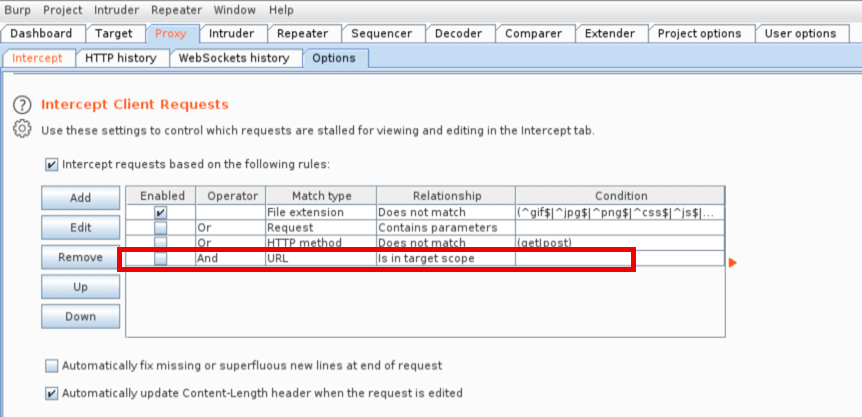
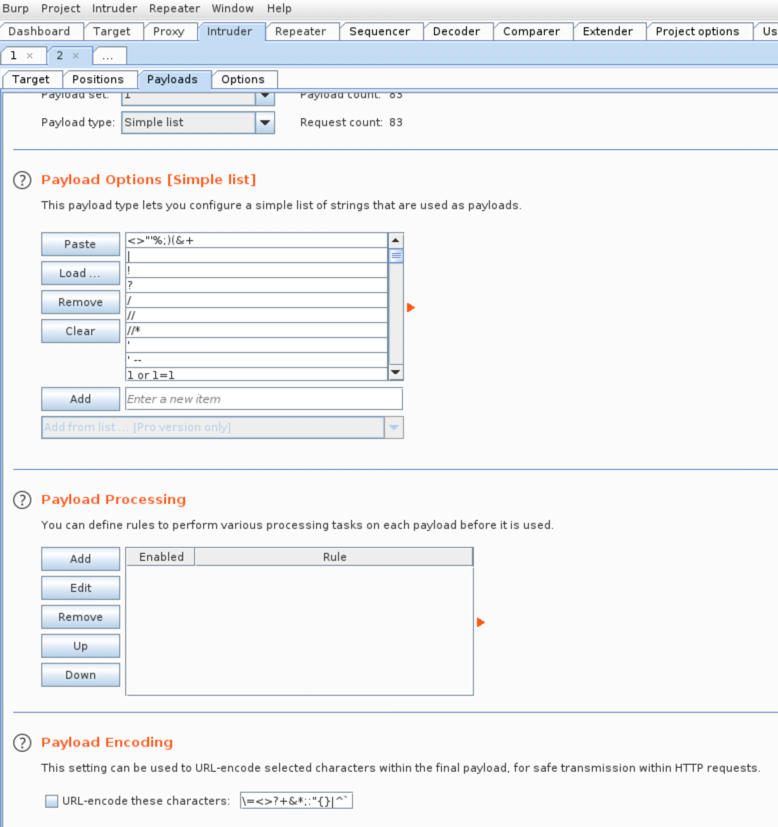
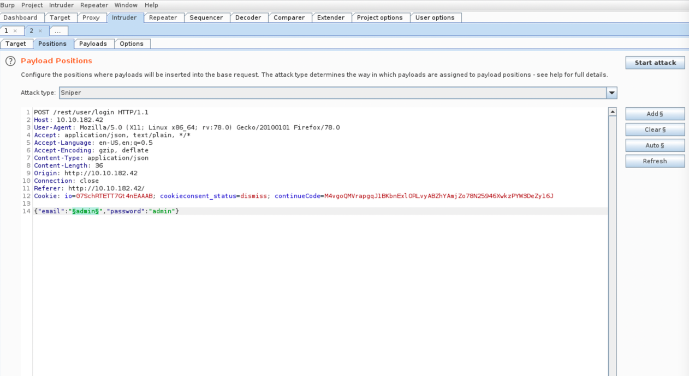
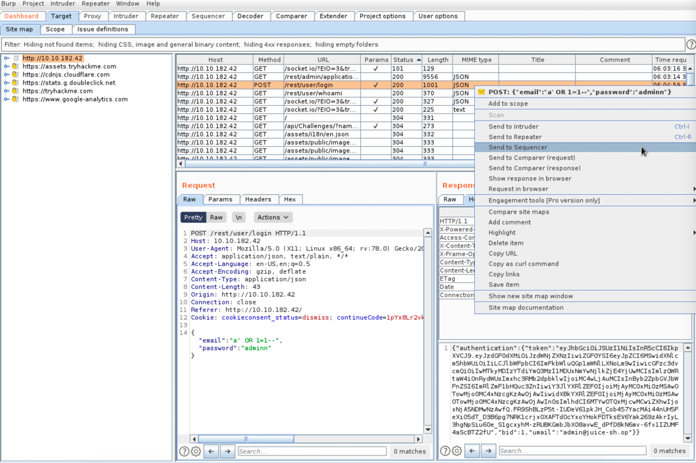

#BurpSuit

https://tryhackme.com/room/rpburpsuite

https://portswigger.net/burp/communitydownload

https://portswigger.net/web-security

Install FoxyProxy:

https://null-byte.wonderhowto.com/how-to/use-burp-foxyproxy-easily-switch-between-proxy-settings-0196630/

https://addons.mozilla.org/en-US/firefox/addon/foxyproxy-standard/

##Components

####Here's a quick overview of each section covered:

- Proxy - What allows us to funnel traffic through Burp Suite for further analysis
- Target - How we set the scope of our project. We can also use this to effectively create a site map of the application we are testing.
- Intruder - Incredibly powerful tool for everything from field fuzzing to credential stuffing and more
- Repeater - Allows us to 'repeat' requests that have previously been made with or without modification. Often used in a precursor step to fuzzing with the aforementioned Intruder
- Sequencer - Analyzes the 'randomness' present in parts of the web app which are intended to be unpredictable. This is commonly used for testing session cookies
- Decoder - As the name suggests, Decoder is a tool that allows us to perform various transforms on pieces of data. These transforms vary from decoding/encoding to various bases or URL encoding.
- Comparer - Comparer as you might have guessed is a tool we can use to compare different responses or other pieces of data such as site maps or proxy histories (awesome for access control issue testing). This is very similar to the Linux tool diff.
- Extender - Similar to adding mods to a game like Minecraft, Extender allows us to add components such as tool integrations, additional scan definitions, and more!
- Scanner - Automated web vulnerability scanner that can highlight areas of the application for further manual investigation or possible exploitation with another section of Burp. This feature, while not in the community edition of Burp Suite, is still a key facet of performing a web application test.

##Proxy

https://en.wikipedia.org/wiki/Proxy_server

1. Requests will by default require our authorization to be sent.

2. We can modify our requests in-line similar to what you might see in a man-in-the-middle attack and then send them on.

3. We can also drop requests we don't want to be sent. This can be useful to see the request attempt after clicking a button or performing another action on the website. 

4. And last but not least, we can send these requests to other tools such as Repeater and Intruder for modification and manipulation to induce vulnerabilities.

##Options

AND:

##Target

https://portswigger.net/burp/documentation/desktop/tools/target

When starting a web application test you'll very likely be provided a few things:

- The application URL (hopefully for dev/test and not prod)
- A list of the different user roles within the application
- Various test accounts and associated credentials for those accounts
- A list of pieces/forms in the application which are out-of-scope for testing and should be avoided

Following the creation of a site map via browsing the happy path, we can go through and start removing various items from the scope. These items typically fit one of these criteria:

- The item (page, form, etc) has been designated as out of scope in the provided documentation from the client
- Automated exploitation of the item (especially in a credentialed manner) would cause a huge mess (like sending hundreds of password reset emails - If you've done a web app professionally you've probably done this at one point)
- Automated exploitation of the item (especially in a credentialed manner) would lead to damaging and potentially crashing the web app

##Repeater

These requests can either be reissued as-is or with modifications

##Intruder

https://portswigger.net/burp/documentation/desktop/tools/intruder/using

Intruder is meant for repeat testing once a proof of concept has been established.
 
- Enumerating identifiers such as usernames, cycling through predictable session/password recovery tokens, and attempting simple password guessing
- Harvesting useful data from user profiles or other pages of interest via grepping our responses
- Fuzzing for vulnerabilities such as SQL injection, cross-site scripting (XSS), and file path traversal

Intruder has four different attack types:

1. Sniper - The most popular attack type, this cycles through our selected positions, putting the next available payload (item from our wordlist) in each position in turn. This uses only one set of payloads (one wordlist).

2. Battering Ram - Similar to Sniper, Battering Ram uses only one set of payloads. Unlike Sniper, Battering Ram puts every payload into every selected position. Think about how a battering ram makes contact across a large surface with a single surface, hence the name battering ram for this attack type.

3. Pitchfork - The Pitchfork attack type allows us to use multiple payload sets (one per position selected) and iterate through both payload sets simultaneously. For example, if we selected two positions (say a username field and a password field), we can provide a username and password payload list. Intruder will then cycle through the combinations of usernames and passwords, resulting in a total number of combinations equalling the smallest payload set provided. 

4. Cluster Bomb - The Cluster Bomb attack type allows us to use multiple payload sets (one per position selected) and iterate through all combinations of the payload lists we provide. For example, if we selected two positions (say a username field and a password field), we can provide a username and password payload list. Intruder will then cycle through the combinations of usernames and passwords, resulting in a total number of combinations equalling usernames x passwords. Do note, this can get pretty lengthy if you are using the community edition of Burp. 

##Sequencer

Some commonly analyzed items include:

- Session tokens
- Anti-CSRF (Cross-Site Request Forgery) tokens
- Password reset tokens (sent with password resets that in theory uniquely tie users with their password reset requests)

We're going to dig for a response which issues a cookie. Parse through the various responses we've received from Juice Shop until you find one that includes a 'Set-Cookie' header. 

Once you've found a request response that issues a cookie, right-click on the request and select 'Send to Sequencer'.

Change over Sequencer and select 'Start live capture'

Once it hits roughly that amount hit 'Pause' and then 'Analyze now'

##Decoder and Comparer

common uses for Comparer are as follows:

- When looking for username enumeration conditions, you can compare responses to failed logins using valid and invalid usernames, looking for subtle differences in responses. This is also sometimes useful for when enumerating password recovery forms or another similar recovery/account access mechanism.
- When an Intruder attack has resulted in some very large responses with different lengths than the base response, you can compare these to quickly see where the differences lie.
- When comparing the site maps or Proxy history entries generated by different types of users, you can compare pairs of similar requests to see where the differences lie that give rise to different application behavior. This may reveal possible access control issues in the application wherein lower privileged users can access pages they really shouldn't be able to.
- When testing for blind SQL injection bugs using Boolean condition injection and other similar tests, you can compare two responses to see whether injecting different conditions has resulted in a relevant difference in responses.

Decoder:

Comparer:

##Extender

Python Interpreter:

https://www.jython.org/download

Dokumentation Extender:

https://portswigger.net/burp/documentation/desktop/tools/extender

https://portswigger.net/testers/penetration-testing-tools

Here are some of the most popular extensions I suggest checking out (not all of these are free but I suggest looking into them all the same):

[Logger++](https://portswigger.net/bappstore/470b7057b86f41c396a97903377f3d81) - Adds enhanced logging to all requests and responses from all Burp Suite tools, enable this one before you need it ;)
[Request Smuggler](https://portswigger.net/bappstore/aaaa60ef945341e8a450217a54a11646) - A relatively new extension, this allows you to attempt to smuggle requests to backend servers. See this talk by James Kettle for more details: [Link](https://www.youtube.com/watch?v=_A04msdplXs)
[Autorize](https://portswigger.net/bappstore/f9bbac8c4acf4aefa4d7dc92a991af2f) - Useful for authentication testing in web app tests. These tests typically revolve around navigating to restricted pages or issuing restricted GET requests with the session cookies of low-privileged users
[Burp Teams Server](https://github.com/Static-Flow/BurpSuite-Team-Extension) - Allows for collaboration on a Burp project amongst team members. Project details are shared in a chatroom-like format
[Retire.js](https://portswigger.net/bappstore/36238b534a78494db9bf2d03f112265c) - Adds scanner checks for outdated JavaScript libraries that contain vulnerabilities, this is a premium extension
[J2EEScan](https://portswigger.net/bappstore/7ec6d429fed04cdcb6243d8ba7358880) - Adds scanner test coverage for J2EE (java platform for web development) applications, this is a premium extension
[Request Timer](https://portswigger.net/bappstore/56675bcf2a804d3096465b2868ec1d65) - Captures response times for requests made by all Burp tools, useful for discovering timing attack vectors 
