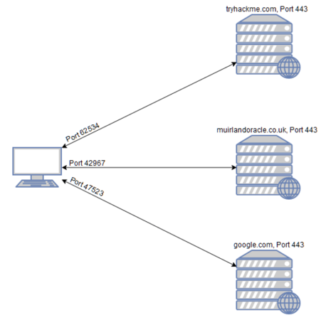
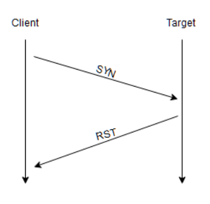
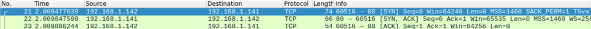
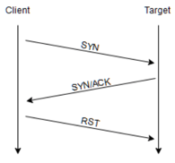
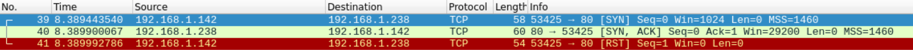

#nmap

    nmap [Scan Type(s)] [Options] {target specification}

Every computer has a total of 65535 available ports

HTTP: 80

HTTPS: 443

NETBIOS: 139

SMB: 445

Well-Known Ports:

[Liste_der_standardisierten_Ports](https://de.wikipedia.org/wiki/Liste_der_standardisierten_Ports)

Port Map:

Switches:

    -sS
    
    -O
    
    -sV
    
    -vv
    
    -oA <basename>

    -A

    -T<0-5>

    -p-

When port scanning with Nmap, there are three basic scan types. These are:

    TCP Connect Scans (-sT)
    SYN "Half-open" Scans (-sS)
    UDP Scans (-sU)

Additionally there are several less common port scan types, some of which we will also cover (albeit in less detail). These are:

    TCP Null Scans (-sN)
    TCP FIN Scans (-sF)
    TCP Xmas Scans (-sX)

Most of these (with the exception of UDP scans) are used for very similar purposes, however, the way that they work differs between each scan. This means that, whilst one of the first three scans are likely to be your go-to in most situations, it's worth bearing in mind that other scan types exist.

###TCP Connect Scans

    -sT

Well, as the name suggests, a TCP Connect scan works by performing the three-way handshake with each target port in turn. In other words, Nmap tries to connect to each specified TCP port, and determines whether the service is open by the response it receives.

In other words, if Nmap sends a TCP request with the SYN flag set to a closed port, the target server will respond with a TCP packet with the RST (Reset) flag set. By this response, Nmap can establish that the port is closed.

If, however, the request is sent to an open port, the target will respond with a TCP packet with the SYN/ACK flags set. Nmap then marks this port as being open (and completes the handshake by sending back a TCP packet with ACK set).

That said, it is very easy to configure a firewall to respond with a RST TCP packet. For example, in IPtables for Linux, a simple version of the command would be as follows:

    iptables -I INPUT -p tcp --dport <port> -j REJECT --reject-with tcp-reset

This can make it extremely difficult (if not impossible) to get an accurate reading of the target(s).

###SYN Scans

    -sS

This has a variety of advantages for us as hackers:

- It can be used to bypass older Intrusion Detection systems as they are looking out for a full three way handshake. This is often no longer the case with modern IDS solutions; it is for this reason that SYN scans are still frequently referred to as "stealth" scans.
- SYN scans are often not logged by applications listening on open ports, as standard practice is to log a connection once it's been fully established. Again, this plays into the idea of SYN scans being stealthy.
- Without having to bother about completing (and disconnecting from) a three-way handshake for every port, SYN scans are significantly faster than a standard TCP Connect scan.

There are, however, a couple of disadvantages to SYN scans, namely:

- They require sudo permissions[1] in order to work correctly in Linux. This is because SYN scans require the ability to create raw packets (as opposed to the full TCP handshake), which is a privilege only the root user has by default.
- Unstable services are sometimes brought down by SYN scans, which could prove problematic if a client has provided a production environment for the test.
- All in all, the pros outweigh the cons.

For this reason, SYN scans are the default scans used by Nmap if run with sudo permissions. If run without sudo permissions, Nmap defaults to the TCP Connect scan we saw in the previous task.

###UDP Scans

    -sU

When a packet is sent to an open UDP port, there should be no response. When this happens, Nmap refers to the port as being open|filtered. In other words, it suspects that the port is open, but it could be firewalled. If it gets a UDP response (which is very unusual), then the port is marked as open. More commonly there is no response, in which case the request is sent a second time as a double-check. If there is still no response then the port is marked open|filtered and Nmap moves on.

When a packet is sent to a closed UDP port, the target should respond with an ICMP (ping) packet containing a message that the port is unreachable. This clearly identifies closed ports, which Nmap marks as such and moves on.

    nmap -sU --top-ports 20 <target>

Will scan the top 20 most commonly used UDP ports, resulting in a much more acceptable scan time.

###ICMP Network Scanning

On first connection to a target network in a black box assignment, our first objective is to obtain a "map" of the network structure -- or, in other words, we want to see which IP addresses contain active hosts, and which do not.

One way to do this is by using Nmap to perform a so called "ping sweep". This is exactly as the name suggests: Nmap sends an ICMP packet to each possible IP address for the specified network. When it receives a response, it marks the IP address that responded as being alive. For reasons we'll see in a later task, this is not always accurate; however, it can provide something of a baseline and thus is worth covering.

To perform a ping sweep, we use the -sn switch in conjunction with IP ranges which can be specified with either a hypen (-) or CIDR notation. i.e. we could scan the 192.168.0.x network using:

    nmap -sn 192.168.0.1-254

or

    nmap -sn 192.168.0.0/24

The -sn switch tells Nmap not to scan any ports -- forcing it to rely purely on ICMP packets (or ARP requests on a local network) to identify targets.

###NSE Scripts

The Nmap Scripting Engine (NSE) is an incredibly powerful addition to Nmap, extending its functionality quite considerably. NSE Scripts are written in the Lua programming language, and can be used to do a variety of things: from scanning for vulnerabilities, to automating exploits for them. The NSE is particularly useful for reconnaisance, however, it is well worth bearing in mind how extensive the script library is.

There are many categories available. Some useful categories include:

    safe:       - Won't affect the target
    intrusive:  - Not safe: likely to affect the target
    vuln:       - Scan for vulnerabilities
    exploit:    - Attempt to exploit a vulnerability
    auth:       - Attempt to bypass authentication for running services (e.g. Log into an FTP server anonymously)
    brute:      - Attempt to bruteforce credentials for running services
    discovery:  - Attempt to query running services for further information about the network (e.g. query an SNMP server).

[nse-usage](https://nmap.org/book/nse-usage.html)

    nmap --script-help <script-name>

[nse-docs](https://nmap.org/nsedoc/)

    --script=<script-name>
    --script=http-fileupload-exploiter
    
    <script-name>.<argument>

    nmap -p 80 --script http-put --script-args http-put.url='/dav/shell.php',http-put.file='./shell.php'

Find Scripts:

    /usr/share/nmap/scripts/script.db

    grep "ftp" /usr/share/nmap/scripts/script.db

    ls -l /usr/share/nmap/scripts/*ftp*

find categorie:

    grep "safe" /usr/share/nmap/scripts/script.db

Installing New Scripts:

We mentioned previously that the Nmap website contains a list of scripts, so, what happens if one of these is missing in the scripts directory locally? A standard sudo apt update && sudo apt install nmap should fix this; however, it's also possible to install the scripts manually by downloading the script from Nmap (sudo wget -O /usr/share/nmap/scripts/<script-name>.nse https://svn.nmap.org/nmap/scripts/<script-name>.nse). This must then be followed up with nmap --script-updatedb, which updates the script.db file to contain the newly downloaded script.

It's worth noting that you would require the same "updatedb" command if you were to make your own NSE script and add it into Nmap -- a more than manageable task with some basic knowledge of Lua! 

    sudo wget -O /usr/share/nmap/scripts/<script-name>.nse https://svn.nmap.org/nmap/scripts/<script-name>.nse

    nmap --script-updatedb

###Firewall Evasion

[man-bypass-firewalls-ids](https://nmap.org/book/man-bypass-firewalls-ids.html)

The following switches are of particular note:

- -f:- Used to fragment the packets (i.e. split them into smaller pieces) making it less likely that the packets will be detected by a firewall or IDS.
- An alternative to -f, but providing more control over the size of the packets: --mtu <number>, accepts a maximum transmission unit size to use for the packets sent. This must be a multiple of 8.
- --scan-delay <time>ms:- used to add a delay between packets sent. This is very useful if the network is unstable, but also for evading any time-based firewall/IDS triggers which may be in place.
- --badsum:- this is used to generate in invalid checksum for packets. Any real TCP/IP stack would drop this packet, however, firewalls may potentially respond automatically, without bothering to check the checksum of the packet. As such, this switch can be used to determine the presence of a firewall/IDS.

Beispiele:

nmap -A -T5 --script vuln -oN rpnmap.nmap [IP-Address]

-p 234,432,44
-p 443-1000
-p- (Wird jeden Port scannen)

--script vuln

"Normaler" scan;

    sudo nmap -sS <ip>

Für Windows:

    sudo nmap -sS -Pn <ip>

nmap --help

    Nmap 7.60 ( https://nmap.org )
    Usage: nmap [Scan Type(s)] [Options] {target specification}
    TARGET SPECIFICATION:
      Can pass hostnames, IP addresses, networks, etc.
      Ex: scanme.nmap.org, microsoft.com/24, 192.168.0.1; 10.0.0-255.1-254
      -iL <inputfilename>: Input from list of hosts/networks
      -iR <num hosts>: Choose random targets
      --exclude <host1[,host2][,host3],...>: Exclude hosts/networks
      --excludefile <exclude_file>: Exclude list from file
    HOST DISCOVERY:
      -sL: List Scan - simply list targets to scan
      -sn: Ping Scan - disable port scan
      -Pn: Treat all hosts as online -- skip host discovery
      -PS/PA/PU/PY[portlist]: TCP SYN/ACK, UDP or SCTP discovery to given ports
      -PE/PP/PM: ICMP echo, timestamp, and netmask request discovery probes
      -PO[protocol list]: IP Protocol Ping
      -n/-R: Never do DNS resolution/Always resolve [default: sometimes]
      --dns-servers <serv1[,serv2],...>: Specify custom DNS servers
      --system-dns: Use OS's DNS resolver
      --traceroute: Trace hop path to each host
    SCAN TECHNIQUES:
      -sS/sT/sA/sW/sM: TCP SYN/Connect()/ACK/Window/Maimon scans
      -sU: UDP Scan
      -sN/sF/sX: TCP Null, FIN, and Xmas scans
      --scanflags <flags>: Customize TCP scan flags
      -sI <zombie host[:probeport]>: Idle scan
      -sY/sZ: SCTP INIT/COOKIE-ECHO scans
      -sO: IP protocol scan
      -b <FTP relay host>: FTP bounce scan
    PORT SPECIFICATION AND SCAN ORDER:
      -p <port ranges>: Only scan specified ports
        Ex: -p22; -p1-65535; -p U:53,111,137,T:21-25,80,139,8080,S:9
      --exclude-ports <port ranges>: Exclude the specified ports from scanning
      -F: Fast mode - Scan fewer ports than the default scan
      -r: Scan ports consecutively - don't randomize
      --top-ports <number>: Scan <number> most common ports
      --port-ratio <ratio>: Scan ports more common than <ratio>
    SERVICE/VERSION DETECTION:
      -sV: Probe open ports to determine service/version info
      --version-intensity <level>: Set from 0 (light) to 9 (try all probes)
      --version-light: Limit to most likely probes (intensity 2)
      --version-all: Try every single probe (intensity 9)
      --version-trace: Show detailed version scan activity (for debugging)
    SCRIPT SCAN:
      -sC: equivalent to --script=default
      --script=<Lua scripts>: <Lua scripts> is a comma separated list of
               directories, script-files or script-categories
      --script-args=<n1=v1,[n2=v2,...]>: provide arguments to scripts
      --script-args-file=filename: provide NSE script args in a file
      --script-trace: Show all data sent and received
      --script-updatedb: Update the script database.
      --script-help=<Lua scripts>: Show help about scripts.
               <Lua scripts> is a comma-separated list of script-files or
               script-categories.
    OS DETECTION:
      -O: Enable OS detection
      --osscan-limit: Limit OS detection to promising targets
      --osscan-guess: Guess OS more aggressively
    TIMING AND PERFORMANCE:
      Options which take <time> are in seconds, or append 'ms' (milliseconds),
      's' (seconds), 'm' (minutes), or 'h' (hours) to the value (e.g. 30m).
      -T<0-5>: Set timing template (higher is faster)
      --min-hostgroup/max-hostgroup <size>: Parallel host scan group sizes
      --min-parallelism/max-parallelism <numprobes>: Probe parallelization
      --min-rtt-timeout/max-rtt-timeout/initial-rtt-timeout <time>: Specifies
          probe round trip time.
      --max-retries <tries>: Caps number of port scan probe retransmissions.
      --host-timeout <time>: Give up on target after this long
      --scan-delay/--max-scan-delay <time>: Adjust delay between probes
      --min-rate <number>: Send packets no slower than <number> per second
      --max-rate <number>: Send packets no faster than <number> per second
    FIREWALL/IDS EVASION AND SPOOFING:
      -f; --mtu <val>: fragment packets (optionally w/given MTU)
      -D <decoy1,decoy2[,ME],...>: Cloak a scan with decoys
      -S <IP_Address>: Spoof source address
      -e <iface>: Use specified interface
      -g/--source-port <portnum>: Use given port number
      --proxies <url1,[url2],...>: Relay connections through HTTP/SOCKS4 proxies
      --data <hex string>: Append a custom payload to sent packets
      --data-string <string>: Append a custom ASCII string to sent packets
      --data-length <num>: Append random data to sent packets
      --ip-options <options>: Send packets with specified ip options
      --ttl <val>: Set IP time-to-live field
      --spoof-mac <mac address/prefix/vendor name>: Spoof your MAC address
      --badsum: Send packets with a bogus TCP/UDP/SCTP checksum
    OUTPUT:
      -oN/-oX/-oS/-oG <file>: Output scan in normal, XML, s|<rIpt kIddi3,
         and Grepable format, respectively, to the given filename.
      -oA <basename>: Output in the three major formats at once
      -v: Increase verbosity level (use -vv or more for greater effect)
      -d: Increase debugging level (use -dd or more for greater effect)
      --reason: Display the reason a port is in a particular state
      --open: Only show open (or possibly open) ports
      --packet-trace: Show all packets sent and received
      --iflist: Print host interfaces and routes (for debugging)
      --append-output: Append to rather than clobber specified output files
      --resume <filename>: Resume an aborted scan
      --stylesheet <path/URL>: XSL stylesheet to transform XML output to HTML
      --webxml: Reference stylesheet from Nmap.Org for more portable XML
      --no-stylesheet: Prevent associating of XSL stylesheet w/XML output
    MISC:
      -6: Enable IPv6 scanning
      -A: Enable OS detection, version detection, script scanning, and traceroute
      --datadir <dirname>: Specify custom Nmap data file location
      --send-eth/--send-ip: Send using raw ethernet frames or IP packets
      --privileged: Assume that the user is fully privileged
      --unprivileged: Assume the user lacks raw socket privileges
      -V: Print version number
      -h: Print this help summary page.
    EXAMPLES:
      nmap -v -A scanme.nmap.org
      nmap -v -sn 192.168.0.0/16 10.0.0.0/8
      nmap -v -iR 10000 -Pn -p 80
    SEE THE MAN PAGE (https://nmap.org/book/man.html) FOR MORE OPTIONS AND EXAMPLES
