#Wireshark

https://tryhackme.com/room/wireshark

https://www.wireshark.org/download.html

https://www.wireshark.org/docs/

##Collection Methods Overview

Network Taps

MAC Floods

ARP Poisoning

##Filters

https://www.wireshark.org/docs/wsug_html_chunked/ChWorkBuildDisplayFilterSection.html

Filtering Operators:

Wireshark only has a few that you will need to be familiar with:

- and - operator: and / &&
- or - operator: or / ||
- equals - operator: eq / ==
- not equal - operator: ne / !=
- greater than - operator: gt /  >
- less than - operator: lt / <

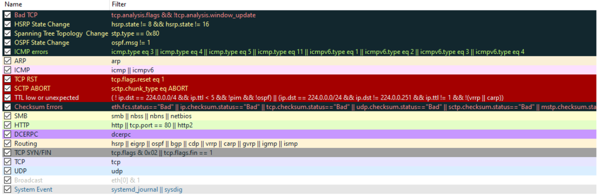

###Basic Filtering:

Filtering by IP:

ip.addr == <IP Address>

Filtering by SRC and DST:

ip.src == <SRC IP Address> and ip.dst == <DST IP Address>

Filtering by TCP Protocols:

tcp.port eq <Port #> or <Protocol Name>

Filtering by UDP Protocols:

udp.port eq <Port #> or <Protocol Name>

###7 Layers of the OSI Model

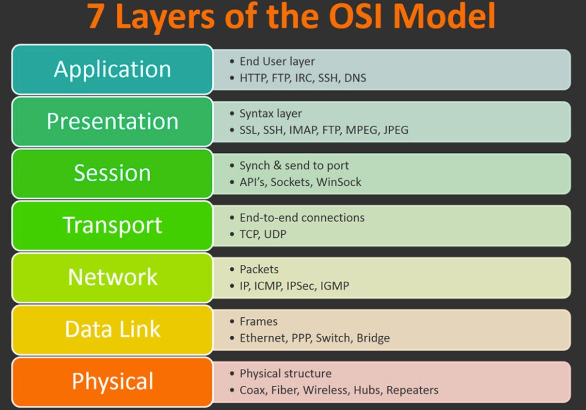

##Packet Zerlegung

Frame (Layer 1) -- This will show you what frame / packet you are looking at as well as details specific to the Physical layer of the OSI model.

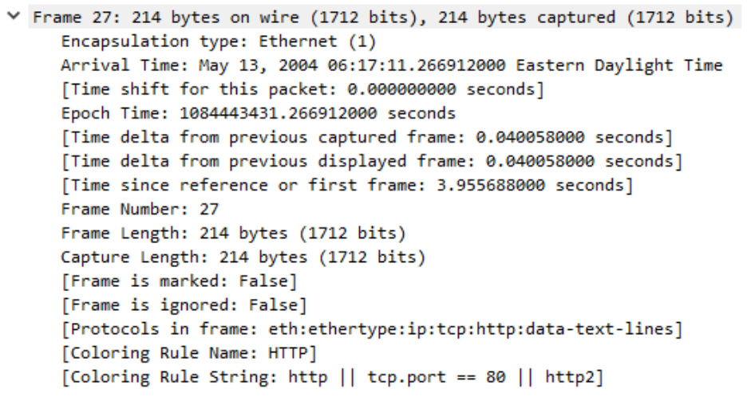

Source [MAC] (Layer 2) -- This will show you the source and destination MAC Addresses; from the Data Link layer of the OSI model.

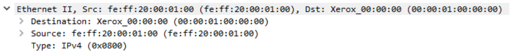

Source [IP] (Layer 3) -- This will show you the source and destination IPv4 Addresses; from the Network layer of the OSI model.

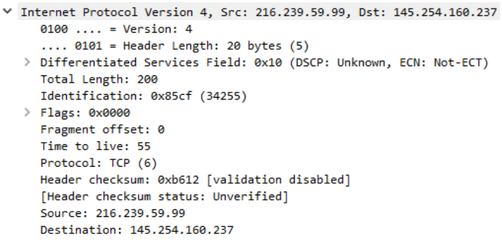

Protocol (Layer 4) -- This will show you details of the protocol used (UDP/TCP) along with source and destination ports; from the Transport layer of the OSI model.

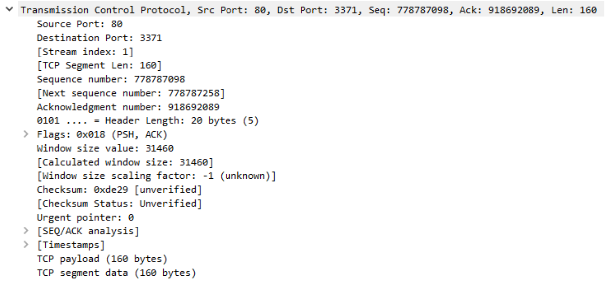

Protocol Errors -- This is a continuation of the 4th layer showing specific segments from TCP that needed to be reassembled.

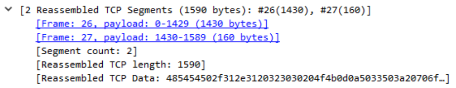

Application Protocol (Layer 5) -- This will show details specific to the protocol being used such HTTP, FTP, SMB, etc. From the Application layer of the OSI model.

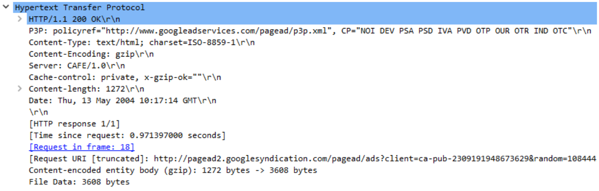

Application Data -- This is an extension of layer 5 that can show the application-specific data.

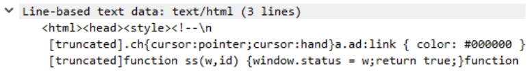

##ARP Traffic

View > Name Resolution > Ensure that Resolve Physical Addresses is checked.

Protocol: ARP

ARP Request:

Broadcast

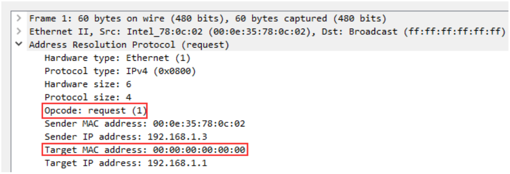

ARP Reply:

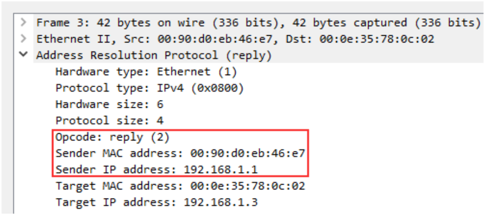

ARP is one of the simpler protocols to analyze, all you need to remember is to identify whether it is a request or reply packet and who it is being sent by. 

##ICMP Traffic

ICMP or Internet Control Message Protocol is used to analyze various nodes on a network. This is most commonly used with utilities like ping and traceroute.

https://tools.ietf.org/html/rfc792

A type that equals 8 means that it is a request packet, if it is equal to 0 it is a reply packet.

ICMP request:

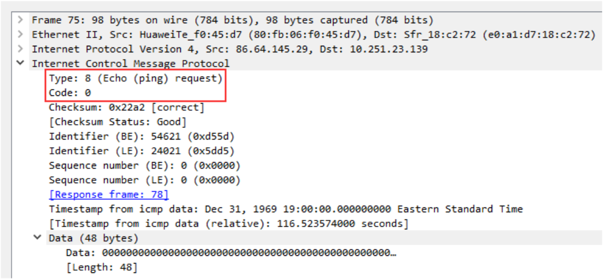

ICMP Reply:

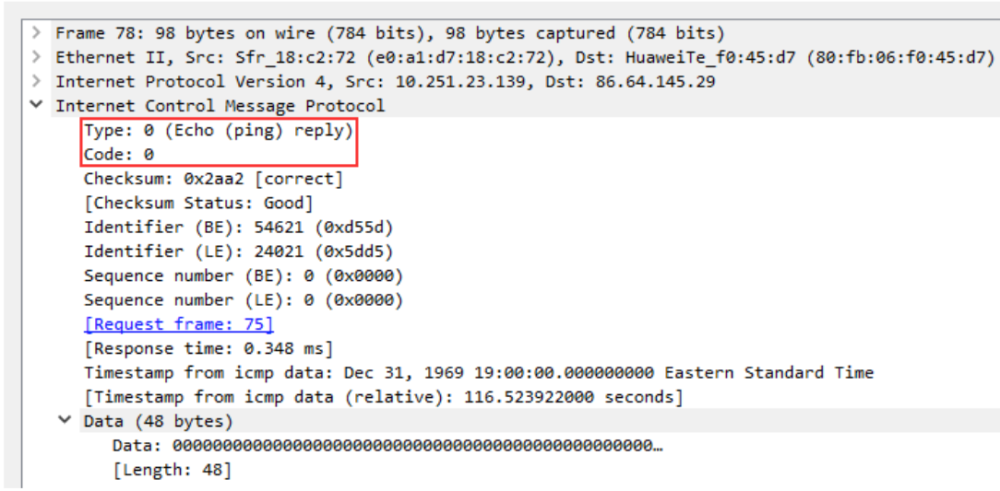

##TCP Traffic

TCP or Transmission Control Protocol handles the delivery of packets including sequencing and errors.

https://tools.ietf.org/html/rfc793

Below we see packet details for an SYN packet. The main thing that we want to look for when looking at a TCP packet is the sequence number and acknowledgment number.

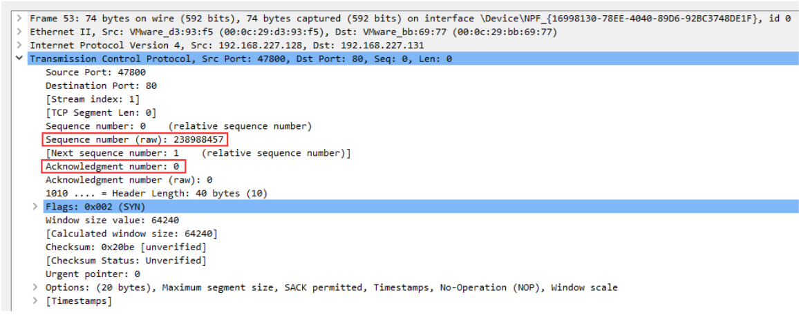

Typically TCP packets need to be looked at as a whole to tell a story rather than one by one at the details.

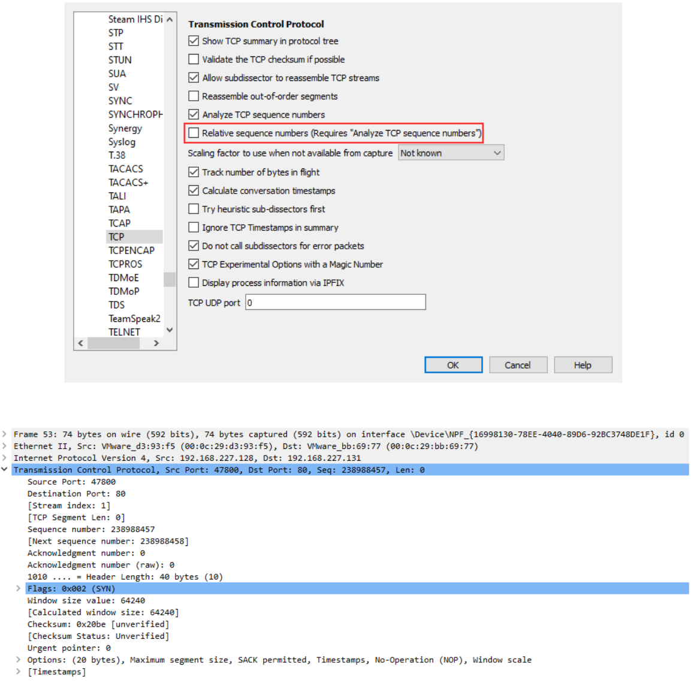

##DNS Traffic

DNS or Domain Name Service protocol is used to resolves names with IP addresses.

https://www.ietf.org/rfc/rfc1035.txt

There are a couple of things outlined below that you should keep in the back of your mind when analyzing DNS packets.

- Query-Response
- DNS-Servers Only
- UDP

DNS Query:

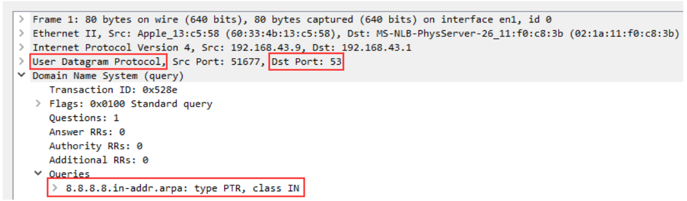

DNS Response:

##HTTP Traffic

HTTP is one of the most straight forward protocols for packet analysis, the protocol is straight to the point and does not include any handshakes or prerequisites before communication.

https://www.ietf.org/rfc/rfc2616.txt

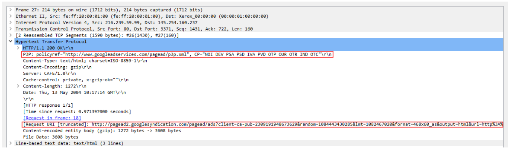

Navigate to Statistics > Protocol Hierarchy.

file > Export Objects > HTTP.

Statistics > Endpoints

##HTTPS Traffic

Before sending encrypted information the client and server need to agree upon various steps in order to make a secure tunnel.

- Client and server agree on a protocol version
- Client and server select a cryptographic algorithm
- The client and server can authenticate to each other; this step is optional
- Creates a secure tunnel with a public key

Below is a Client Hello packet showing the SSLv2 Record Layer, Handshake Type, and SSL Version

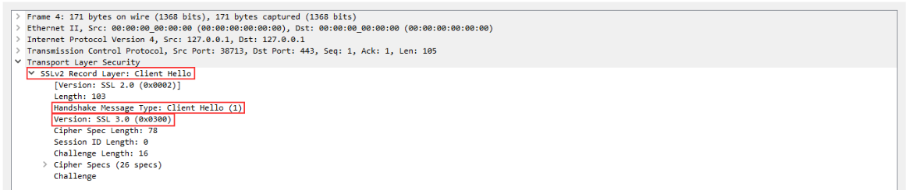

Below is the Server Hello packet sending similar information as the Client Hello packet however this time it includes session details and SSL certificate information

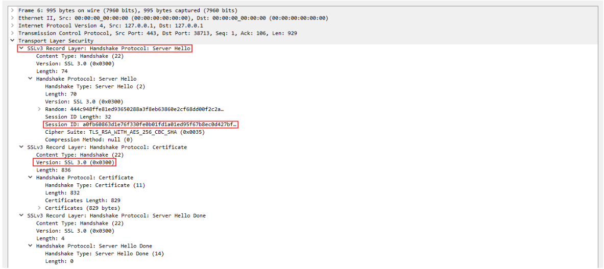

Below is the Client Key Exchange packet, this part of the handshake will determine the public key to use to encrypt further messages between the Client and Server

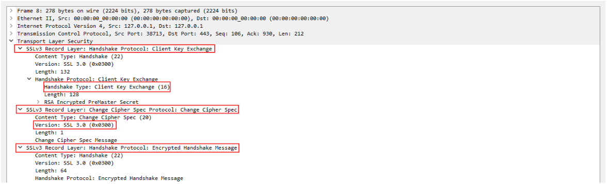

In the next packet, the server will confirm the public key and create the secure tunnel, all traffic after this point will be encrypted based on the agreed-upon specifications listed above

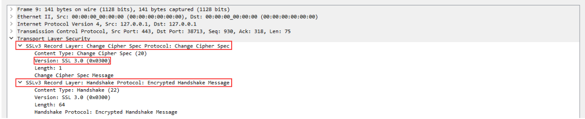

The traffic between the Client and the Server is now encrypted and you will need the secret key in order to decrypt the data stream being sent between the two hosts.

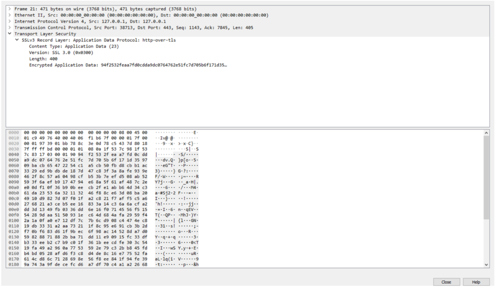

You can use an RSA key in Wireshark in order to view the data unencrypted.

Edit > Preferences > Protocols > TLS > Edit > [+]

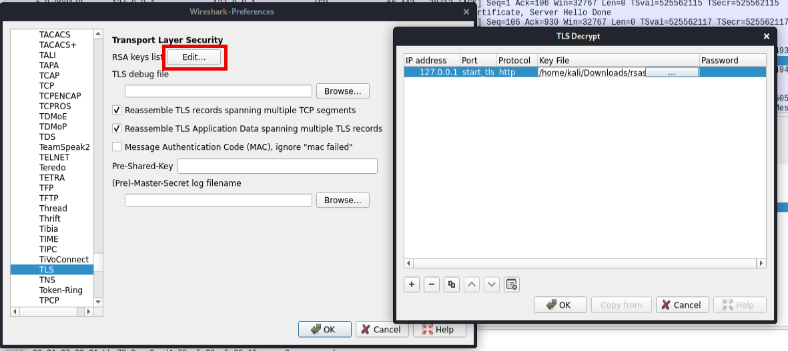

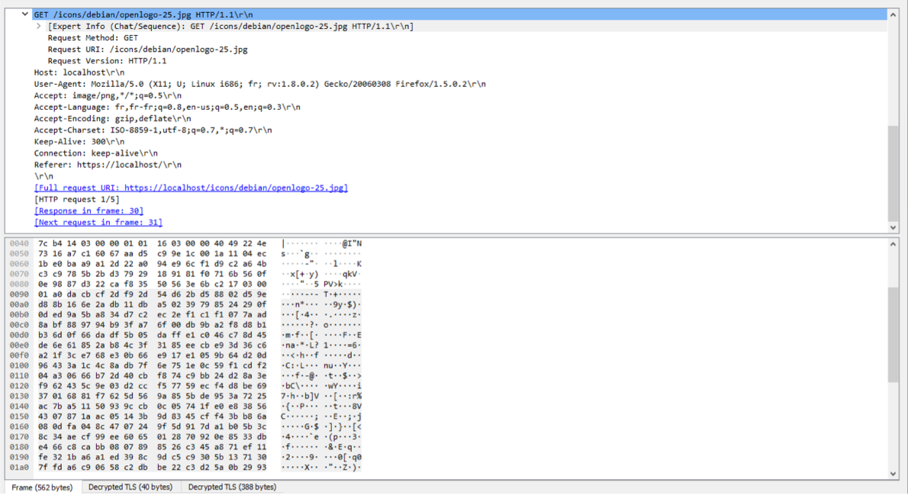

