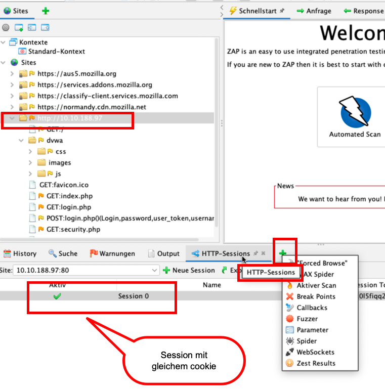

#ZAP

https://www.zaproxy.org/download/

    sudo apt install libjenkins-htmlunit-core-js-java

FireFox Proxy einrichten:

ZAP Zertifikat hinterlegen:

Proxy einstellen:

authenticated scan:

automatischer angriff:

BruteForce analog Dirbuster:

Datei wählen für BruteForce:

Passwort BrutForce - Fuzzen:

Character Encoding: ISO-8859-1

 Nach Zustand - Reflected sortieren:

Enable HUNT.py:

Desktop eManuel: https://www.zaproxy.org/docs/desktop/ui/
OWASP ZAP Forums: https://groups.google.com/forum/#!forum/zaproxy-users 
ZAP in Ten: https://www.alldaydevops.com/zap-in-ten
